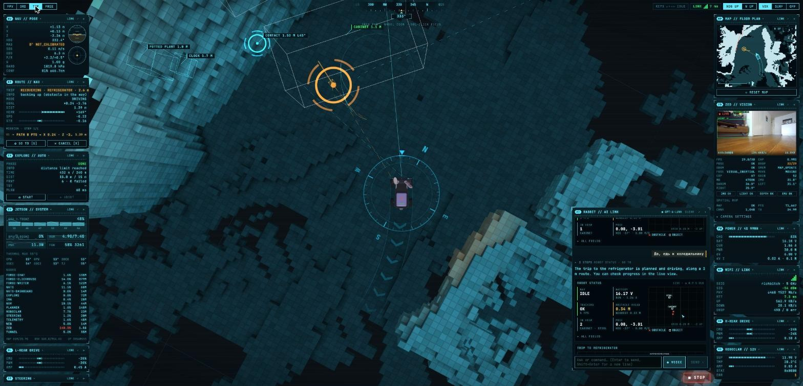
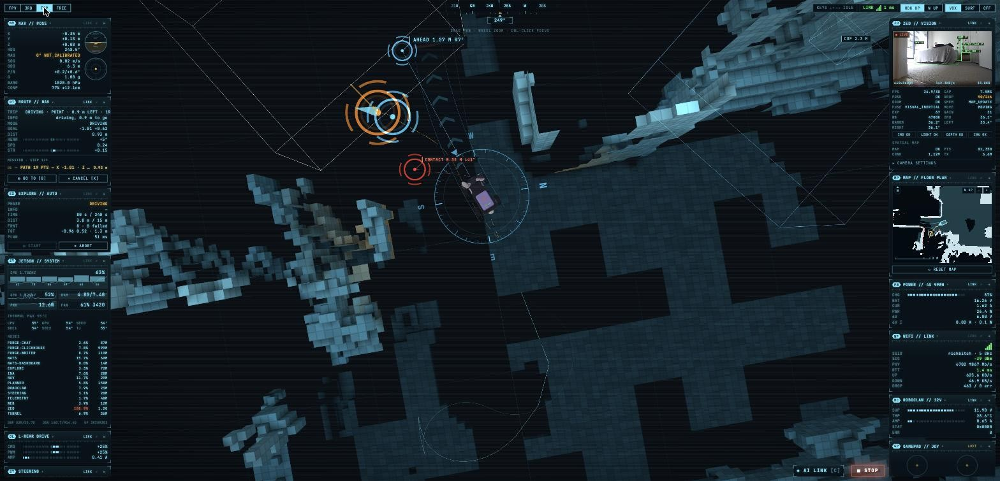
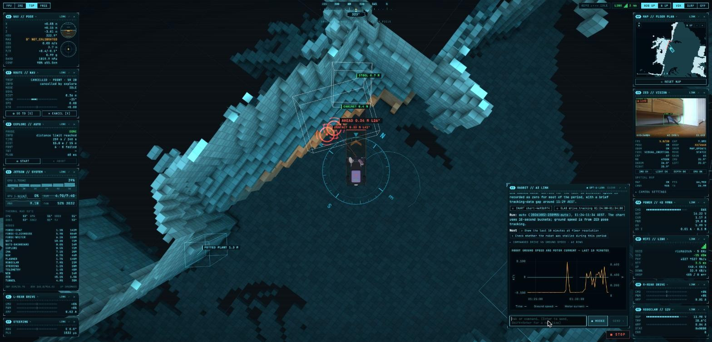
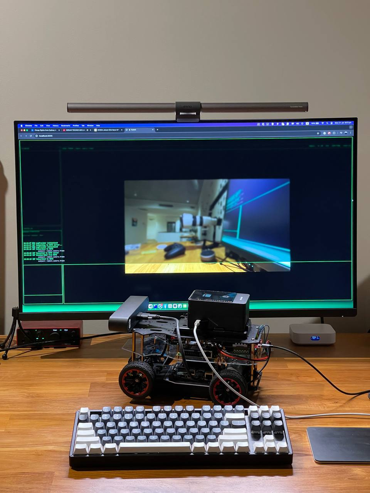
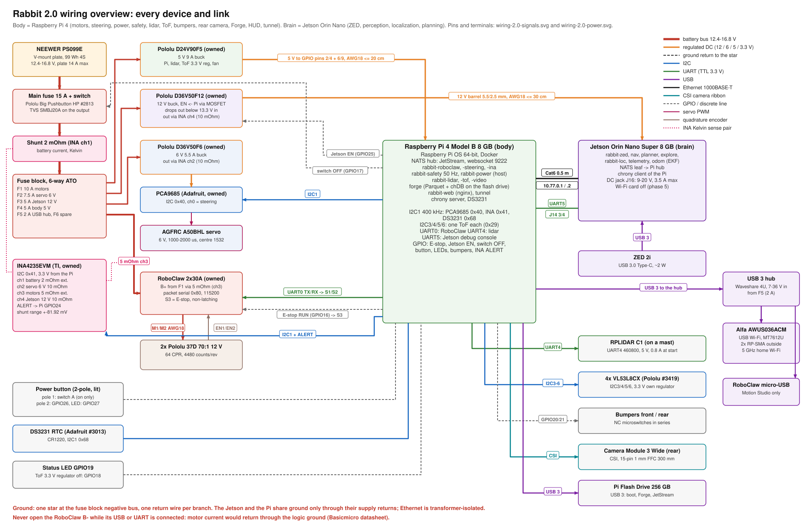

# Rabbit

A small home-built Ackermann rover that maps a flat on its own, drives to things you name ("drive to the fridge") and explains what it did. Everything is in this repo: the robot code, the web HUD, the telemetry store with its AI agent, the hardware design for the next version, and the build log.

Build log (Russian and English): **[rabbit0.dev](https://rabbit0.dev)** · Live HUD: https://live.rabbit0.dev (by personal link)



## What it does

- **Maps and localizes with one stereo camera.** A ZED 2i provides depth, visual-inertial odometry and object detection. nvblox builds a voxel map and a clearance grid on the GPU, and the robot relocalizes in its saved map after a restart. Relocalizing after being carried to another room is the open problem; RTAB-Map is replacing ZED GEN_3 for it.
- **Plans and drives like a car.** A Hybrid A* planner knows the robot's asymmetric turning radius and plans forward and reverse manoeuvres. A path tracker follows the plan on the rear axle, and a collision guard checks the swept footprint against the live obstacle scan.
- **Explores by itself.** It picks views by information gain and finishes a room before leaving it.
- **Takes orders in plain language.** The HUD chat, by text or voice, talks to Forge, an agent that answers from the recorded telemetry ("why did it stop at 03:12?") and can send trips after the operator approves them.
- **Records everything.** Every pose, command, decision with its reason, log line and power sample goes into Parquet files, queried with chDB (embedded ClickHouse).
- **Runs headless.** The HUD is only a viewer: the robot doesn't care whether anyone is watching.

| | |
|---|---|
|  |  |

## Hardware



| Part | What |
|---|---|
| Chassis | "Red Ackerman Racing Car" metal kit; front steering, rear drive. Wheelbase 0.17 m, 75 mm wheels, ~3.5 kg |
| Brain | NVIDIA Jetson Orin Nano Super 8 GB (JetPack 6, MAXN_SUPER, headless) |
| Camera | Stereolabs ZED 2i (depth, VIO, IMU, barometer, magnetometer) |
| Drive | 2 × Pololu 37D 70:1 12 V gearmotors on a RoboClaw 2x30A; electronic differential in software |
| Steering | AGFRC A50BHL brushless servo via a PCA9685 |
| Power | NEEWER PS099E V-mount battery (99 Wh, 4S Li-ion) and Pololu step-down regulators; INA4235 4-channel power monitor |
| Network | Wi-Fi only; NATS over websockets for the HUD; a Cloudflare tunnel for public access |

## Software

Python nodes talk over [NATS](https://nats.io) instead of ROS, one Docker container per node on the Jetson.

```
 ZED 2i ─► rabbit-zed ──pose/odom, obstacle scan, objects, map──► rabbit-nav ──drive──► rabbit-roboclaw ─► motors
              │                                              ▲        │                rabbit-steering ─► servo
              └─► rabbit-loc (RTAB-Map, map←odom)            │        └─ safety trips, recovery
                                   rabbit-planner (Hybrid A*) ┤
                                   rabbit-explore (frontiers) ┘
 rabbit-ina, rabbit-telemetry ─► power, Jetson, Docker, Wi-Fi
 all subjects ─► Forge (Parquet + chDB) ─► slabs, MCP, HUD chat agent
 HUD (React, three.js, uPlot) ◄── NATS websocket, served by rabbit-web (nginx)
```

| Path | What |
|---|---|
| [`workspaces/rabbit`](workspaces/rabbit) | robot nodes (`src/node/`), libraries (`src/lib/`), native extensions (nvblox, RTAB-Map), tests, the simulator |
| [`workspaces/web`](workspaces/web) | the HUD |
| [`workspaces/forge`](workspaces/forge) | Forge: telemetry writer, store, slabs, metric graph, MCP server and chat agent ([README](workspaces/forge/README.md)) |
| [`workspaces/blog`](workspaces/blog) | the build log at rabbit0.dev |
| [`workspaces/bench`](workspaces/bench) | localization benchmark and recording tools |
| [`workspaces/compose.yaml`](workspaces/compose.yaml), [`workspaces/nats`](workspaces/nats), [`workspaces/jetson`](workspaces/jetson) | services, NATS config, Jetson boot tuning |
| [`pcb/rabbit-body`](pcb/rabbit-body), [`cad/brackets`](cad/brackets), [`model`](model) | Rabbit 2.0 body PCB, 3D-printed mounts, chassis model |
| [`docs`](docs) | engineering log, reports, roadmap, open issues, lessons |
| [`scripts`](scripts) | deploy, bring-up, simulator, access links, blog |

## Rabbit 2.0

The next version splits the robot into a **brain** and a **body**:
- the Jetson keeps only GPU work: perception, localization and planning;
- a Raspberry Pi 4 becomes the body. It runs the motors, the steering, the power, an independent safety loop, a 360° lidar, ToF sensors and bumpers, a rear camera, Forge and the HUD.

The body electronics move from an acrylic deck full of modules onto one PCB shaped like the chassis deck. The board is generated from Python with KiCad and Freerouting.

| | |
|---|---|
|  |  |
|  |  |

Design: [architecture](docs/reports/2026-10-03-architecture-2.0.md) · [wiring](docs/reports/2026-10-03-architecture-2.0-wiring.md) · [BOM](docs/reports/2026-10-03-architecture-2.0-bom.md) · [body PCB](docs/reports/2026-10-03-body-pcb.md) · [mounts](docs/reports/2026-10-03-mounts.md) · [power](docs/reports/media/power-2.0.svg)

## Working on it

The project is developed mostly by coding agents. [`AGENTS.md`](AGENTS.md) holds the rules, and the skills in [`.claude/skills`](.claude/skills) hold the procedures:
- `rabbit-robot`: operating and deploying the robot;
- `rabbit-dev`: robot code and the HUD;
- `forge-dev`: Forge;
- `rabbit-blog`: the blog.

```sh
# robot tests
cd workspaces/rabbit && uv run --no-project --python 3.10 --with pytest --with numpy --with pydantic --with numba --with nats-py python -m pytest tests -q

# full-stack simulator on the Mac: local NATS + rabbit-sim + the real nav, planner and explore
scripts/sim.sh

# HUD dev server at https://localhost:3005
cd workspaces/web && node ../../.yarn/releases/yarn-4.9.3.cjs dev

# deploy named services to the robot
scripts/deploy.sh rabbit-nav rabbit-web

# after the robot was off: checks, deploy, tests, step by step
uv run scripts/bringup.py check
```

## Work log and blog

Every piece of significant work leaves two traces, written as part of the work:

1. **Engineering log** in [`docs/`](docs/README.md), in English and factual:
   - `docs/log/YYYY-MM-DD-<topic>.md`: what was tried and dropped, numbers, root causes;
   - [`docs/roadmap.md`](docs/roadmap.md): what's next;
   - [`docs/open-issues.md`](docs/open-issues.md): open questions and unresolved problems;
   - [`docs/lessons.md`](docs/lessons.md): rules learned the hard way.
2. **Blog post** at [rabbit0.dev](https://rabbit0.dev), in the author's voice:
   - source in [`workspaces/blog`](workspaces/blog): `README.ru.md` holds the Russian posts, `README.md` the English ones, `static/media/` the media;
   - `scripts/blog.sh build` renders the pages;
   - `scripts/blog.sh publish` pushes `workspaces/blog` to the [seralexeev/rabbit0](https://github.com/seralexeev/rabbit0) deploy mirror, which Cloudflare Pages serves.

## Access links

The public HUD at https://live.rabbit0.dev opens only through a personal link; the LAN address (https://jetson.rabbit) stays open. Ask the agent "give me a link" (optionally "for Alice") or "remove Alice's link", or run it yourself:

```sh
scripts/links.sh              # list: name, date, link
scripts/links.sh add alice    # create a link, prints https://live.rabbit0.dev/k/<token>
scripts/links.sh rm alice     # revoke it: the open HUD is cut off within ~5 s
```

The registry lives only on the robot, in `/root/rabbit/workspaces/links/links.map`. Details are in the `rabbit-robot` skill.

Old hardware and setup scratch notes: [`docs/notes.md`](docs/notes.md).
