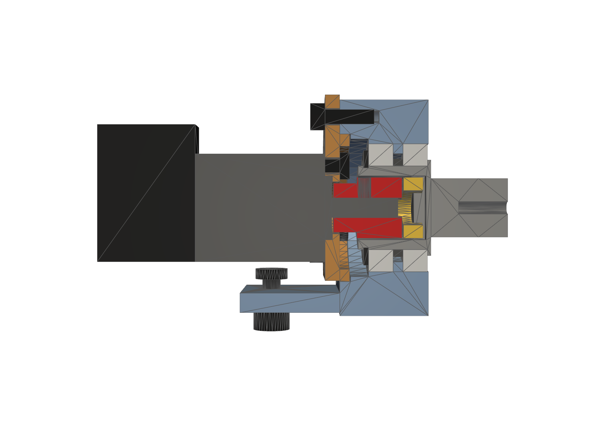

# Rabbit rear drive: BLDC motors, brackets and wheel coupling

The owner chose BLDC drive motors and accepted new brackets (Q39, 2026-10-03). This folder holds the bracket, the motor flange, the wheel coupling and the fit check against the widened chassis. Study and choice: `docs/reports/2026-10-03-bldc-drive.md` §13 (Russian), log `docs/log/2026-10-03-bldc-drive-mount.md`.

```bash
cd cad/drive
uv run --project ../../model python bracket.py     # bracket.step (CNC), bracket_print.3mf/.stl, motor_flange_<maker>.step/_print.3mf
uv run --project ../../model python coupling.py    # stub_axle, inner_spacer, oldham_disc, oldham_hub_<maker> (.step)
uv run --project ../../model python drawing.py     # drawings/*.pdf + .png with fits and tolerances
uv run --project ../../model python assembly.py    # fit checks (renders/fit_report.json), renders/, drive-assembly.step (~5 min)
```

`assembly.py` reuses `cad/brackets/assembly.py`: the 3-deck stack, the body PCB STEP as deck 2, the printed mounts. It removes the kit's rear drive (brackets, 37D motors, hubs, screws) and moves the rear wheels out by 10.7 mm per side.

## Motor

**maxon ECX FLAT 22 L 18 V (sealed, "HTQ") + GPX 22 LN 16:1 + ENX 22 MILE 1024**, configuration code **B845D2FFA4A0** in the maxon configurator (designations `ECXFL22L KL A HTQ 18V`, `GPX22 LN 16:1`, `ENX 22 MILE 1024IMP`). €429.78 per drive in the maxon shop (1–4 pcs, excl. VAT); maxon Australia (Mt Kuring-Gai NSW, +61 2 9457 7477, sales.au@maxongroup.com) quotes in CHF, about CHF 409 per drive (≈ A$770 ex GST).

| At 14 V, per wheel | maxon (chosen) | Faulhaber 3216W012BXTH + 22GPT 11:1 + IEF3-4096 (alternative) |
|---|---|---|
| No-load / at 0.2 N·m | 2.35 / 2.08 m/s (2.82 m/s free at 16.8 V; firmware cap 10,000 motor rpm = 2.52 m/s) | 2.62 / 2.41 m/s |
| Current at 0.2 / 0.6 N·m | 1.22 / 3.46 A | 1.37 / 3.86 A |
| Gearhead continuous / intermittent | 0.55 / 0.70 N·m (plastic planets, −5 dB(A) vs standard) | 0.8 / 1.1 N·m (stainless) |
| Output shaft | Ø4 × 14.85, flat 3.5 over 9.3 | Ø6 × 16.3, flat 5.4 over 10 |
| Encoder | 1024 lines (4,096 counts/motor rev, 63,800 per wheel rev), A/B + inverted, no index | 4096 lines (16,384 counts/motor rev), A/B/I push-pull |
| Length behind the flange / Ø | 46.3 mm / Ø22 (Hall board sticks out to ~R17, mounted up) | 49.2 mm / Ø22 gearhead, **Ø32 motor**, cable block to R21 |
| Fit here | clear: 4.3 mm above deck 1, 22.9 mm between the two motors | **motor body 0.67 mm into deck 1** (32 mm³ per side): needs a ~14 × 24 mm window filed into deck 1 each side (Q20) |

The bracket, stub axle and Oldham disc are the same for both; only the motor flange and the Oldham hub (bore Ø4 vs Ø6) change.

## How it works



- **The bracket carries the wheel, not the motor.** An L in 6061: a 4 mm foot under deck 1 on the kit's two M4 holes (slots allow ±1 mm fore-aft), and a housing outboard of the plate edge with two SKF 61803-2RS1 (17 × 26 × 5) on either side of a 2 mm shoulder. The hollow stainless stub axle runs in them; its outboard end is the kit's 12 mm hex with the M3 axial thread, so the wheel goes on exactly as before.
- **Torque only through the gearhead shaft.** The gearhead shaft sits inside the hollow stub. Hub A (on the shaft, set screw on the flat) drives a PEEK Oldham disc, which drives the cross slot at the bottom of the stub bore. The disc floats ±0.3 mm, so the two sets of bearings never fight. Wheel loads (12 N static, ~60 N on a 5 g bump, plus cornering) go stub → bearings → bracket → deck 1.
- **Motor flange.** The gearhead bolts to a 3 mm plate that spigots (Ø30 g6/H7) into the bracket and is held by 3 × M3. The motor comes out with three screws from the motor side; the bearings and the wheel stay put.
- **Same axle as today**: wheel axis 44.46 mm above deck 1's model origin (15.3 mm above the deck top), same y, wheel in the same place relative to the bracket's inner face.

Bearing loads (`fit_report.json` → `loads`): wheel centre 18.3 mm outboard of the outer bearing, span 7 mm. Static: 44 N on the outer bearing; 0.7 g cornering: 89 N; 5 g bump + cornering: 265 N, static safety s0 = 3.9 on C0 = 1.04 kN. The gearhead shaft sees no wheel load. For comparison, the GPX 22 LN is rated 100 N at 10 mm from its flange and the wheel centre would be ~37 mm away: hanging the wheel on the gearhead was marginal, hence the bearings.

## Fit check (`assembly.py`, chassis widened to 142 mm between the bracket faces)

| Check | maxon | Faulhaber |
|---|---|---|
| Interference with the chassis (deck 1, standoffs, wheels), the body PCB STEP (266 solids), the printed mounts and between drive parts | none | motor body into deck 1, 32 mm³ per side |
| Gap between the two motors' rear ends | 22.9 mm | 17.1 mm |
| Motor to deck 1 top | 4.3 mm | −0.67 mm |
| Bracket top / motor to the body PCB (incl. THT pins) | 7.8 / 12.7 mm | 7.8 / 8.7 mm |
| Motor flange to deck 1 | 0.5 mm (flat cut) | 0.5 mm |
| Bracket to the wheel's inner face | 1.0 mm | 1.0 mm |
| Foot slots over the deck 1 M4 holes (4 screws) | all 4 match | all 4 match |
| Lowest point (M4 nuts) above the floor | 11.1 mm (inside the tyre's silhouette, so a step meets the tyre first) | same |

Renders (`renders/`):
- whole robot: `assembly_<maker>_{iso,top,rear}.png`;
- rear axle, deck 3 hidden: `rear_<maker>_{iso_rear,top,rear}.png`;
- section through the axle: `section_<maker>_front.png`;
- one side alone: `drive_<maker>_{iso,iso_rear}.png`, `drive_section_<maker>_front.png`.

## Make

### CNC (primary): JLCCNC or PCBWay CNC

Upload the STEP and the PDF drawing of each part; ask for the tolerances on the drawing (they need the "precision" option, ±0.01).

| Part | File | Material, finish | Qty | Critical |
|---|---|---|---|---|
| Bracket | `bracket.step` (robot left; mirror for the right, or order "1 + 1 mirrored") | 6061-T6, bead blast + anodise | 2 | bearing seats Ø26 J7 coaxial Ø0.02 to the spigot seat Ø30 H7; shoulder 2.00 +0.02/0 (`drawings/bracket.pdf`) |
| Motor flange | `motor_flange_maxon.step` | 6061-T6 | 2 | spigot Ø30 g6 coaxial to the pilot pocket Ø13 H7 (`drawings/motor_flange_maxon.pdf`) |
| Stub axle | `stub_axle.step` | stainless 303 | 2 | Ø17 k5, groove DIN 471-17, slot 3.5 F7, hex 12 A/F, M3 × 10 (`drawings/coupling_maxon.pdf`) |
| Oldham hub A | `oldham_hub_maxon.step` | stainless 303 | 2 | bore Ø4 H7, slot 3.5 F7, M3 set-screw hole |
| Oldham disc | `oldham_disc.step` | PEEK (natural) | 2 + 2 spare | tongues 3.48 h7 |
| Inner-ring spacer | `inner_spacer.step` | stainless | 2 | 2.00 0/−0.02 |

The bracket is drawn and exported as the robot-left part. The right-hand part is its mirror image. It is symmetric about its own y = 0 plane except for the foot slots (26.90 mm pitch, off-centre by 0.08 mm), so in practice the same part fits both sides.

### Print (test fit): Bambu Lab P2S

| Part | File | Material | Orientation | Settings |
|---|---|---|---|---|
| Bracket | `bracket_print.3mf` | PA-CF (or PETG for a first look) | outboard face down, as exported: bores vertical | 5 walls, 40% gyroid, 0.2 mm; ~2 h, ~30 g. The 2 mm bearing shoulder is the only ledge (prints without supports); clean it with a 22 mm drill or file |
| Motor flange | `motor_flange_maxon_print.3mf` | PA-CF / PETG | flat, as exported | 100% infill |

Print bores are +0.10 mm. Press the bearings in by hand with a drop of CA. M3 heat-set inserts (Ø4.0 × 6) replace the tapped holes. Use a metal stub axle even on the printed bracket.

## Assemble

1. Bearings into the bracket: the outer one from the wheel side against the shoulder, the inner one from the motor side; Loctite 641 on the outer rings.
2. Stub axle in from the wheel side, the 2 mm inner-ring spacer between the bearings, DIN 471-17 circlip from the motor side.
3. Bracket to deck 1: M4 × 10 button heads from the top through the deck's holes, nyloc nuts under the foot. Slide it fore-aft in the slots so the wheel runs straight, then tighten.
4. Wheel on the hex, kit M3 × 8 + washer, as before.
5. Motor: gearhead to the motor flange (3 × M3 × 6 DIN 7984, Loctite 243). Then hub A on the shaft with its face 15.6 mm from the gearhead face (a printed gauge or calipers), M3 × 3 cup-point on the flat, Loctite 243. Put the disc in the stub bore and turn the wheel until the slot lines up. Push the motor in so the spigot seats, then fit 3 × M3 × 10 ISO 4762 from the motor side.
6. Hall board up. Cables go out at the motors' rear ends, at the centreline, back to J41–J46 on the PCB's rear edge (~45 mm away). Tie them to deck 1's slot at y 99.

## BOM (two drives)

| Item | Qty | Order | Note |
|---|---|---|---|
| maxon ECX FLAT 22 L 18 V HTQ + GPX 22 LN 16:1 + ENX 22 MILE 1024 | 2 (+1 spare) | config B845D2FFA4A0, maxon AU | €429.78 each (shop), ≈ A$770 ex GST |
| SKF 61803-2RS1 (17 × 26 × 5) | 4 (+2) | SKF via CBC / BSC / Bearing Wholesalers | ~A$15–25 each [estimate] |
| Circlip DIN 471 17 × 1.0, stainless | 2 (+4) | | |
| Socket set screw M3 × 3 cup point ISO 4029, 45H | 2 (+2) | | Loctite 243 |
| ISO 4762 M3 × 10 A2 | 6 | | flange → bracket |
| DIN 7984 M3 × 6 A2 (low head) | 6 | | gearhead → flange (maxon) |
| ISO 7380 M4 × 10 A2 + DIN 985 M4 nyloc | 4 + 4 | | bracket → deck 1 |
| M3 × 8 + washer | kit | | wheel screw, reused |
| CNC parts (table above) | 2 sets | JLCCNC / PCBWay | ~US$200–260 for two sets [estimate] |
| Faulhaber instead | 2 | ERNTEC Pty Ltd (Scoresby VIC, +61 3 9756 4000), the Faulhaber partner for AU/NZ | price on request; then `motor_flange_faulhaber`, `oldham_hub_faulhaber`, 6 × DIN 7984 M2 × 5 and a window in deck 1 |

## Wiring to the body PCB (rev B connectors, no board change)

| PCB | maxon lead | Adapter |
|---|---|---|
| J41/J42 phases, Molex KK 396 3-pin: 1 A, 2 B, 3 C | Molex 39-01-2040 (Mini-Fit Jr 4): 1–3 phases, 4 n.c. | pigtail Mini-Fit Jr 4 → KK 396 3 (09-50-8031), AWG 22 |
| J43/J44 Halls, JST PH 5: 1 5V_HALL, 2 GND, 3 HA, 4 HB, 5 HC | Molex 43025-0600 (Micro-Fit 6): 1 H1, 2 H2, 3 H3, 4 GND, 5 V_Hall (3.5–24 V), 6 n.c. | 5→1, 4→2, 1→3, 2→4, 3→5 |
| J45/J46 encoder, JST GH 7: 1 5V, 2 3V3, 3 GND, 4 A, 5 B, 6 Z, 7 GND | ENX 22 MILE, 10-pin 2.54 IDC: 2 Vcc, 3 GND, 5 /A, 6 A, 7 /B, 8 B | 2→1, 3→3, 6→4, 8→5; /A, /B and GH 2, 6 not connected |

Faulhaber: Micro-Fit 43025-0800 (1 phase C, 2 B, 3 A, 4 GND, 5 +5 V, 6 Hall C, 7 Hall B, 8 Hall A) and the IEF3 PicoBlade 51021-0600 (2 I, 3 GND, 4 5 V, 5 B, 6 A).

## Measure on the robot before ordering

Tracked in `docs/open-issues.md` (M13–M18):
1. How the widened brackets are fixed now, and the distance from the deck's M4 holes (46.4 mm from the centreline in the kit model) to the bracket inner face (assumed 71.0 mm: 142 / 2). Parameter `HALF_GAP`, `FOOT_HOLES`.
2. Wheel axle height above deck 1's top (model: 15.3 mm) and the deck plate edge (model: 60.3 mm from the centreline). `AXLE_Z`, `PLATE_EDGE`.
3. Wheel: distance from the bracket's inner face to the wheel's inner rim face (model 8.8 mm) and to the bottom of the hex socket (17.9 mm). `WHEEL_INNER`, `HEX_FACE`.
4. Free space under deck 1 at the foot (40 × 30 mm under each rear corner) and around the plate edge.
5. maxon's Hall board outline: confirm in the maxon STEP (configurator "Create CAD data" for B845D2FFA4A0) that with the board up it stays below R17. `MOTORS["maxon"]["tab"]`.
6. Rear track after the widening (wheel centre to centre, model: 188.8 mm); the rear wheels now stand 7 mm outside the bumpers (`Footprint` half width).
