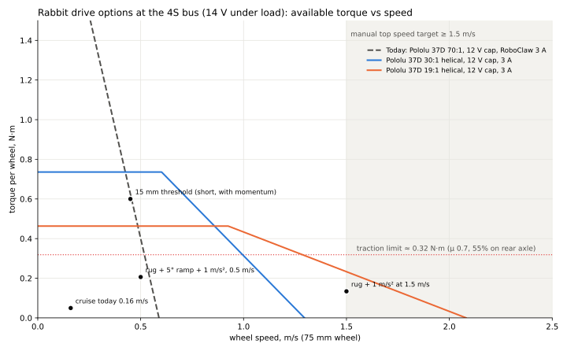

# Rabbit 2.0: привод — замена 37D 70:1 + RoboClaw (BLDC и щёточные варианты)

Дата: 2026-10-03. Робот выключен, всё сделано офлайн: модель шасси `model/chassis.step`, даташит Pololu 37D в `datasheet/`, телеметрия Forge (`log/2026-10-03-power-rails.md`), поиск в интернете. Цены на 03.10, проверять при покупке.

Метки у чисел: **[д]** — даташит или страница продавца, **[и]** — измерено (Forge, модель шасси), **[о]** — оценка или расчёт.

## Итог

- **Решение (03.10, поздний вечер; Q39 закрыт):** владелец выбрал **BLDC с новыми кронштейнами**. Мотор — **maxon ECX FLAT 22 L 18 В + GPX 22 LN 16:1 + ENX 22 MILE 1024** (код конфигурации B845D2FFA4A0, €429,78 за привод, ≈ A$770 без GST): 2,35 м/с при 14 В, Ø22 — помещается над палубой 1 без переделки. Колесо несёт кронштейн на двух SKF 61803-2RS1, вал редуктора передаёт только момент через муфту Oldham. Faulhaber 3216 + 22GPT 11:1 — запасной (быстрее и крепче, но корпус Ø32 заходит в палубу 1 на 0,67 мм). Подробно — §13, CAD — `cad/drive/`. Ниже — исследование до решения.
- **Почему сейчас медленно и шумно:** 70:1 даёт 0,59 м/с и момент в 8 раз больше, чем колёса могут передать на пол (сцепление ~0,32 Н·м на колесо). На 0,5 м/с мотор крутится на 8 900 об/мин: шумят быстрая первая ступень и щётки.
- **Требования:** длительно 0,2 Н·м на колесо, кратковременно 0,6 Н·м; **потенциал 2–2,5 м/с** (ответ владельца: «не гоночная машина и не медленный робот»; 1,5 м/с — пол), круиз задаётся программно; плавно от 0,01–0,03 м/с; удержание на 5°.
- **Место:** штатный кронштейн 6 × M3 на Ø31, отверстие Ø15, вал 6 мм D смещён на 7 мм вниз от оси коробки; шасси расширено — между кронштейнами 142 мм, ~70 мм на мотор. Сейчас стоят **Pololu #4754** (37Dx70L, 70:1, энкодер 64 CPR; подтвердил владелец).
- **Рекомендация (03.10, вечер; правила владельца: прикрутить в штатный кронштейн, готовый качественный мотор со встроенным энкодером, деньги не ограничение):** жёсткий фильтр проходит **только Pololu 37D** — щёточный. Основной — **Pololu #4751 19:1** (37Dx68L, энкодер 64 CPR, косозубая первая ступень): тот же корпус, лицо, вал и хаб. 2,1 м/с без нагрузки при ограничении 12 В, **2,4 м/с при 14 В**; 1,6–1,9 м/с при 0,2 Н·м; пик 0,62 Н·м при 4 А; 1 200 отсчётов на оборот колеса; мотор на 0,5 м/с в 3,7 раза медленнее нынешнего (оценка −11 дБ(A)). A$144,95 в Core Electronics. До платы rev B работает на нынешнем RoboClaw.
- **BLDC — только с новым кронштейном:** Faulhaber 3216 BXT H + 22GPT 11:1 + IEF3-4096 (49 мм, 2,5 м/с при 0,2 Н·м, 180 000 отсчётов на оборот колеса) или maxon ECX FLAT 22 L + GPX 22 LN 16:1 + ENX 22 MILE (45–50 мм, 2,1 м/с, редуктор на ~5 дБ тише стандартного). Около A$750 и больше за ось, печатный или алюминиевый кронштейн. Тише и лучше на малой скорости, но не «прикрутить как есть»; выбор за владельцем (Q39). Готовые «голые» JGB37 BLDC и JGB37 со встроенным драйвером отпадают: нет энкодера, слабые даташиты. Pololu 30:1 #4752 — запасной с той же посадкой.
- **На плате rev B (§8, требования для агента платы):** состав блока прежний — STM32G474RET6 + 2 × DRV8316CR (щёточный мотор на двух полумостах, BLDC на трёх), E-stop в железо (BKIN + DRVOFF через И-НЕ), тормозной ключ 17,6 В, руль и бамперы в MCU. Изменилось: J_ENC теперь инкрементальный 5 В A/B/I на таймеры, а не SSI; MT6701 убран. Модули Pololu на плате заменяются микросхемами из каталога JLC.
- **Батарея (Q22):** по спецификации NEEWER площадка и D-Tap принимают заряд 16,8 В до 8 А; поведение BMS на полном заряде и при бросках неизвестно — проектируем как «не принимает»: ток назад ≤ 0,5 А в прошивке, тормозной ключ 17,6 В (§7).
- **Главные неизвестные:** насколько плавно Pololu 19:1 едет на 0,01–0,03 м/с (щётки, люфт); поведение DRV8316 в роли H-моста (проверить на DRV8316REVM); реальный шум 19:1 (замер M11).

## 1. Что стоит сейчас

| | Значение | Откуда |
|---|---|---|
| Моторы | 2× Pololu 37D 70:1, 12 В, щёточные, «helical pinion» (первая ступень косозубая с 2019 г.) | [д] [даташит](../../datasheet/pololu-37d-metal-gearmotors-rev-1-2.pdf) |
| Версия | **Pololu #4754** «70:1 Metal Gearmotor 37Dx70L mm 12V with 64 CPR Encoder (Helical Pinion)» — подтвердил владелец 03.10; 64 × 70 = 4 480 отсчётов на оборот колеса | владелец |
| Характеристики при 12 В | без нагрузки 150 об/мин и 0,11 А; стопор ~270 кг·мм (2,65 Н·м) и 5,2 А; макс. КПД 52% при 0,31 Н·м; допустимо длительно 100 кг·мм (0,98 Н·м), кратковременно 250 кг·мм | [д] |
| Контроллер | RoboClaw 2x30A, packet serial, 50 Гц опрос | [д] |
| Колёса | Ø75 мм (в модели 74,9 × 29,2), хаб — шестигранник 12 мм на валу 6 мм D | [и] |
| Ток мотора в езде | медиана 0,03 А, p99 0,45 А, старты 3,3–4,7 А | [и] Forge 1–3 окт. |
| Скорость | 0,464 м/с на единицу скважности при 12 В; круиз nav 0,35 = 0,16 м/с; потолок ~0,55 м/с с нагрузкой | [и] |

**Почему медленно.** 70:1 даёт на колесе 150 об/мин = 0,59 м/с без нагрузки. Момент при этом в 8 раз больше, чем может передать резина на пол (§2): редуктор «съедает» скорость ради момента, который не нужен.

**Почему шумно.** При 0,16 м/с мотор крутится на 2 850 об/мин, а на 0,5 м/с — на 8 900 об/мин, почти без нагрузки: несколько ступеней прямозубых передач (первая косозубая), щётки и коллектор. Шум зацепления растёт со скоростью шестерни на входе (§2.4). BLDC без щёток с меньшим передаточным числом крутится в 2–5 раз медленнее на той же скорости робота.

## 2. Требования в числах

Масса 4,5 кг (2.0 с Pi, лидаром и бамперами; сегодня ~3,5), вес 44,1 Н. Колесо r = 37,5 мм. Привод задний, на заднюю ось ~55% веса [о]. Все расчёты — в `media/bldc-drive.py`.

### 2.1. Скорость

| | м/с | об/мин колеса | Почему |
|---|---|---|---|
| Минимум плавно | **0,03** (цель 0,01) | 7,6 (2,5) | парковка у зарядки, подъезд к цели. Сегодня nav не едет медленнее 0,2 скважности ≈ 0,09 м/с: ниже щёточный мотор с редуктором дёргается и встаёт |
| Круиз автономно сейчас | 0,16 | 41 | `CRUISE_SPEED` 0,35; уверенность позы ZED падает выше ~0,2 м/с (`log/2026-10-03-nav-replay.md`) |
| Круиз автономно в 2.0 | 0,5–0,8 | 127–204 | лидар 10 Гц, энкодеры колёс и EKF снимают зависимость от VIO. Роботы-пылесосы ездят 0,3–0,5 м/с |
| Вручную, максимум | **2–2,5** (1,5 — минимум) | 509–637 | ответ владельца (Q21): «потенциал ехать быстро». Тормозной путь при 3 м/с²: 0,38 м с 1,5 м/с, 1,04 м с 2,5 м/с; 2,5 м/с — 25 см за оборот лидара, поэтому в автономе скорость ограничивает программа |
| Запас регулятора | ×1,2 | ~640–760 при 14 В | регулятору скорости нужен запас напряжения, батарея проседает до 14 В под нагрузкой и до 12,4 В разряженной |

Диапазон 0,03…1,5 м/с — это **1 : 50**, а 0,01…1,5 — 1 : 150. Для щёточного мотора с ШИМ по напряжению это предел; для BLDC с FOC и энкодером на валу мотора — обычный режим.

### 2.2. Момент на колесе

| Нагрузка | Сила, Н | Момент на колесо, Н·м |
|---|---|---|
| Качение по паркету (Crr 0,015) [о] | 0,66 | 0,012 |
| Качение по ковру (Crr 0,06) [о] | 2,65 | 0,050 |
| Подъём 5° | 3,85 | 0,072 |
| Разгон 1 м/с² / 1,5 / 2 | 4,5 / 6,75 / 9 | 0,084 / 0,127 / 0,169 |
| **Ковёр + 5° + 1 м/с²** | 11,0 | **0,21** — расчётный длительный |
| Сцепление (μ 0,7, 55% на задней оси) [о] | 17,0 | **0,32** — больше колёса не передадут на пол |
| Заднее ведущее колесо на порог 15 мм, статически | — | 0,36 + толкать переднюю ось |
| Передние колёса на порог 15 мм, статически | 26,5 | больше сцепления: **порог 15 мм статически не взять** ни с каким мотором |

- **Порог 15 мм** берётся только с разгона: передней оси нужно поднять 0,3 Дж, у робота на 0,5 м/с кинетическая энергия 0,56 Дж. Значит, на пороге нужен разгон до ≥ 0,4–0,5 м/с и кратковременно **0,4–0,6 Н·м** на колесо. Пиковый момент выше ~0,6 Н·м бесполезен: колёса буксуют.
- **Проверка по Forge:** p99 тока 0,45 А на 70:1 — это ~0,19 Н·м на колесе (крутизна по даташиту 0,018 А на кг·мм) [и]. Совпадает с расчётным 0,21.
- **Удержание на уклоне 5°:** 0,072 Н·м на колесо, длительно без движения. У BLDC это ток в обмотке при нулевой скорости (нагрев), у червяка или большого редуктора — трение.

**Итог требований на один мотор:** длительно **0,2 Н·м**, кратковременно (1–2 с) **0,6 Н·м**, скорость **≥ 640 об/мин** колеса при 14 В без нагрузки (2,5 м/с), плавно от **2,5–8 об/мин**.

### 2.3. Мощность и ток

| Режим | Механическая мощность на оба колеса | Ток от батареи 14,5 В [о] |
|---|---|---|
| 0,16 м/с по ковру | 0,4 Вт | < 0,1 А |
| 0,5 м/с, ковёр + 5° | 3,2 Вт | ~0,4 А |
| 1,5 м/с, ковёр + разгон 1 м/с² | 10,7 Вт | ~1,2 А |
| Разгон на пределе сцепления (17 Н) до 1,5 м/с | 26 Вт | ~2,5–3 А |

КПД мотор+редуктор+драйвер принят 60–70% для BLDC с редуктором и 35–50% для 37D на рабочем участке [д по графикам Pololu]. Батарея 99 Вт·ч, компьютеры берут 15–25 Вт: привод даже на 1,5 м/с добавляет единицы процентов к расходу.

**Ток моторов не должен превышать 2 × 4 А** на пике: площадка V-mount даёт 14 А, а Jetson + Pi + руль на пиках ~6 А (`architecture-2.0.md`, «Силовая часть»). Сегодняшние старты 37D по 3,3–4,7 А ограничивает только понижайка 12 В.

### 2.4. Шум: что шумит сейчас

Замеров шума у робота нет: первым делом записать телефоном (этап 0, §10). Что известно:

| Источник | Что говорят данные | Метка |
|---|---|---|
| Первая ступень редуктора 37D | на форуме Pololu владелец 37D 70:1: шумят маленькие быстрые шестерни, медленный конец «почти беззвучен». Pololu отвечает, что механический шум убрать нечем и предлагает только ШИМ 20 кГц от электрического писка. Смазка, по Pololu, не помогает | [д] [форум 1](https://forum.pololu.com/t/like-37d-gearmotor-70-1-but-quieter/7257), [2](https://forum.pololu.com/t/help-its-too-noisy/21456), [3](https://forum.pololu.com/t/gearmotor-lubrication/5308) |
| Косозубая первая ступень | у нынешних 37D уже есть (с 2019 г.): «reduces noise and vibration» — dB не приводятся | [д] даташит |
| Скорость мотора | 70:1 на 0,5 м/с — 8 900 об/мин; тон зацепления первой ступени — единицы кГц, где ухо чувствительнее всего | [о] |
| Щётки и коллектор | широкополосный шум, растёт со скоростью | [о] |
| ШИМ RoboClaw | частота ШИМ в даташите 2x30A и руководстве не указана; часто называют ~20 кГц — **не подтверждено**, проверить спектром | [о] |
| Шум зацепления от скорости | правило: +~6 дБ на удвоение скорости шестерни. Источника с замером не нашлось | [о] |

**Что отсюда следует:** главный рычаг — **меньшая скорость первой ступени** на той же скорости робота. 19:1 вместо 70:1 — в 3,7 раза медленнее (−~11 дБ по правилу выше, оценка), BLDC без щёток убирает коллектор, синусоидальная коммутация (FOC) убирает тон коммутации, который есть у трапецеидальной (TI, [DRV10987](https://www.ti.com/product/DRV10987): синус «significantly reduces the pure tone acoustics»).

Ориентиры по шуму у готовых FOC-приводов [д], условия замера у всех разные: прямой привод Waveshare DDSM400 ≤ 40–45 дБ(A), DDSM210 ≤ 48 дБ(A); планетарные 10:1 CubeMars AK40-10 — 50 дБ на 65 см, Steadywin GIM4305-10 — < 60 дБ.

## 3. Посадочное место (модель шасси)

Измерено в `model/chassis.step` (build123d), сверено с чертежом Pololu. Оси модели: X поперёк (центр робота X ≈ 2,5), Y вдоль, Z вверх; пол на Z = 6,95 (низ колеса). Ниже — расстояния от центра робота и от пола.

| Элемент | Размер | Откуда |
|---|---|---|
| Кронштейн мотора | L-образный, лицевая пластина 3 мм, 36,9 × ~42 мм, внутренняя грань на 60,3 мм от центра робота. Лапа крепится к палубе 1 двумя винтами M4 с шагом 27 мм вдоль робота | [и] |
| Отверстия лицевой пластины | **6 × Ø3,2 на окружности Ø31**, через 60°; центральное Ø15 под бобышку редуктора | [и], совпадает с Pololu: 6 × M3 на Ø31 [д] |
| Ось редуктора (центр окружности) | 44,5 мм над полом — на 7 мм выше оси колеса | [и] |
| Выходной вал | Ø6 мм, лыска 5,4 мм, **смещён на 7,0 мм вниз** от оси редуктора; бобышка Ø12 × 6 мм, вал 16 мм за бобышкой (22 мм от торца) | [д] Pololu, [и] |
| Ось колеса | 37,5 мм над полом, на 83 мм от центра робота по X | [и] |
| Хаб колеса | Ø12 × 11,8 мм с радиальным винтом M4 на вал + шестигранник 12 мм × 6 мм в колесо, винт M3 по оси | [и] |
| Колесо | Ø74,9 × 29,2 мм, внутренняя грань на 66,6 мм от центра | [и] |
| Зазор кронштейн — колесо | ~3,3 мм | [и] |
| Корпус мотора по высоте | Ø37 по оси 44,5 мм: от 26 до 63 мм над полом. Палуба 1 — 20,2…22,2 мм над полом; плата тела снизу — 69,8 мм (стойки 45 мм) | [и], `body-pcb.md` §3 |
| Вырез в палубе 1 под моторами | X −34…+34 мм от центра в зоне оси (Y 75–90) | [и] |
| Длина места по оси | по модели кита 60,3 мм на мотор — **устарело**: шасси расширено, между кронштейнами 142 мм, ~70 мм на мотор (владелец, 03.10) | [и], владелец |
| Вес мотора 37D | 175–195 г без энкодера, 190–210 г с энкодером | [д] |

**Что следует из модели:**
- колесо висит **только на валу мотора**: подшипник выходного вала держит вес робота (~12 Н на колесо) и удары;
- любой соосный мотор (планетарный редуктор, gimbal) поставит колесо на ось редуктора, а она **на 7 мм выше** нынешней оси колеса. Чтобы ось колеса не поменялась, новый мотор надо сместить на 7 мм вниз: **новый кронштейн** на те же два винта M4 лапы (печать или алюминий), а не переходная пластина на старый кронштейн — в его центральное отверстие Ø15 вал на 7 мм ниже центра не проходит;
- по длине: в модели кита ~58 мм, но **шасси расширено** — на деле ~70 мм на мотор (142 мм между кронштейнами), нынешний 37Dx70L помещается;
- по диаметру: вниз до палубы 1 от оси колеса 15 мм (Ø30 соосно с колесом — предел без выреза в палубе), вверх до платы 32 мм. Корпус до Ø40 со смещением оси на 7 мм вверх, как сейчас, помещается.

## 4. Моторы, которые встают в это место

*График — в §6.1. Момент на колесе, доступный на каждой скорости при 14 В на шине (батарея под нагрузкой): прямая «без нагрузки → стопор», срезанная ограничением тока контроллера. Точки — требования из §2. Скрипт `media/bldc-drive.py` (`uv run docs/reports/media/bldc-drive.py`).*

### 4.1. Сравнение

| Вариант | Скорость при 4S, м/с (без нагрузки / при 0,2 Н·м) | Момент на колесе, Н·м | Ток | Масса | Шум | Посадка | Цена за 2 |
|---|---|---|---|---|---|---|---|
| **Сегодня:** Pololu 37D 70:1 #4754, 12 В с ограничением скважности | 0,59 / 0,55 [д] | стопор 2,65, редуктор 0,98 длительно [д] | 0,11 А х.х., стопор 5,2 А при 12 В | 190–210 г | «really slow and noisy» (блог #148, июль 2025) | — | есть |
| **Pololu 37D 19:1 #4751** (12 В, энкодер 64 CPR, косозубая 1-я ступень) | 2,08 / 1,57 [д, о] | стопор 0,83; 0,62 при 4 А [д] | х.х. 0,12 А, стопор 5,4 А | 190–210 г | та же коробка, мотор в 3,7 раза медленнее на той же скорости робота | **как есть**: те же отверстия, вал, хаб | 2 × US$60,95 |
| Pololu 37D 30:1 #4752 | 1,30 / 1,08 [д, о] | стопор 1,37; 0,98 при 4 А | | | мотор в 2,3 раза медленнее | как есть | 2 × US$60,95 |
| Pololu 37D 24 В 19:1 #4691 на 14,5 В | 1,26 / 0,81 [о] | стопор ~0,56 [о] | стопор ~1,8 А: ограничение тока «само собой» | | | как есть | 2 × US$60,95 |
| BLDC JGB37-3650 со **встроенным драйвером** (NFP, PFDE, Chihai CHR-GM37), 12/24 В, 6,3–18,8:1 | 18,8:1 при 12 В: 1,85 / 1,55 [л, о] | номинал 0,26, стопор 1,06 при 12 В (NFP 18,8:1) [л] | номинал 2 А | ~250–300 г [о] | без щёток; редуктор прямозубый | **те же 6 × M3 на Ø31, смещение 7 мм, вал 6 мм D** — по чертежам PFDE и Chihai (03.10); 50 мм мотор + 19–21 мм коробка ≈ 69–71 мм | ~A$36–56 с доставкой за шт. [л] |
| BLDC JGB37-3625 / 3525 (короткий; в листинге — со встроенным драйвером) | 10:1: 600 об/мин при 12 В [л]; со своим FOC при 14 В — 2,6 м/с [о] | со встроенным драйвером номинал 0,055, стопор 0,22 при 10:1 [л]; со своим FOC пик ~0,30 [о, §6.1] | номинал 0,8 А, стопор 1,8 А (12 В) | 170–180 г | | 26 мм мотор + 19 мм коробка: **влезает в 58 мм** с крышкой энкодера | ~A$35 [л] |
| BLDC 36 мм + планетарный 36GP-3650, 14:1 | 1,3 [л] | номинал 0,39 (12 В) / 0,78 (24 В) [л] | ≤ 1,8–2,6 А | ~450 г | планетарный, dB нигде не опубликованы | вал **8 мм D** по оси: новый кронштейн + хаб 8 мм, а корпус Ø36 на оси колеса **уходит в палубу 1 на ~3 мм** (§3) → вырез в палубе | 2 × US$52 [л] |
| BLDC 28 мм + планетарный GA28Y-2838 | 25:1: 0,94 при 12 В | номинал 0,10, стопор 0,25 [л] | 0,33 А | 205–235 г | | влезает соосно (Ø28) | 2 × US$36 |
| Прямой привод, gimbal (GM4108, GB54-2, GL40, GL60) | GL60 II: ~0,6 при 16 В [д] | ≤ 0,5 пик у моторов ≤ Ø47; 1,0 пик только у Ø70 [д] | | 124–276 г | самые тихие | Ø47–70 соосно с колесом: в палубу 1 и в колесо, **не помещается** | US$70–330 |
| Актуатор с планетарным 10:1 и своим драйвером (Steadywin GIM4305-10, CubeMars AK40-10) | 0,92–1,2 при 4S [д, о]: обмотки на 24 В | 1,05–1,3 номинал, 3,8–4,1 пик [д] | | 150–185 г, Ø53 | 50 дБ на 65 см (AK40-10), < 60 дБ (GIM4305) [д] | Ø53: не помещается, CAN/RS485 | 2 × ~US$100 |
| Мотор-колёса Waveshare DDSM210 / DDSM400 | DDSM210: 210 об/мин при 14,4 В [д] | 0,25 / 0,85 [д] | | 236–260 г | ≤ 48 / ≤ 40–45 дБ(A) [д] | своя шина и крепление оси: переделка шасси | 2 × US$24–26 |
| maxon / Faulhaber 22 мм (2232BX4 + планетарный) | ~1,4 при 24 В, медленнее на 4S [о] | ~0,25 длительно [о] | | 65 г мотор | заметно тише 37D (форум Pololu) | Ø22: нужен кронштейн | US$600–1000 за ось [о, по памяти] |

[л] — листинг продавца (NFP: precisionminidrives.com, nfpshop.com, microdcmotors.com): цифры шаблонные, ±15%, номинал = стопор / 4 у всех моделей.

### 4.2. Что из этого следует

1. **Прямой привод и готовые актуаторы отпадают.** Моторы ≤ Ø47 не дают 0,6 Н·м, а Ø53–70 не помещаются между палубой 1 и колесом. Обмотки актуаторов рассчитаны на 24–48 В: на 4S они ~1 м/с.
2. **Планетарные 36 мм соосны валу** и ставят колесо на 7 мм выше; чтобы этого не было, корпус надо опустить и вырезать паз в палубе 1. Плюс вал 8 мм, масса 450 г и только встроенные драйверы в найденных листингах. Это не «без переделки шасси».
3. **В место кронштейна 37D встаёт формат JGB37**: та же коробка 37 мм со смещённым на 7 мм валом 6 мм D и 6 × M3 на Ø31 — подтверждено чертежами PFDE JGB37-3650 и Chihai CHR-GM37 (03.10). Собранные BLDC-версии JGB37 продаются **только со встроенным драйвером** (5 проводов: ШИМ, направление, FG 6 импульсов на оборот). Для FOC с нашей платы — голый мотор 3650 с Холлами (Chihai CHB-BLDC3650) и отдельная коробка JGB37 (SONGPUWEI): §6.1.
4. **Главный рычаг по шуму и скорости — передаточное число, а не тип мотора.** На 0,5 м/с мотор 70:1 крутится на 8 900 об/мин, 19:1 (щёточный или BLDC) — на 2 400. BLDC добавляет к этому: нет щёток и коллектора, тихий FOC на 20–25 кГц, плавный ход от 0,01 м/с и удержание с энкодером, ограничение момента и тока в прошивке, питание прямо от 4S без «12 В по скважности».
5. **Длина.** После расширения шасси между кронштейнами 142 мм, ~70 мм на мотор (как у нынешнего 37Dx70L). Модель кита с 58 мм устарела. Выбор — §6.

## 5. Контроллеры

### 5.1. С датчиками или без, FOC или трапецией

| Вопрос | Ответ | Почему |
|---|---|---|
| Бездатчиковый (MCF8316, A89307) | **нет** | наблюдатель противо-ЭДС работает только выше порога перехода (1…19% от макс. скорости в MCF8316A); ниже — разомкнутый пуск без управления моментом. Мотор с 7 парами полюсов на 8 об/мин колеса без редуктора — 0,9 Гц электрических; удержания на месте нет, только «align braking» током в одну фазу, а повторный старт — с рывком ([MCF8316A, SLLSFI0C §7.3.10](https://www.ti.com/lit/ds/symlink/mcf8316a.pdf), [SLLA665](https://www.ti.com/lit/pdf/SLLA665)) |
| Только Холлы | **годится для скорости ≥ ~0,1 м/с**, грубо ниже | 6 × число пар полюсов фронтов на оборот. ODrive советует для низких скоростей другой датчик; в SimpleFOC `SmoothingSensor` прямо написано, что на очень малой скорости Холлы «move in steps» ([ODrive](https://docs.odriverobotics.com/v/latest/manual/hardware-config.html), [SimpleFOC](https://github.com/simplefoc/Arduino-FOC-drivers/tree/master/src/encoders/smoothing)). У 3650 по FG 6 импульсов/об — видимо, 2 пары полюсов: 12 фронтов на оборот мотора; с 6,25:1 на 0,03 м/с — ~10 фронтов/с, это слишком грубо |
| **Магнитный энкодер на валу мотора** | **да** | MT6701 / AS5047P: 14 бит, 16 384 отсчёта на оборот. На 0,03 м/с при 10:1 — 76 об/мин мотора, ~21 000 отсчётов/с; удержание позиции и FOC на нуле скорости. Магнит Ø6 диаметральный на заднем конце вала (у XYT 3625 вал выходит с обеих сторон) |
| Трапеция или синус | **FOC (синус)** | трапеция 120° даёт пульсации момента и тон коммутации (TI [SSZTCX2](https://www.ti.com/lit/pdf/SSZTCX2)); в замерах TI [SLLA567](https://www.ti.com/lit/pdf/SLLA567) FOC тише синуса без FOC на 2,7 дБА, 150° тише 120° на 3,3 дБА |
| Частота ШИМ | 20–25 кГц | выше слышимого; SimpleFOC по умолчанию 25 кГц на STM32 |

### 5.2. Микросхемы для своей платы

| Часть | Что | Ключевое | LCSC, цена, наличие 03.10 [л] |
|---|---|---|---|
| **DRV8316CR** (SPI) / CT (выводы) | 3 полумоста со своими ключами + 3 усилителя тока | 4,5–35 В (абс. 40), 95 мОм верх+низ, 8 А пик, **~3 А RMS длительно** (TI: корпус 66 °C при 3 А RMS, 20 кГц), защита от перенапряжения, VQFN-40 7 × 5 мм | [C5447274](https://www.lcsc.com/product-detail/C5447274.html) US$4,30, 2 833 шт.; CT [C6602057](https://www.lcsc.com/product-detail/C6602057.html) US$4,06 |
| DRV8316R | то же без OVP | | C5218861, **3 шт.** |
| DRV8317 / DRV8311 | меньше ток | 20 В рабочее / 24 абс. — **мало для 4S с рекуперацией** | — |
| DRV8323RS / DRV8353RS | драйвер затворов + свои MOSFET | для 1–3 А избыточен, больше места | C2653553 / C506246 |
| MCT8316Z | Холлы + **трапеция** в железе, без MCU | шумнее, низкой скорости нет | C3681249 |
| MCF8316A/C/D | бездатчиковый FOC в железе, I2C | см. 5.1 — не подходит | C3681167 |
| **STM32G474RET6** (LQFP-64; CEU6 QFN-48 — C1235412 — не хватает выводов, §8.3) | MCU на оба мотора | 170 МГц, FPU, CORDIC, 5 АЦП, 3 продвинутых таймера (TIM1/TIM8/TIM20 с входом аварийного останова BKIN), FDCAN на будущее | C521608 US$13,54, 242 шт. |
| STM32G431CBU6 | дешевле, 2 АЦП | тоже потянет два мотора, но с меньшим запасом по АЦП | C529356 US$7,91 |
| STSPIN32G4 | G431 + драйвер затворов 5,5–75 В в одном корпусе | нужны внешние MOSFET; «2 мотора с одного MCU» только со вторым драйвером | C7434864 US$6,11 |
| TMC9660 (ADI) | FOC, скорость и положение **в железе**, драйвер затворов 7,7–70 В, UART/SPI, сторожевой таймер | интересно: Pi говорит с ним по UART без своей прошивки; но нужны 6 MOSFET и шунты на мотор, и это один мотор на корпус | C46628628 US$19,26, 49 шт. |
| TMC4671 + TMC6200 | FOC в железе + драйвер затворов | ~US$70 на ось | C465954 |
| Infineon IMD700A | XMC1404 + драйвер 6EDL7141 | дешёво, но экосистема и SimpleFOC — нет | C6577830 US$2,93 |
| **MT6701** (QFN / SOP8) | магнитный энкодер 14 бит, SSI/I2C + ABZ до 1024 PPR + UVW | < 5 мкс задержки, дёшев, есть в SimpleFOC | [C2913974](https://www.lcsc.com/product-detail/C2913974.html) US$1,90 |
| AS5047P | 14 бит SPI + ABI 4096 | эталон для FOC, магнит Ø8 × 3 мм на 2 мм | C962063 US$4,72 |
| AS5600 | 12 бит I2C | медленный, для FOC на скорости плох | C499458 |

### 5.3. Готовые модули для прототипа

| Модуль | Цена | Напряжение / ток | Связь с Pi 4 | Датчики | Прошивка | Два мотора? |
|---|---|---|---|---|---|---|
| **SimpleFOC Mini v2.3** (DRV8316) | **US$6,90** [л] | 5–35 В, 8 А пик (~3 А длит. [о]), 3 усилителя тока, 24 × 25 мм | только силовая часть: нужен MCU, дальше UART | через MCU | открытая (SimpleFOC) | 2 модуля на один MCU |
| SimpleFOCShield v2/v3 | ~US$15–25 [о] | ≤ 35 В, 2 А | через Arduino-плату | энкодер/Холлы | открытая | нет |
| MKS ESP32 FOC V2 | ~US$30–40 [о] | 12–24 В, **два мотора**, 6 А пик, шунт 1 мОм (грубо на 1–3 А) | UART/Wi-Fi ESP32 | Холлы, SPI/I2C/ABI | открытая (SimpleFOC) | **да** |
| B-G431B-ESC1 (ST) | ~US$19 [о] | до ~6S, 40 А пик, шунты 3 мОм (грубо) | UART (площадки CAN) | Холлы/ABZ | открытая (MCSDK / SimpleFOC) | нет |
| ODrive Micro | US$89 [л] | 10–31 В, 3,5 А длит. / 7 А пик, 32 × 32 мм, энкодер MA702 на плате | **только CAN/USB**: нужен CAN-HAT (MCP2515) | Холлы, ABZ, SPI | закрытая | нет |
| ODrive S1 | US$149 | 12–48 В, 40 А | USB, UART, CAN, step/dir | | закрытая; выход на тормозной резистор | нет |
| moteus c1 | US$69 [л] | 10–51 В, 5 А длит., 20 А пик, 38 × 38 мм, абсолютный энкодер на плате | **только CAN-FD** (MCP2518FD, pi3hat US$149) | свой + aux | **открытая (Apache-2.0)**, «flux braking» вместо резистора | нет |
| Tinymovr M5 | €88 | «5 А, для gimbal» | CAN | свой | открытая | нет |
| SOLO Pico | €89 | 8–58 В | USB, **UART**, CANopen | энкодер, Холлы | закрытая | нет |
| VESC-класс (Flipsky Mini) | US$60–90 | 50 А | UART/CAN/USB | Холлы/энкодер | открытая | нет; шунты слишком грубые для 1–3 А |

**Выбор для стенда (по правилу «качество, не самое дешёвое»):** TI DRV8316REVM (A$202) + NUCLEO-G474RE (A$32): эталонная плата TI с той же связкой DRV8316 + G474, что пойдёт на плату тела. SimpleFOC Mini — дешёвая копия той же схемы. Pi говорит с ним по UART0 вместо RoboClaw. ODrive Micro и moteus c1 лучше «из коробки» (тормоз, сторожевые таймеры, настройка), но требуют CAN-шины на Pi и другого протокола, а на плату их прошивку не перенести.

## 6. Рекомендация

**Новые факты и правила владельца (03.10, вечер):**
1. **Шасси расширено.** Между кронштейнами 142 мм, то есть ~70 мм на мотор от грани кронштейна внутрь. Нынешние моторы — **Pololu #4754** «70:1 Metal Gearmotor 37Dx70L mm 12V with 64 CPR Encoder (Helical Pinion)», 4 480 отсчётов на оборот колеса. Модель кита с её 58 мм устарела.
2. **Жёсткий фильтр — прикрутить в штатные кронштейны без переделки:**
   - лицо 6 × M3 на Ø31;
   - бобышка входит в отверстие Ø15;
   - корпус ≤ Ø37;
   - выход там же, где сейчас: смещение 7 мм;
   - вал 6 мм D под нынешний хаб 12 мм.

   Всё, что требует переходника или другого кронштейна, — отдельным списком, ниже.
3. **Готовые качественные моторы со встроенным энкодером:** без самодельных магнитов, без снятия встроенных драйверов. **Деньги не ограничение:** порядок — посадка, затем качество и надёжность, затем цена.

Ответы раньше: сразу BLDC (Q17); потенциал 2–2,5 м/с, 1,5 — пол (Q21).

### 6.1. Кто проходит жёсткий фильтр

| Кандидат | Лицо 6 × M3 Ø31, смещение 7 мм, вал 6 мм D | Длина ≤ 70 мм | Встроенный энкодер | Качество и даташит | Итог |
|---|---|---|---|---|---|
| **Pololu 37D 12 В, косозубая 1-я ступень, энкодер 64 CPR** (#4751 19:1, #4752 30:1, #4758 10:1) | **да**: тот же корпус, что у нынешнего #4754 | 37Dx68L (19:1, 30:1), 37Dx65L (10:1) | да, 64 CPR на валу мотора | да: полный даташит с графиками на каждое число ([PDF](../../datasheet/pololu-37d-metal-gearmotors-rev-1-2.pdf)), один и тот же производитель с 2019 г. | **проходит** — единственный |
| BLDC JGB37-3650 / 3625 (PFDE, Chihai CHR-GM37, XYT, NFP) | да, по чертежам продавцов | 3650 ~69–71 мм; 3625 ~45 мм | **нет**: только встроенный драйвер с FG 6 имп./об (ШИМ-скорость, без управления моментом); «голых» с энкодером в продаже нет | шаблонные листинги AliExpress, ±15% | не проходит (энкодер, качество) |
| maxon (ECX FLAT 22 L, ECX TORQUE 22 L) + GPX 22 + ENX | **нет**: фланец Ø22, M2/M2.5, вал соосный | 45–50 мм (FLAT) | да | высшее | → «нужен переходник» |
| Faulhaber 3216 BXT H / 2232 BX4 + 22GPT + IEF3 | **нет**: 6 × M2 на ~Ø15, вал соосный | 49–60 мм | да | высшее | → «нужен переходник» |
| DJI M2006 P36 + C610 | нет (Ø24,4, свой фланец) | 64,8 мм | да (8 192 на оборот ротора) | хорошее | → и медленно: ~1,2–1,4 м/с на 4S, ESC на 24 В |
| Dynamixel X, Nidec 24H, Dunker BG 32, Moons | — | — | — | — | не подходят: медленно (Dynamixel ≤ 95 об/мин), без редуктора и энкодера (Nidec 24H), длинно (BG 32 + PLG + энкодер > 100 мм) |

**Вывод.** Прямо в кронштейн с качественным встроенным энкодером встаёт только **Pololu 37D** — щёточный. **BLDC, отвечающих всем условиям, в продаже нет.** BLDC высокого класса (Faulhaber, maxon) требуют нового кронштейна. Это противоречит раннему «сразу BLDC» (Q17), и решать владельцу (Q39). По правилу «сначала посадка» основной вариант — Pololu.

### 6.2. Основной: Pololu #4751 (19:1) — прикручивается как есть

| | |
|---|---|
| Деталь | **Pololu #4751** «19:1 Metal Gearmotor 37Dx68L mm 12V with 64 CPR Encoder (Helical Pinion)», 2 шт. + 1 запасной |
| Посадка | тот же корпус, лицо, смещение, вал и хаб, что у #4754; на 2 мм короче (68 против 70 мм), 190–210 г |
| Скорость | без нагрузки 2,08 м/с при ограничении 12 В (`duty_max`); **2,43 м/с при 14 В** без ограничения. При 0,2 Н·м — 1,58 / 1,93 м/с, на ковре — 1,96 / 2,30 м/с [д + о] |
| Момент | стопор 0,83 Н·м при 12 В; **0,62 Н·м при 4 А** (выше сцепления 0,32) [д] |
| Ток | х.х. 0,12 А, 0,2 Н·м ≈ 1,5 А, стопор 5,4 А при 12 В [д] |
| Энкодер | 64 CPR × 18,75 = **1 200 отсчётов на оборот колеса** (0,2 мм хода на отсчёт) |
| Низкая скорость | 0,03 м/с = 7,6 об/мин колеса = 143 об/мин мотора = 152 отсчёта/с — плавно; 0,01 м/с = 51 отсчёт/с — шагами (трение щёток, люфт), нужна оценка скорости по периоду импульсов [о] |
| Шум | та же косозубая первая ступень, но на 0,5 м/с мотор крутится на **2 400 об/мин вместо 8 900** у 70:1: оценка **−11 дБ(A)** по правилу 6 дБ на удвоение (не замер); щётки остаются |
| Ресурс | при 14 В без ограничения Pololu предупреждает о сокращении ресурса щёток. Режим «быстро» включается программно (`MOTOR_VOLTAGE`), круиз — с ограничением 12 В |
| Цена | **A$144,95** за шт. в Core Electronics (под заказ, срок не указан), US$60,95 на pololu.com |
| Где | [Core Electronics #4751](https://core-electronics.com.au/19-1-metal-gearmotor-37dx68l-mm-12v-with-64-cpr-encoder-helical-pinion.html), [Pololu #4751](https://www.pololu.com/product/4751) |

**Альтернатива с той же посадкой:** **#4752 30:1** (37Dx68L, A$149,95). Даёт 1,30 м/с без нагрузки, 0,98 Н·м при 4 А и 1 920 отсчётов на оборот колеса — плавнее на малой скорости и сильнее на порогах, но медленнее цели. #4758 10:1 быстрый (3,9 м/с), но пик всего ~0,32 Н·м при 4 А, а при 0,2 Н·м мотор работает на 40% стопора и греется — не берём.

### 6.3. Нужен переходник: BLDC высокого класса (тише, лучше на малой скорости)

Оба привода — BLDC с Холлами и энкодером. Встроенная плата STM32G474 + DRV8316 (§8) ведёт их без изменений.

| | **F1: Faulhaber 3216W012BXTH + IEF3-4096 + 22GPT 11:1** | **M1: maxon ECX FLAT 22 L 18 В + GPX 22 LN 16:1 + ENX 22 MILE** |
|---|---|---|
| Длина за фланцем | 43,0 + 6,2 = **49,2 мм** | ~43,4 + энкодер ≈ **45–50 мм** |
| Диаметр | мотор Ø32, редуктор Ø22 | Ø22 (у старой версии сбоку выступает плата Холлов) |
| Без нагрузки / при 0,2 Н·м, 14,5 В | **2,69 / 2,49 м/с** | **2,32 / 2,07 м/с** |
| Момент длительно / пик на колесе | 0,35 / 1,1 Н·м (предел редуктора) | 0,43 / 0,7 Н·м (предел редуктора) |
| Ток при 0,2 / 0,5 Н·м | 1,33 / 3,1 А | 1,16 / 2,8 А |
| Энкодер | IEF3-4096: 4 096 линий, 3 канала → 16 384 отсчёта на оборот мотора, **180 000 на оборот колеса** | ENX 22 MILE |
| Выход | Ø6 мм, 16,3 мм; радиальная нагрузка 90 Н на 10 мм | радиальная 100 Н на 10 мм |
| Шум | dB не опубликованы | у GPX 22 **LN** — на ~5 дБ(A) тише стандартного (maxon) |
| Цена | по запросу (оценка A$700–1 000 за ось) | CHF 184,20 + 126,80 + энкодер ≈ CHF 400 ≈ **A$750 за ось** [о] |
| Где в AU | дистрибьютор не найден (страницы партнёров Faulhaber только с JavaScript) — спросить Faulhaber | maxon Australia, Сидней: [maxongroup.net.au](https://www.maxongroup.net.au/maxon/view/catalog), +61 2 9457 7477; цены в CHF; maxon X drives — ~11 рабочих дней (не подтверждено) |
| Даташиты | [3216 BXT H](https://www.faulhaber.com/fileadmin/Import/Media/EN_3216_BXTH_DFF.pdf), [22GPT](https://www.faulhaber.com/fileadmin/Import/Media/EN_22GPT_FMM.pdf), [IEF3-4096](https://www.faulhaber.com/fileadmin/Import/Media/EN_IEF3-4096_DFF.pdf) | каталог maxon, стр. 259 (ECX FLAT 22 L) и 391 (GPX 22 LN) |

**Что за переходник.** Вал у обоих соосный, а нынешний выход смещён на 7 мм вниз от центра отверстий Ø31. Значит, ось редуктора должна стоять на оси колеса, на 7 мм ниже центра кронштейна. Вал Ø6 со смещением 7 мм не проходит в отверстие Ø15 нынешнего кронштейна. Поэтому нужен **новый кронштейн**: печатный (PA-CF на P2S) или фрезерованный алюминиевый, на те же два винта M4 лапы, с фланцем под 6 × M2 Faulhaber или крепёж maxon. Ограничение снизу: корпус Ø22 на оси колеса — 26,5 мм от пола, палуба 1 на 22,2 мм: проходит. Мотор Ø32 у F1 стоит дальше внутрь, над вырезом палубы (по модели кита; на расширенном шасси проверить).

Отброшено при подборе:
- ECX SPEED 22 L — только 24–48 В, нужен 50:1 на высоких оборотах;
- ECX TORQUE 22 L 12 В — с GPX 22 ~85 мм, длинно;
- Faulhaber 2250 BX4 — 78 мм;
- 2232 BX4 + 22GPT 16:1 — 60 мм, но только Холлы и 0,198 Н·м длительно.

### 6.4. Чем управлять

**Плата rev B не меняется по составу.** Блок STM32G474 + 2 × DRV8316 (§8) ведёт оба варианта:
- **щёточный Pololu** — двумя полумостами DRV8316 (OUTA и OUTB, OUTC свободен) в режиме 3x PWM, с теми же усилителями тока; энкодер A/B — на таймеры MCU в режиме энкодера;
- **BLDC Faulhaber/maxon** — тремя полумостами с FOC, Холлы и энкодер A/B/I.

Отличия — только в разъёмах и прошивке (§8, вверху). Для щёточного мотора есть и специализированный H-мост TI DRV8874 (C1855818, 29 975 шт., 37 В, 6 А, IPROPI), но менять блок, который уже разводится, ради него не нужно. Это запасной путь, если на стенде DRV8316 в режиме H-моста поведёт себя плохо.

**До платы rev B** Pololu #4751 работает на нынешнем RoboClaw: в скоростном режиме (QPPS 64 × 18,75 = 1 200 на оборот колеса), с ограничением тока 4 А. Новых модулей не нужно. Проверку DRV8316 в режиме H-моста сделать заранее на **TI DRV8316REVM** + NUCLEO-G474RE.



### 6.5. Купить в Австралии

Цены 03.10, AUD с GST. Mouser AU и RS AU не проверены (защита от ботов).

| Что | Где | Цена, AUD | Наличие | Ссылка |
|---|---|---|---|---|
| **Pololu #4751** 19:1 37Dx68L, энкодер 64 CPR × 3 | Core Electronics | 144,95 | под заказ | [Core](https://core-electronics.com.au/19-1-metal-gearmotor-37dx68l-mm-12v-with-64-cpr-encoder-helical-pinion.html) |
| то же напрямую | pololu.com | US$60,95 + доставка | | [Pololu](https://www.pololu.com/product/4751) |
| Pololu #4752 30:1 × 2 (для сравнения на пороге, по желанию) | Core Electronics | 149,95 | под заказ | [Core](https://core-electronics.com.au/30-1-metal-gearmotor-37dx68l-mm-with-64-cpr-encoder-helical-pinion.html) |
| **TI DRV8316REVM** (стенд H-моста и FOC на эталонной плате TI) | DigiKey AU | 202,16 | 13 | [DigiKey](https://www.digikey.com.au/en/products/detail/texas-instruments/DRV8316REVM/15769131) |
| **NUCLEO-G474RE** (ST-LINK V3E на плате) | DigiKey AU | 32,24 | 2 557 | [DigiKey](https://www.digikey.com.au/en/products/detail/stmicroelectronics/NUCLEO-G474RE/10231585) |
| STLINK-V3MINIE (для платы rev B) | DigiKey AU | 40,85 | 3 892 | [DigiKey](https://www.digikey.com.au/en/products/detail/stmicroelectronics/STLINK-V3MINIE/16284301) |
| Резистор 10 Ом 10 Вт (тормоз на стенде) | Jaycar RR3352 / Altronics R0423 | 1,80 / 1,75 | есть | |
| 1000 мкФ 35 В low-ESR | Jaycar RE6340 / Altronics R5185 | 1,95 / 1,60 | есть | |
| Если владелец выберет BLDC с переходником (Q39): maxon ECX FLAT 22 L + GPX 22 LN 16:1 + ENX 22 MILE × 2 | maxon Australia, Сидней | ~A$750 за ось [о], цены в CHF | ~11 раб. дней [не подтв.] | [maxongroup.net.au](https://www.maxongroup.net.au/maxon/view/catalog) |
| или Faulhaber 3216W012BXTH + IEF3-4096 + 22GPT 11:1 × 2 | Faulhaber (AU-дистрибьютор — уточнить) | по запросу | | [faulhaber.com](https://www.faulhaber.com) |

**Итого основной вариант:** моторы 3 × A$144,95 ≈ **A$435**, стенд DRV8316REVM + NUCLEO ≈ A$235, вместе ≈ **A$670**. Если BLDC с переходником — ещё ~A$1 500–2 000 за два привода плюс кронштейны.

### 6.6. Если что-то не сложится

| Проблема | Что делаем |
|---|---|
| На 0,01–0,03 м/с Pololu дёргается | 30:1 (#4752): 1 920 отсчётов на оборот колеса, мотор в 1,6 раза быстрее на той же скорости |
| Шум 19:1 всё ещё мешает | BLDC с переходником (§6.3): F1 или M1 с GPX 22 LN |
| 2,4 м/с при 14 В сокращает ресурс щёток | круиз с ограничением 12 В, «быстро» — коротко; запасной мотор в комплекте |
| DRV8316 как H-мост ведёт себя плохо на стенде | DRV8874 (C1855818) в той же зоне платы; или RoboClaw через разъём запасного пути (§8.6) |

## 7. Рекуперация и батарея с BMS

**Откуда энергия.** При торможении мотор становится генератором, и контроллер с синхронным выпрямлением (FOC, RoboClaw тоже) отдаёт ток назад в шину.

| | Число | Метка |
|---|---|---|
| Кинетическая энергия 4,5 кг на 0,5 / 1,0 / 1,5 м/с | 0,56 / 2,25 / 5,1 Дж | [о] |
| Мощность торможения 3 м/с² с 1,5 м/с (до потерь) | 20 Вт механических, ~10–14 Вт в шину | [о] |
| Сколько примут конденсаторы шины 1000 / 2200 / 4700 мкФ при подъёме 16,8 → 20 В | 0,06 / 0,13 / 0,28 Дж | [о] |
| Потребление электроники на той же шине | 15–25 Вт постоянно (Jetson 8,5 Вт медиана, Pi, руль, хаб) | [и] power-rails |

**Выводы:**
1. **Конденсаторы рекуперацию не удержат**: 5 Дж против 0,1–0,3 Дж. Если ток некуда деть, напряжение шины моторов за десятки миллисекунд уйдёт за 20 В (TVS SMBJ20A на плате начнёт проводить на ~22 В и сгорит при длительной энергии) и дальше — за 35–40 В, предел DRV8316 и конденсаторов.
2. **Почти всё съест сама электроника.** Шина моторов на плате тела — это та же VBUS, что питает преобразователи Jetson, Pi и руля. Пока отдаваемая мощность меньше их 15–25 Вт, ток батареи остаётся разрядным, и BMS ничего не видит. Обратный ток в батарею появится только при резком торможении с ≥ 1 м/с, когда Jetson простаивает.
3. **Батарея по спецификации NEEWER заряд через площадку принимает** (проверено 03.10, ответ на Q22): в характеристиках PS099E входы «BP/D Tap: 16.8V 8A (Max)» и «USB C: 20V 3.25A», выходы «D TAP / BP 14.54V 14A (Max)»; в описании «Fully charged in 3h via a 16.8V D Tap charger»; у PS099F вход «16.8V/6.8A Max (BP/D-TAP)», у PS099U — входы «USB C1, USB C2, BP, DTAP». NEEWER продаёт зарядку D-Tap 16,8 В 2 А ([PS099E](https://neewer.com/products/neewer-ps099e-6800mah-14-5v-99wh-v-mount-battery-66603180), [картинка портов](https://cdn.shopify.com/s/files/1/0225/2960/5706/files/2_7da0ce94-861b-46d9-bcb9-ed4ac761adf2.jpg), [PS099U](https://neewer.com/products/neewer-v-mount-battery-ps099u-6800mah-99wh-smart-app-control-66609589), [зарядка D-Tap](https://neewer.com/products/neewer-d-tap-battery-charger-with-3-3feet-1m-d-tap-cable-66600885)). **Неизвестно** (разборов и замеров не нашлось): что BMS делает на полном заряде (обычно закрывает зарядный ключ — рекуперация упирается в шину) и при броске тока заряда > 8 А (дешёвые BMS выключают выход целиком — Jetson падает). Поэтому проектируем как «не принимает»: ток назад ограничен прошивкой до 0,5 А (в 16 раз ниже 8 А), а полный заряд закрывает тормозной ключ. Проверить можно на столе: лабораторный блок 16,8 В с ограничением тока в площадку, ступени 1 / 4 / 8 А, при 50% и 100% заряда.

**Три уровня:**

| Уровень | Что | Параметр |
|---|---|---|
| 1. Прошивка | ограничение отрицательного тока шины для каждого мотора (как `dc_max_negative_current` у ODrive): сумма двух ≤ 0,5 А, это ~7 Вт — меньше, чем постоянно берёт электроника. Если заданное замедление требует больше, прошивка тормозит мягче (дольше). Аварийный стоп и E-stop тормозят замыканием обмоток (все нижние ключи открыты, V = 0): ток в шину не идёт, энергия уходит в сопротивление обмоток | Ibus ≥ −0,25 А на мотор; замедление по-прежнему slew 5/с |
| 2. Тормозной ключ (brake chopper) на плате | компаратор с гистерезисом (например, TLV3011 + опора) включает N-MOSFET на резистор, когда шина моторов > 17,6 В, выключает < 17,2 В. Резистор 10 Ом: 1,8 А и 32 Вт пока открыт; на одно торможение с 1,5 м/с — 5 Дж. Средняя мощность мала, резистор нужен по импульсу | 2× 2512 20 Ом 3 Вт параллельно или проволочный 10 Ом 5–10 Вт на краю платы |
| 3. Идеальный диод между батареей и шиной моторов | LM74700QDBVRQ1 (C2941042) + N-MOSFET: обратный ток в батарею запрещён совсем, рекуперация остаётся на шине моторов и уходит в ключ (2) | **не нужен**: батарея заряд принимает, ток назад ограничен 0,5 А. Посадочное место можно оставить с перемычкой |

- **Почему не только прошивка:** зависание MCU в момент торможения, сбой при отладке, ручное толкание выключенного робота (обмотки через диоды ключей заряжают шину) — всё это рекуперация без участия прошивки.
- **Телеметрия:** напряжение шины моторов, время работы тормозного ключа, Ibus каждого мотора — в поток (§9), чтобы на столе увидеть, сколько реально уходит назад.
- **TVS SMBJ20A на выходе выключателя остаётся** последней линией, но рассчитывать на неё нельзя: это импульсная защита, не тормоз.

## 8. PCB rev B requirements for the motor drive

> **Изменение 03.10 (поздний вечер, после выбора BLDC, §13).** Мотор — maxon ECX FLAT 22 L 18 В + GPX 22 LN 16:1 + ENX 22 MILE (BLDC на трёх полумостах; щёточный режим больше не нужен, но не мешает). **Плата не меняется:** J41/J42 (фазы), J43/J44 (Холлы, 5 В, подтяжки 4,7 кОм к 3,3 В подходят), J45/J46 (энкодер) — через переходные кабели, распиновка в §13.6. Отличия для прошивки и проверки: у ENX 22 MILE **нет индекса** (Z не подключён), выходы — драйвер линии КМОП 5 В, берём только A и B; ток типично 0,3–1,2 А, пик 3,5 А на 1–2 с, ограничение Iq 3,7 А; ток КЗ обмотки при 16,8 В 11,7 А — включить ограничение тока DRV8316 и нижний уровень OCP; усиление 0,3 В/А остаётся; ограничение скорости мотора 10 000 об/мин (вход редуктора). Если выберут запасной Faulhaber — у него индекс есть, распиновка там же.

> **Изменение 03.10 (вечер), для агента платы rev B.** Состав блока не меняется: STM32G474RET6, 2 × DRV8316CR, BKIN/DRVOFF, тормозной ключ, руль, бамперы. Основной мотор теперь **щёточный Pololu #4751** с энкодером 64 CPR (§6.2), BLDC Faulhaber/maxon — возможное улучшение (§6.3), и блок должен вести оба. Отсюда три изменения:
> 1. **J_ENC (JST-GH 5, C189896) — инкрементальный энкодер, а не SSI:** 5 В, GND, A, B, I. Питание 5 В нужно энкодерам Pololu (3,5–20 В), Faulhaber IEF3 и maxon ENX (5 В). A/B — на 5-вольт-толерантные (FT) входы таймеров в режиме энкодера (TIM2 и TIM5, по одному на мотор), I — на EXTI (можно не разводить). Выходы энкодера Pololu идут от 0 до Vcc = 5 В.
> 2. **J_MOT (VH 3,96, 3 конт.):** щёточный мотор — на контакты 1–2 (OUTA–OUTB), контакт 3 (OUTC) свободен. BLDC — на все три.
> 3. **Усилитель тока DRV8316:** для Pololu (стопор 5,5 А) — 0,3 В/А (±5,5 А), настройка по SPI. J_HALL (PH 5) остаётся для BLDC; с Pololu не используется.
>
> Ток фаз с Pololu ограничиваем 4 А на пике, ~1 А типично (ниже предела DRV8316 — 8 А пик и ~3 А RMS). Бюджет выводов — 51 из 52 с индексами I, 49 без них.


Требования для агента платы `pcb/rabbit-body/` rev B (сам проект здесь не менялся). Ограничения владельца: **максимум заводской сборки JLCPCB, детали LCSC в наличии, минимум ручной пайки.** Наличие и цены — каталог JLCPCB на 2026-10-03 (API `selectSmtComponentList`), «ext» — расширенная деталь (~US$3 за позицию на заказ), «base» — базовая.

### 8.1. Блок

```
 VBUS ── F2 7,5 А ── шунт 5 мОм (INA ch3, есть) ── MOT_BUS ──┬─ 220 мкФ 35 В + 2 × 10 мкФ 50 В на каждый VM
                                                            ├─ SMBJ20A
                                                            ├─ делитель 100k/10k → АЦП MCU (V_MOT)
                                                            ├─ тормозной ключ: TLV3201 (17,6/17,2 В) → AO3400A → 4 × 56 Ом 2 Вт ∥ (14 Ом)
                                                            ├─ DRV8316CR #1 (SPI) ── OUTA/B/C → J_MOT_L (VH 3,96, 3 конт.)
                                                            └─ DRV8316CR #2 (SPI) ── OUTA/B/C → J_MOT_R
 5V (плата) ── TLV75533 → 3V3_MCU ── STM32G474RET6 (LQFP-64); 5V (плата) → J_ENC (энкодеры моторов)
 5V (плата) ── резистор 22 Ом / PTC ── 5V_HALL → J_HALL_L/R (PH 5 конт.)
 STM32G474: TIM1 CH1–3 → INHA–C #1, TIM8 CH1–3 → INHA–C #2 (режим DRV8316 «3x PWM»: INLx = разрешение),
            TIM1_BKIN + TIM8_BKIN ← ESTOP_RUN, TIM2/TIM5 ← энкодеры A/B (5 В, FT-входы), 6 × GPIO ← Холлы (только для BLDC),
            АЦП ← SOA/SOB/SOC обоих DRV8316, V_MOT, 2 × NTC, USART ↔ UART0 Pi, SPI ↔ DRV8316 (общая шина, 2 × CS),
            TIM15/16/17 → сервоприводы (через SN74AHCT1G125 на 5 В)
 ESTOP_RUN (GPIO16 Pi, 1 кОм к земле) ─┐
 MCU_ALIVE (GPIO, импульсы прошивки → RC) ─┴─ SN74LVC1G00 (И-НЕ) → DRVOFF обоих DRV8316 (высокий = все 6 ключей выключены)
```

- **3x PWM вместо 6x:** INHx — ШИМ, INLx — разрешение полумоста. Экономит 6 выводов. Вход BKIN переводит INHx в 0 при INLx = 1: открыты нижние ключи, торможение замыканием обмоток, без кода. DRVOFF через И-НЕ с «MCU жив» гасит все ключи, если Pi отпустил `ESTOP_RUN` или прошивка зависла. DRVOFF, а не nSLEEP: nSLEEP сбрасывает регистры DRV8316 (даташит SLVSF16B, §8.4.2).
- **MCU питается от рейки 5 В платы**, а не от встроенного понижающего DRV8316 (он есть: 3,3/5 В, 200 мА): MCU должен жить и отчитываться, даже если сгорел F2 моторов. Понижающий DRV8316 не используется (SW_BK — через резистор по даташиту), берётся только его LDO AVDD.

### 8.2. Детали (все в каталоге JLC/LCSC)

| Поз. | Деталь | LCSC | Склад 03.10 | Цена, US$ | Тип | Зачем |
|---|---|---|---|---|---|---|
| U1 | **STM32G474RET6** LQFP-64 | C521608 | 242 | 13,54 | ext | 2 × FOC, 5 АЦП, TIM1/TIM8/TIM20, 52 вывода. LQFP проще QFN для сборки и ремонта |
| U1 (запас) | STM32G431RBT6 LQFP-64 | C431633 | 654 | 5,74 | ext | тот же корпус, 2 АЦП, 128 КБ flash / 32 КБ RAM: хватает, но без запаса |
| U2, U3 | **DRV8316CRRGFR** VQFN-40 | C5447274 | 2 833 | 4,30 | ext | силовые каскады, 95 мОм, 8 А пик, ~3 А RMS |
| U4 | TLV3201AIDBVR | C105188 | 39 590 | 0,97 | ext | компаратор тормозного ключа (питание 5 В, вход — делитель MOT_BUS) |
| U5 | SN74LVC1G00DBVR | C434066 | 22 342 | 0,05 | ext | И-НЕ: `ESTOP_RUN` и `MCU_ALIVE` → DRVOFF |
| U6 | TLV75533PDBVR | C404027 | 136 301 | 0,14 | ext | 3,3 В 500 мА для MCU и энкодеров |
| U7–U10 | SN74AHCT1G125DBVR | C7484 | 47 800 | 0,10 | ext | сигналы сервоприводов 3,3 → 5 В (вход TTL, VIH 2 В) |
| Q1 | AO3400A | C20917 | 954 006 | 0,09 | **base** | ключ тормозного резистора |
| R_BR | 4 × HoCR2512-2W 56 Ом ∥ (14 Ом, 8 Вт) | C2912630 | 3 673 | 0,09 | ext | 1,26 А, 22 Вт пока открыт; одна остановка с 2,5 м/с ≤ 14 Дж |
| D1 | SMBJ20A | C151922 | 81 241 | 0,07 | ext | всплески на MOT_BUS (уже в BOM платы) |
| C_bulk | 220 мкФ 35 В полимер, SMD 8 × 9 | C19270710 | 5 740 | 0,34 | ext | у DRV8316; 1000 мкФ (C1) остаётся на входе ветви |
| C_VM | 10 мкФ 50 В X7R 1210 (CL32B106KBJNNNE) | C138687 | 30 522 | 0,33 | ext | 2 на каждый VM |
| C | 100 нФ 50 В 0603 | C14663 | 58 млн | 0,01 | **base** | развязка, CPH/CPL, VCP — по даташиту DRV8316 |
| Y1 | 8 МГц 3225 | C367183 | 10 982 | 0,34 | ext | UART 1 Мбит/с без ошибки частоты |
| RT1, RT2 | NTC 10k 0603 (NCP18XH103F03RB) | C13564 | 253 328 | 0,05 | ext | температура у DRV8316; NTC у моторов — на кабеле |
| J_MOT ×2 | JST VH 3,96 мм 3 конт. (A3963WV-3P) | C239410 | 68 068 | 0,06 | ext, THT | фазы, 7 А |
| J_HALL ×2 | JST PH 5 конт. B5B-PH-K-S | C157993 | 158 208 | 0,05 | ext, THT | Холлы: 5 В, GND, HA, HB, HC |
| J_ENC ×2 | JST GH 5 конт. SM05B-GHS-TB | C189896 | 47 596 | 0,20 | ext, SMD | инкрементальный энкодер: 5 В, GND, A, B, I (Pololu 64 CPR, Faulhaber IEF3, maxon ENX) |
| J_SWD | 2 × 5 1,27 мм (FTSH-105-01-F-DV-K) | C5382952 | 4 953 | 1,89 | ext, SMD | ST-Link / отладка |
| Энкодер | **не нужен**: энкодер встроен в мотор (Pololu 64 CPR; у Faulhaber/maxon — свой) | — | — | — | — | MT6701 больше не используется |

Детали блока на одну плату ≈ US$40, из них MCU 13,5 и драйверы 8,6; ~17 расширенных позиций (~US$50 разовой наладки на заказ).

### 8.3. Бюджет выводов STM32G474RET6 (52 I/O)

| Группа | Выводов |
|---|---|
| ШИМ 3x: TIM1 CH1–3, TIM8 CH1–3 + 2 × разрешение INL | 8 |
| BKIN TIM1 и TIM8 (оба на `ESTOP_RUN`) | 2 |
| АЦП: ток 2 фазы × 2 мотора (третья вычисляется), V_MOT, 2 × NTC | 7 |
| Холлы 2 × 3 | 6 |
| Энкодеры: TIM2 и TIM5 (A/B, FT-входы) + 2 × I на EXTI (по желанию) | 4–6 |
| SPI к DRV8316: SCK, SDI, SDO, 2 × nSCS; nFAULT (общий, открытый сток); nSLEEP (общий); MCU_ALIVE | 8 |
| USART к Pi; SWDIO/SWCLK; HSE ×2 | 6 |
| Серво 4 × (TIM15 CH1/CH2, TIM16, TIM17) | 4 |
| Бамперы 2 × EXTI; выход компаратора тормоза (счёт времени); светодиод | 4 |
| **Итого** | **49–51 из 52** — распределить в STM32CubeMX до разводки; BOOT0 на G4 совмещён с PB8, не занимать его ничем, что тянет вверх при старте |

### 8.4. Площадь, токи, тепло

| | |
|---|---|
| Площадь | ~50 × 60 мм на оба мотора, MCU, тормозной ключ и разъёмы [о]; место RoboClaw (стойки −52,8…−7,0; −105,3…−38,7, ~51 × 76 мм) освобождается целиком |
| Ток фаз | с Pololu #4751: ~1 А типично, 4 А пик (ограничение прошивки), стопор 5,4 А; с BLDC Faulhaber/maxon — 1,1–1,3 А при 0,2 Н·м, ~3 А пик. Блок рассчитан на 3 А длительно и 8 А пик. Усилитель тока DRV8316 — 0,3 В/А (±5,5 А), настройка по SPI |
| Медь | VM — полигон от `MOT_FUSED` на F и B со сшивкой (≥ 6 переходных 0,8/0,4 на DRV8316); фазы — 2 мм на F + дубль на B, ≤ 30 мм до разъёма; `GND_MOT` как сейчас; PGND DRV8316 → тепловая площадка → ≥ 12 переходных 0,3 мм на In1 и B.Cu |
| Тепло | 2 А RMS на мотор: ~0,8 Вт на DRV8316 → +21 °C (25,7 °C/Вт на EVM TI); езда 0,3–0,5 А — доли ватта; пик 5 А (3,6 Вт) — секунды. Вокруг DRV8316 ≥ 10 мм сплошной меди на обоих слоях, над ним ничего высокого |
| Тормозной резистор | 4 × 2512 в ряд с зазором 2 мм, у края платы, медь под ними — отдельный полигон на B.Cu; при длительной работе ключа (> 1 с) прошивка снижает торможение |
| Аналог | усилители тока DRV8316 → АЦП дорожками над сплошной GND In1, RC 100 Ом/1 нФ у входа MCU; аналоговая земля к PGND в одной точке |

### 8.5. Защита

- Перегрузка: ограничение тока DRV8316 по циклу + Iq в прошивке + F2 7,5 А (вместо 10 А).
- Перенапряжение: OVP DRV8316C; тормозной ключ 17,6 В аппаратно; прошивка гасит ключи на 18,5 В; SMBJ20A.
- Обратная полярность: на входе платы (§8.9), отдельно не нужна.
- Ток ветви в обе стороны (рекуперация): INA4235 канал 3, есть.
- E-stop: BKIN (торможение) и DRVOFF через И-НЕ (выключение) — см. §8.1.

### 8.6. Связь с Pi и запасной RoboClaw

- UART0 Pi (GPIO14/15) → USART MCU, на выводах, которые поддерживает системный загрузчик STM32G4 (USART1 PA9/PA10 или USART2 PA2/PA3 — AN2606). Две перемычки-капли переключают UART0 и `ESTOP_RUN` на 4-контактный разъём «RoboClaw» (TX, RX, S3, GND), плюс винтовая клемма 2 конт. от `MOT_FUSED`/`GND_MOT`. Посадочное место RoboClaw на плате не нужно.
- NRST и BOOT0 MCU — к GPIO0/GPIO1 Pi через 1 кОм (восстановление «окирпиченной» платы); BOOT0 с 10 кОм к земле.
- `MCU_ALIVE`: прошивка дёргает вывод в главном цикле, RC-детектор (диод + 100 нФ + 100 кОм) держит вход И-НЕ высоким, пока импульсы идут.

### 8.7. Руль от STM32G4 вместо PCA9685

- **Да, стоит.** Таймеры TIM15 (2 канала), TIM16, TIM17 дают 4 выхода 50 Гц с шагом 1 мкс (170 МГц / 170 = 1 МГц); сейчас PCA9685 даёт 12 бит на 20 мс ≈ 4,9 мкс. Буфер SN74AHCT1G125 от 5 В на каждый выход, резистор 100 Ом последовательно. Разъёмы сервоприводов S0–S3 остаются.
- **PCA9685 в наличии всё-таки есть** (C92206 — 1 205 шт., C2678753 — 393 шт. на 03.10), но с MCU он не нужен: минус одна микросхема, минус зависимость руля от I2C Pi.
- **Протокол:** узел `rabbit-steering` шлёт угол той же командой по UART (своя команда 200+), тема `rabbit.steering` не меняется. Без команды 0,5 с MCU держит последний угол (руль не должен дёргаться при перезапуске узла), при E-stop — тоже держит.

### 8.8. Что ещё дёшево отдать STM32G4

| Что | Выгода | Цена |
|---|---|---|
| **Бамперы** (2 × EXTI) | рефлекс < 1 мс: MCU сам останавливает моторы в сторону удара и разрешает отъезд назад (правило «бамперы не на линию E-stop» сохраняется); событие уходит на Pi | 2 вывода, уже в бюджете |
| Напряжение шины моторов, температура DRV8316 и моторов | телеметрия без INA | в бюджете |
| Вентилятор Pi (ШИМ) и светодиод состояния | освобождает GPIO Pi | 1–2 вывода |
| **Не отдавать:** ToF (4 шины I2C, 15 Гц × 64 зоны), лидар (UART 460800), INA4235, кнопку питания и EN Jetson | это работа Pi; отказ MCU не должен лишать робота питания и датчиков | — |

### 8.9. Модули на плате → схемы, которые JLC соберёт сам

| Сейчас | Замена на плате | LCSC, склад | Примечание |
|---|---|---|---|
| Pololu D24V90F5 (5 В Pi) | TPS56637RPAR, 6 А, вход 4,5–28 В | C841386, 5 915, US$2,53 | Pi 4 + флешка ≤ 3,5 А; катушка 2,2–3,3 мкГн 8 А (подобрать по даташиту в каталоге JLC) |
| Pololu D36V50F6 (6 В руль) | второй TPS56637RPAR на 6 В | C841386 | пики сервопривода 5,9 А измерены: на пределе 6 А, разнести с 5 В |
| Pololu D36V50F12 (12 В Jetson) | **не понижайка**: вход Jetson по спецификации несущей платы 9–20 В (`datasheet/Jetson Orin Nano DevKit Carrier Board Specification`, J16), поэтому прямое питание от шины через eFuse TPS259474LRPWR (2,7–23 В, EN от Pi, порог перенапряжения 19 В) | C2864845, 3 698, US$1,29 | понижайка 12 В от 12,4–16,8 В всё равно работает в просадке; если хочется ровно 12 В — buck-boost TPS55289RYQR (C5942077, 4 224) |
| Pololu Big Pushbutton HP #2813 | LTC2954CTS8-1 (кнопка вкл/выкл с прерыванием на Pi и входом KILL) + LM74502DDFR (защита от переполюсовки и перенапряжения, драйвер двух N-MOSFET) + 2 × CSD17573Q5B | C683782 (2 310), C3236215 (8 154), C202231 (542) | ~15 А через пару MOSFET 1 мОм — меньше нагрев, чем у #2813 (16 А тепловой предел) |
| RoboClaw 2x30A | блок §8.1 | — | |
| PCA9685 | таймеры MCU (§8.7) | — | |

Модули Pololu на штырях JLC может впаять как THT, но их нет в каталоге: их пришлось бы везти самим (consigned parts). Микросхемы выше — в каталоге и ставятся автоматом.

### 8.10. Что JLCPCB соберёт сам

- **SMT с двух сторон и THT** в обоих режимах (Economic и Standard PCBA): «Single & double sided placement (SMT/Thru-hole)», THT — волной; размер платы до 460 × 500 мм (наша 120,5 × 270) ([возможности JLC](https://jlcpcb.com/capabilities/pcb-assembly-capabilities)).
- Значит, разъёмы VH/PH/XH, держатели ATO Keystone 3557, XT60/XT30, 40-контактный разъём Pi, электролиты — из каталога LCSC и впаиваются на заводе. Руками остаются только модули не из каталога (Pi на стойках, NEEWER-площадка, кабели).
- Шаг выводов от 0,35 мм (Standard) / 0,4 мм (Economic): VQFN-40 0,5 мм DRV8316 и LQFP-64 — в пределах; DSBGA INA4235 0,4 мм — только Standard.

## 9. Прошивка и управление

### 9.1. Что за прошивка

| Этап | Прошивка | Почему |
|---|---|---|
| Стенд (этапы 1–2) | RoboClaw как есть (скоростной режим) и TI DRV8316REVM + NUCLEO-G474RE со своей прошивкой | RoboClaw уже работает; REVM — эталонная плата TI для проверки режима H-моста |
| Своя плата (этап 3) | щёточный Pololu — свой код на STM32 HAL/LL: ШИМ на двух полумостах DRV8316, ток по усилителю, ПИ скорости 1 кГц по энкодеру TIM2/TIM5, оценка скорости по периоду импульсов на малых оборотах. BLDC Faulhaber/maxon — **SimpleFOC** (Arduino-STM32, PlatformIO): `BLDCDriver3PWM` + `DRV8316` из `SimpleFOCDrivers`, `Encoder` + Холлы, `LowsideCurrentSense` | одна плата и одна прошивка с выбором типа мотора в конфиге |

### 9.2. Контуры

- **Ток (FOC):** Id = 0, Iq по команде; ШИМ 20–25 кГц (выше слышимого), центрированный, синусоидальная модуляция SVPWM. Ограничение Iq — по моменту (0,6 Н·м на колесе на 1–2 с, 0,25 длительно) и по температуре.
- **Скорость:** ПИ на скорости вала мотора, 1 кГц, фильтр низких частот на оценке скорости. Ограничения ускорения ±1,5 м/с² и торможения ±5 м/с² — в прошивке, а не только в `roboclaw.py`.
- **Ноль скорости:** удержание позиции (контур положения поверх скорости) при команде 0 дольше 0,2 с: робот стоит на уклоне без сползания. Выход из удержания — по первой ненулевой команде.
- **Одометрия:** счётчик положения вала мотора (Холлы: 6 × число пар полюсов отсчётов на оборот; энкодер: 4096–16384) → колесо через передаточное число. Публикуется в тех же единицах, что ждёт Forge: `encoder` (отсчёты, int64) и `speed` (отсчёты/с), плюс `speed_mps`.

### 9.3. Как заменить `roboclaw.py`, не ломая контракт

Самый дешёвый путь — **плата говорит подмножеством протокола RoboClaw packet serial**, а не своим:

| Команда RoboClaw | Номер | Что делает плата |
|---|---|---|
| Read firmware | 21 | строка `rabbit-bldc x.y` |
| Drive M1/M2 duty | 34 | скважность → напряжение (режим «как раньше», для A/B сравнения) |
| **Drive M1/M2 speed** | 37 | скорость в отсчётах/с (QPPS): основной режим, его и так планировал этап 6 архитектуры 2.0 |
| Set/read serial timeout | 14 / 15 | сторожевой таймер команд |
| Read encoders / speeds / avg speeds | 78 / 79 / 108 | счётчики и скорости |
| Read PWMs / currents | 48 / 49 | приложенная скважность (Vq/Vbus) и ток Iq |
| Read main battery / temperature / status | 24 / 82 / 90 | шина моторов, температура платы, флаги (свой набор битов) |
| Reset encoders | 20 | |
| Max current | 133–136 | ограничение Iq |
| Свои команды | 200+ | Ibus, температура каждого DRV8316, ошибки драйвера, время тормозного ключа, причина последней остановки |

- `lib/roboclaw.py` и узел работают без изменений; `rabbit.roboclaw` сохраняет все поля, Forge и nav ничего не замечают. RoboClaw можно вернуть, переткнув UART.
- Узел потом получает: команду скорости в м/с вместо скважности (`METRES_PER_SECOND_PER_DUTY` = 0,464 больше не нужен; для совместимости 1,0 = 0,464 м/с на первом этапе, затем шкала в м/с), поля `speed_mps`, `iq_a`, `bus_current_a`, `driver_fault`, `brake_s` и события.
- CRC16 и подтверждение 0xFF как у RoboClaw: ошибки линии уже считаются (`errors`, `retries`).

### 9.4. Прошивка и обновление с Pi

- **SWD с Pi:** три GPIO (SWDIO, SWCLK, NRST) к разъёму Tag-Connect TC2030 или 2×5 1,27 мм, OpenOCD `bcm2835gpio`/`linuxgpiod` на Pi. На Pi свободны только GPIO0/1 (`-wiring.md`), поэтому проще **заводской загрузчик STM32 по UART**: прошивка сама переходит в системный загрузчик по своей команде; BOOT0 (10 кОм к земле на плате, слабая подтяжка Pi при загрузке её не пересилит) и NRST заведены на GPIO0 и GPIO1 (выводы 27/28, ID EEPROM HAT не используется) только для восстановления «окирпиченной» платы; прошивка `stm32flash /dev/ttyAMA0` по тому же UART, что и протокол. Обновление — команда `deploy.sh body-fw`, без снятия палубы.
- **Разъём SWD на плате обязателен** для первой прошивки и отладки (ST-Link V3 Mini).

### 9.5. Настройка, по шагам

1. Фазы и Холлы: автоматическое выравнивание SimpleFOC (`initFOC`), записать смещение и направление в flash.
2. Сопротивление и индуктивность фазы — измерить (SimpleFOC/MCF-утилита или LCR) → коэффициенты токового ПИ по полосе ~1 кГц.
3. Скорость: колесо в воздухе, ступеньки 0,05 → 0,5 → 1,5 м/с; ПИ до перерегулирования < 10%, время установления < 100 мс.
4. Низкая скорость: 0,01 / 0,03 м/с на полу 30 с, пульсация скорости < 20% (по энкодеру) и без остановок.
5. Удержание на доске под 5°: сползание < 5 мм за минуту, температура мотора < 60 °C.
6. Нагрузка: 10 разгонов до 1,5 м/с и торможений; Ibus в минус ≤ 0,5 А, шина ≤ 17,6 В.

### 9.6. Безопасность

| Уровень | Как |
|---|---|
| Сторожевой таймер команд | нет команды 0,5 с → торможение до нуля и удержание; как таймаут RoboClaw (`HARDWARE_TIMEOUT`) |
| E-stop (fail-safe) | линия `ESTOP_RUN` от Pi (высокий = можно ехать, 1 кОм к земле на плате) заходит **в железо**, а не только в прошивку: вход BKIN таймеров TIM1/TIM8 (INHx в 0 при INLx = 1 — нижние ключи открыты, торможение замыканием) и через И-НЕ с «MCU жив» — в DRVOFF обоих DRV8316 (все ключи выключены) (§8.1). Оборванный провод, упавший Pi или зависший MCU = торможение, затем ключи выключены |
| Сторожевой таймер MCU | IWDG 50 мс; после сброса драйверы выключены до первой команды |
| Ограничения тока | Iq в прошивке; аппаратное ограничение тока DRV8316 (cycle-by-cycle) как последняя линия; предохранитель ветви F2 (7,5 А, §8.4) |
| Перегрев | температура DRV8316 (флаг OTW) и NTC у мотора → снижение тока, потом стоп и событие |
| Обрыв датчика | недопустимое состояние Холлов или скачок энкодера → стоп, событие `motors.sensor_fault` |
| Перенапряжение шины | > 18,5 В → ключи закрыты, тормозной ключ открыт, событие |

### 9.7. Наблюдаемость (Forge)

- Поток `rabbit.roboclaw` 50 Гц — все прежние поля плюс новые числовые столбцы (Forge: новая схема, отдельной задачей у агента Forge).
- События через `self.event(...)` узла, как сейчас: `motors.connected` (версия прошивки), `motors.driver_fault` (регистр DRV8316), `motors.overvoltage`, `motors.brake_active` (каждые ≥ 5 с), `motors.sensor_fault`, `motors.hold_slip`, `motors.thermal_derate`.
- Метрики в `node_health`: длительность цикла FOC и загрузка MCU (свои команды 200+).

## 10. Этапы и приёмка

| Этап | Что | Приёмка (все числа — по телеметрии или рулетке) |
|---|---|---|
| **0. Измерить и спросить** | M5 и линейкой место под мотор (~53 мм нужно, 58 по модели — не блокирует заказ); продавцу Chihai — есть ли 8-проводный GM37-BL3525; шум сегодня (M11): телефон в 30 см от задней оси, 0,16 / 0,3 / 0,5 м/с на месте с колёсами в воздухе и на полу, приложение со спектром (dB(A) + пик тона) | записаны дБ(A) и частота самого громкого тона в `docs/log/` |
| **1. Один мотор на столе** | Pololu #4751 на нынешнем RoboClaw (скоростной режим, 4 А) и на стенде DRV8316REVM + NUCLEO-G474RE (H-мост, свой ПИД по энкодеру) | 0,03 м/с без остановок 30 с, 0,01 м/с — без остановок дольше 1 с; ≥ 2,0 м/с без нагрузки при 12 В и ≥ 2,3 м/с при 14 В; удержание 0,07 Н·м 5 мин; шум на 0,5 м/с на ≥ 6 дБ(A) ниже #4754 в тех же условиях; обрыв UART → стоп ≤ 0,5 с; `ESTOP_RUN` низкий → ключи закрыты ≤ 10 мс |
| **2. Оба мотора на роботе, модули** | моторы в штатных кронштейнах, модули на стяжках, узел с протоколом RoboClaw, nav как есть | 5 м по рулетке: одометрия < 2%; та же команда на паркете и ковре — скорость ±5%; порог 15 мм с разгона 0,5 м/с 10 из 10; уклон 5° — стоит минуту без сползания > 5 мм; 10 торможений с 2 м/с: ток батареи ни разу < 0 А по INA (или шина моторов ≤ 17,6 В при работе ключа); 1 час езды nav — 0 `driver_fault`, 0 `motors.port_lost` |
| **3. Плата rev B** | силовая часть на плате тела, модули сняты | всё из этапа 2 + температура DRV8316 < 85 °C после 10 мин 2 м/с с разгонами; шум ШИМ не слышен (≥ 20 кГц); прошивка обновляется с Pi без снятия палуб; RoboClaw подключается обратно к UART0 и едет без изменений кода |

## 11. Риски

| # | Риск | Что будет | Что делаем |
|---|---|---|---|
| 1 | Pololu 19:1 рывками на 0,01–0,03 м/с | хуже парковка | оценка скорости по периоду импульсов, ограничение рывка; 30:1 (#4752); BLDC с переходником (§6.3) |
| 2 | Работа на 14 В без ограничения сокращает ресурс щёток | износ моторов | «быстро» коротко, круиз с ограничением 12 В, запасной мотор; ток и счётчик часов в телеметрии |
| 3 | Прямозубая коробка шумит и без щёток | выигрыш по шуму меньше ожидаемого | замер этапа 0/1 до платы rev B; путь §6.3 |
| 4 | Рекуперация в батарею, BMS не принимает | выключение робота целиком или скачок шины | §7: ограничение в прошивке, тормозной ключ, TVS; проверка на этапе 2 по INA ch3 |
| 5 | Своя прошивка — новый код, который может отказать на ходу | робот едет сам | E-stop в железе (BKIN, DRVOFF), сторожевые таймеры, этапы с колёсами в воздухе, протокол RoboClaw для A/B |
| 6 | DRV8316 перегрев при длительном 3 А | ограничение тока, остановка | тепловые переходные, ограничение Iq по температуре; ток в езде 0,3–0,5 А |
| 7 | Наличие DRV8316CR и G474 на JLC | задержка сборки | на 03.10 есть (2 833 и в каталоге); DRV8316R без C — 3 шт., не брать |
| 8 | Помехи от фаз на I2C ToF и UART | ошибки шин | фазы короткие, витые; блок в углу, далеко от ToF и I2C (как RoboClaw сейчас) |
| 9 | `tools/roboclaw_encoders.py` ждёт 19 014 отсчётов/м (70:1) | неверная проверка | с 19:1: 64 × 18,75 / 0,2356 м ≈ **5 093 отсчёта/м** — в конфиг |


## 12. Вопросы владельцу

В трекере `docs/open-issues.md`: открытые Q19, Q20, Q40 (заказ); замеры M11, M13–M18; закрытые C12–C16, C24 (M5), C25 (Q39 — BLDC), C26 (Q30, Q31); статус P13.

Ответы 03.10: Q17 — сразу BLDC; Q21 — 2–2,5 м/с; Q22 — исследовано (§7); M5 — стоят Pololu #4754; M10 — шасси расширено, ~70 мм на мотор. Вечером владелец задал правила: прикрутить в штатный кронштейн, готовый качественный мотор со встроенным энкодером, деньги не ограничение. Открыто:

1. ~~**Q39**~~ — закрыт: BLDC с новыми кронштейнами (решение владельца), выбор и крепление — §13.
2. ~~**Q30**~~ — снят выбором BLDC, заказ теперь Q40 (§13.8). Было: заказываем 3 × Pololu #4751 (A$144,95, Core Electronics, под заказ) + стенд DRV8316REVM и NUCLEO-G474RE (DigiKey AU)?
3. ~~**Q31**~~ — снят выбором BLDC. Было: режим «быстро» (2,4 м/с при 14 В без ограничения) — согласен на меньший ресурс щёток, или держим ограничение 12 В (2,1 м/с)?
4. **Q19:** своя прошивка на G474 или готовые контроллеры? (для BLDC с переходником)
5. **Q20:** окна в палубе 1 — только если понадобится запасной Faulhaber (§13.2).

## 13. Окончательный выбор BLDC и крепление

Решение владельца (Q39, 03.10, поздний вечер): **BLDC, новые кронштейны допустимы**. Деньги не ограничение, порядок: посадка, качество и надёжность, потом цена. CAD — `cad/drive/` (README там же), лог — `log/2026-10-03-bldc-drive-mount.md`. Данные моторов — даташиты и магазины производителей 03.10 (поиск в интернете выбран до конца, сайты читались напрямую).

### 13.1. Кандидаты при 14 В на шине

| | **M1: maxon ECX FLAT 22 L 18 В (HTQ, закрытый) + GPX 22 LN 16:1 + ENX 22 MILE 1024** | **F1: Faulhaber 3216W012BXTH + 22GPT 11:1 + IEF3-4096** |
|---|---|---|
| Мотор | 676 об/мин/В, 14,1 мН·м/А, 1,43 Ом, длительно 28,8 мН·м / 2,05 А, 6 пар полюсов, 32 г [д] | 530 об/мин/В, 18,0 мН·м/А, 0,88 Ом, длительно 38 мН·м / 2,18 А, 7 пар полюсов, 65 г [д] |
| Редуктор | 15,58:1, 0,55 Н·м длительно / 0,70 кратковременно, КПД 81%, люфт 1,05°, пластиковые сателлиты, на 5 дБ(A) тише стандартного; вал Ø4 × 14,85, лыска 3,5 на 9,3 мм; 100 Н радиально в 10 мм, 40 Н осевая [д] | 10,875:1, 0,8 / 1,1 Н·м, КПД 82%, люфт 0,8°, нерж. сталь, преднатяженные подшипники; вал Ø6 × 16,3, лыска 5,4 на 10 мм; 90 Н в 10 мм, 85 Н осевая [д] |
| Скорость без нагрузки / при 0,2 Н·м | **2,35 / 2,08 м/с** (2,82 м/с при 16,8 В; предел входа редуктора 10 000 об/мин → ограничение прошивкой 2,52 м/с) [о] | **2,62 / 2,41 м/с** [о] |
| Ток при 0,2 / 0,6 Н·м на колесе | 1,22 / 3,46 А [о] | 1,37 / 3,86 А [о] |
| Энкодер | 1024 импульса, A/B + инверсные (RS422, КМОП 5 В), **без индекса**; 4 096 отсчётов на оборот мотора, 63 800 на оборот колеса [д] | 4096 линий, A/B/I двухтактные 5 В; 16 384 / 178 000 [д] |
| Холлы | есть, питание 3,5–24 В; тип выхода не подтверждён [д] | есть, открытый сток, 2,7–24 В [д] |
| Длина за фланцем / диаметр | **46,3 мм / Ø22**, плата Холлов сбоку до ~R17 [д] | 49,2 мм; Ø22 редуктор, **Ø32 мотор**, кабельный блок до R21 [д] |
| Масса привода | ~98 г [д] | ~139 г [д] |
| Цена | **€429,78 за привод** (магазин maxon, 1–4 шт., без НДС), код конфигурации **B845D2FFA4A0**; maxon AU — в CHF, ~CHF 409 ≈ **A$770 без GST** [л, о: курс] | по запросу; ориентир — мотор 3216W024BXTH €235,60; оценка €500–700 за привод ≈ A$900–1 250 [л, о] |
| Где в AU | maxon Australia, Mt Kuring-Gai NSW, +61 2 9457 7477, sales.au@maxongroup.com; сроки не опубликованы | ERNTEC Pty Ltd (MicroDrives), Scoresby VIC, +61 3 9756 4000 — партнёр Faulhaber для AU/NZ; сроки не опубликованы (обычно 4–8 недель [о]) |
| STEP | конфигуратор, «Create CAD data» (вход не проверен) | скачивается без входа (`data/cad/makers/faulhaber/`, лицензия запрещает изменённое распространение — не в репозитории) |

Отброшены: maxon GPX 22 HP (2,4 Н·м, вал Ø6, но вход ≤ 8 000 об/мин → 2,0 м/с), ECX TORQUE 22 L (~90 мм), EC-i 30 (обмотки на 24 В); Faulhaber 2232 BX4 (0,13 Н·м длительно), 2250 BX4 (78 мм), 2214 BXT H (слабый), 3216 + 26A (пластик, 4 Н радиально). Portescap, Nidec и Moons не проверены: сайт Portescap отвечает 403, лимит поиска кончился.

### 13.2. Выбор: maxon M1

1. **Посадка.** Ось мотора совпадает с осью колеса, а она всего на 15,3 мм выше палубы 1. Корпус Ø32 у Faulhaber заходит в палубу на 0,67 мм (32 мм³ с каждой стороны, `cad/drive/renders/fit_report.json`). Пришлось бы выпилить в палубе окна ~14 × 24 мм (Q20). У maxon Ø22: до палубы 4,3 мм, без переделки шасси.
2. **Шум** — главная жалоба на нынешний привод. GPX 22 LN — единственный редуктор с заявленным снижением шума (−5 дБ(A)). Мотор на 0,5 м/с крутится на ~2 000 об/мин против 8 900 у 37D 70:1.
3. **Скорость и момент проходят.** 2,35 м/с при 14 В — внутри «2–2,5 м/с». Пик 0,6 Н·м на колесе укладывается в кратковременные 0,70 Н·м редуктора, а выше сцепления (0,32 Н·м) колесо всё равно буксует. Прошивка держит Iq ≤ 3,7 А (≈ 0,65 Н·м на колесе).
4. **Слабые места M1 и что с ними:**
   - вал Ø4 и осевая 40 Н — колесо на вал больше не опирается (§13.3);
   - пластиковые сателлиты — ограничение момента прошивкой, при ударах колёс момент ограничен сцеплением;
   - нет индекса — он не нужен: коммутация по Холлам и энкодеру, одометрия по счёту.

**F1 остаётся запасным**, если LN не выдержит или понадобится запас момента (0,8 / 1,1 Н·м, сталь, вал Ø6, 4096 линий). Кронштейн, полуось и диск Oldham те же; меняются фланец (`motor_flange_faulhaber`), ступица Oldham (Ø6) и нужны окна в палубе 1.

### 13.3. Нагрузка на выходной вал → своя опора колеса

- **Нагрузки:**
  - статически 12,1 Н на колесо (4,5 кг, 55% на заднюю ось);
  - в повороте 0,7 g добавляется 8,5 Н сбоку на плече 37,5 мм;
  - на ударе 3–5 g — 36–61 Н радиально.
- **Если вешать колесо на вал:** центр колеса оказался бы в ~37 мм от фланца редуктора, а 100 Н нормированы на 10 мм. Пересчёт на плечо даёт ~40–50 Н против 61 Н удара плюс момент от бокового усилия. Это на пределе, а у LN ещё и 40 Н осевой.
- **Поэтому колесо несёт кронштейн:**
  - полая полуось (нерж. 303) на двух **SKF 61803-2RS1** (17 × 26 × 5) по обе стороны буртика 2 мм;
  - на конце полуоси тот же шестигранник 12 мм с осевым M3, что у штатного хаба;
  - вал редуктора стоит внутри полуоси и передаёт только момент через муфту Oldham: ступица на валу (винт M3 на лыску), диск из PEEK, поперечный паз в дне расточки полуоси. Радиальный зазор ±0,3 мм, поэтому подшипники редуктора и кронштейна не спорят.
- **Расчёт** (`assembly.py` → `loads`):
  - центр колеса в 18,3 мм от наружного подшипника, база подшипников 7 мм;
  - статика: 44 Н на наружный подшипник;
  - поворот: 89 Н;
  - удар 5 g + поворот: 265 Н, запас по статической грузоподъёмности s0 = 3,9 (C0 = 1,04 кН).

### 13.4. Кронштейн

- **Форма:** «L» из 6061-T6.
  - Лапа 4 мм под палубой 1 на двух штатных отверстиях M4: пазы ±1 мм вдоль робота для выставки колеса, винты M4 × 10 сверху, гайки с нейлоном снизу. Сверлить ничего не надо.
  - Корпус подшипников стоит снаружи кромки палубы: после расширения на 10,7 мм на сторону там свободно. Ширина 44 мм, верх R22 вокруг оси.
- **Фланец мотора** — пластина 3 мм:
  - центрируется в кронштейне по Ø30 g6/H7 и держится тремя M3 со стороны мотора;
  - редуктор садится по пилоту Ø13 H7 на 3 × M3 (DIN 7984);
  - снизу срезан на 0,5 мм выше палубы.
- **Снятие мотора:** три винта, колесо и подшипники остаются на месте.
- **Точность:** посадки подшипников Ø26 J7, соосность к Ø30 H7 в пределах Ø0,02, ширина буртика 2,00 +0,02. Чертежи с посадками — `cad/drive/drawings/*.pdf`.
- **Печатный вариант** для примерки на P2S (`bracket_print.3mf`): PA-CF или PETG, наружной стороной на стол, расточки +0,1 мм, вставки M3 вместо резьбы.
- **Масса:** кронштейн 65 г, фланец 12 г, полуось 28 г, ступица 10 г. Сторона с мотором ~230 г — как нынешний 37D с кронштейном.

### 13.5. Проверка в сборке

`cad/drive/assembly.py`: шасси с расширением до 142 мм, плата тела (STEP, 266 тел), печатные крепления из `cad/brackets/`. Задние колёса сдвинуты на 10,7 мм наружу.

| Проверка | maxon | Faulhaber |
|---|---|---|
| Пересечения с шасси, платой, креплениями и между деталями привода | нет | мотор в палубе 1, 32 мм³ |
| Между торцами двух моторов | 22,9 мм | 17,1 мм |
| Мотор — палуба 1 | 4,3 мм | −0,67 мм |
| Кронштейн / мотор — плата тела (с выводами THT) | 7,9 / 12,7 мм | 7,9 / 8,7 мм |
| Фланец — палуба 1; кронштейн — колесо | 0,5; 1,0 мм | то же |
| Пазы лапы над отверстиями M4 палубы | 4 из 4 | 4 из 4 |
| Нижняя точка (гайки M4) над полом | 11,1 мм, внутри силуэта шины: ступенька встречает сначала шину | то же |

Рендеры: `cad/drive/renders/assembly_maxon_{iso,top,rear}.png`, `rear_maxon_{iso_rear,top,rear}.png`, `section_maxon_front.png`, `drive_section_maxon_front.png`; то же для `faulhaber`.

### 13.6. Электрика: обмотка, ток и разъёмы платы

- **Обмотка 18 В на 4S (12,4–16,8 В):**
  - мотор недогружен по напряжению: 11 400 об/мин без нагрузки при 16,8 В против 15 000 допустимых;
  - вход редуктора LN ограничен 10 000 об/мин длительно, поэтому прошивка ограничивает скорость мотора 10 000 об/мин (2,52 м/с).
- **Ток против DRV8316 (8 А пик, ~3 А RMS):**
  - типично 0,3–1,2 А, пик 3,5 А на 1–2 с (тепловая постоянная обмотки ~7 с);
  - ограничение Iq 3,7 А в прошивке;
  - ток короткого замыкания обмотки при 16,8 В — 11,7 А, выше 8 А DRV8316, поэтому включить ограничение тока DRV8316 и OCP на нижнем уровне;
  - усиление 0,3 В/А (±5,5 А) остаётся.
- **FOC:** 6 пар полюсов; Холлы для старта, энкодер 4 096 отсчётов на оборот мотора для FOC и малой скорости (2,5 об/мин колеса = 39 об/мин мотора = 2 700 отсчётов/с).
- **Разъёмы rev B подходят без изменений платы, нужны переходные кабели:**

| Плата | maxon | Переход |
|---|---|---|
| J41/J42 фазы, Molex KK 396 3 конт.: 1 A, 2 B, 3 C | Molex 39-01-2040 (Mini-Fit Jr 4): 1–3 фазы, 4 не подключён, AWG 22 | косичка Mini-Fit Jr 4 → KK 396 3 (09-50-8031) |
| J43/J44 Холлы, JST PH 5: 1 5V_HALL, 2 GND, 3 HA, 4 HB, 5 HC | Molex 43025-0600 (Micro-Fit 6): 1 H1, 2 H2, 3 H3, 4 GND, 5 V Hall, 6 не подключён | 5→1, 4→2, 1→3, 2→4, 3→5 |
| J45/J46 энкодер, JST GH 7: 1 5V, 2 3V3, 3 GND, 4 A, 5 B, 6 Z, 7 GND | ENX 22 MILE, 10 конт. 2,54 IDC (TE 1-215915-0): 2 Vcc, 3 GND, 5 /A, 6 A, 7 /B, 8 B | 2→1, 3→3, 6→4, 8→5; /A, /B, GH 2 и 6 не подключены |

Подтяжки Холлов на плате (4,7 кОм к 3,3 В + 1 кОм последовательно) работают и с открытым коллектором, и с двухтактным выходом 5 В. Выходы ENX — КМОП 5 В от драйвера линии: однофазное подключение A/B на 5-вольт-толерантные входы TIM4/TIM3 через 22 Ом допустимо на 30 см кабеля. Дифференциальный приёмник (AM26LV32) — улучшение для rev C, не обязательное. Индекс не используется.

Faulhaber (если F1): Micro-Fit 43025-0800 (1 фаза C, 2 B, 3 A, 4 GND, 5 +5 В, 6 Холл C, 7 Холл B, 8 Холл A) и PicoBlade 51021-0600 энкодера (2 I, 3 GND, 4 5 В, 5 B, 6 A).

### 13.7. Что измерить на роботе до заказа

Трекер — `open-issues.md`, M13–M18:
1. Как сейчас закреплены расширенные кронштейны и расстояние от отверстий M4 палубы до внутренней грани кронштейна (в модели 24,6 мм при 71 мм от центра).
2. Высота оси колеса над верхом палубы 1 (в модели 15,3 мм) и положение кромки палубы (60,3 мм от центра).
3. Колесо: от внутренней грани кронштейна до внутреннего торца обода (8,8 мм) и до дна шестигранного гнезда (17,9 мм).
4. Что есть под палубой 1 в зоне лапы (40 × 30 мм у каждого заднего угла).
5. Контур платы Холлов maxon по STEP из конфигуратора: при установке вверх — не выше R17.
6. Колея после расширения (в модели 188,8 мм между центрами колёс): задние колёса теперь на 7 мм шире бамперов (`Footprint`).

### 13.8. Заказ (AUD, оценки отмечены)

| Что | Где | Цена |
|---|---|---|
| maxon B845D2FFA4A0 × 2 (+1 запасной по желанию) | maxon Australia / магазин maxon | €429,78 за шт. ≈ A$770 без GST [о: курс] |
| Детали ЧПУ на 2 стороны: кронштейн, фланец, полуось, ступица, диск PEEK, проставка | JLCCNC / PCBWay CNC | ~US$200–260 [о] |
| SKF 61803-2RS1 × 4 (+2) | CBC, BSC, Bearing Wholesalers | ~A$15–25 за шт. [о] |
| Крепёж (M4 × 10 + гайки, M3 × 10, M3 × 6 DIN 7984, установочные M3 × 3, DIN 471-17) | любой | — |
| Печатная примерка | P2S, PA-CF | — |

Итого на два привода ≈ **A$2 000–2 200** с деталями и подшипниками (с GST); со стендом DRV8316REVM + NUCLEO-G474RE (§6.5) ещё ≈ A$235.

## Источники

**Свои данные:** `model/chassis.step` (замеры §3), [даташит Pololu 37D](../../datasheet/pololu-37d-metal-gearmotors-rev-1-2.pdf), [`log/2026-10-03-power-rails.md`](../log/2026-10-03-power-rails.md), [`log/2026-10-03-nav-replay.md`](../log/2026-10-03-nav-replay.md), [`architecture-2.0-wiring.md`](2026-10-03-architecture-2.0-wiring.md), [`body-pcb.md`](2026-10-03-body-pcb.md), блог rabbit0.dev #37, #148, #149.

**Моторы:**
- Pololu: [37D](https://www.pololu.com/category/116/37d-metal-gearmotors), [#4751](https://www.pololu.com/product/4751), [#4752](https://www.pololu.com/product/4752), [#4754](https://www.pololu.com/product/4754), [#4692](https://www.pololu.com/product/4692), [чертёж](https://www.pololu.com/file/0J1735/37d-metal-gearmotors-dimension-diagram.pdf), хабы [#1083](https://www.pololu.com/product/1083), [#1999](https://www.pololu.com/product/1999)
- Форум Pololu о шуме: [7257](https://forum.pololu.com/t/like-37d-gearmotor-70-1-but-quieter/7257), [21456](https://forum.pololu.com/t/help-its-too-noisy/21456), [5308](https://forum.pololu.com/t/gearmotor-lubrication/5308)
- NFP: [JGB37-3650 BLDC](https://www.precisionminidrives.com/product/40kg-cm-brushless-double-reduction-gearmotors-12v-24v-6mm-shaft-diameter-model-nfp-jgb37-3650-ce), [GM37-BL3650](https://www.nfpshop.com/product/36mm-metal-gear-motor-model-nfp-gm37-bl3650), [JGB37-3625](https://www.microdcmotors.com/product/37mm-brushless-dc-gear-motor-model-nfp-jgb37-3625), [36GP-BL3650](https://www.precisionminidrives.com/product/36mm-brushless-planetary-gear-motor-model-nfp-36gp-bl3650), [36GP-BL3525](https://www.nfpshop.com/product/36mm-12v-24v-bldc-planetary-geared-motor-model-nfp-36gp-bl3525), [GA28Y-2838](https://www.microdcmotors.com/product/28mm-high-torque-dc-brushless-gear-motor)
- Gimbal и актуаторы: [iFlight](https://shop.iflight.com/gimbal-motors-cat44), [T-Motor GB4106](https://store.tmotor.com/product/gb4106-gimbal-type.html), [GB54-2](https://store.tmotor.com/product/gb54-2-gimbal-type.html), [CubeMars GL40](https://www.cubemars.com/product/gl40-kv70-gimbal-motor.html), [GL60](https://www.cubemars.com/product/gl60-kv25-gimbal-motor.html), [GL60 II](https://www.cubemars.com/product/gl60-II-kv28-gimbal-motor.html), [AK40-10](https://www.cubemars.com/product/ak40-10-robotic-actuator.html), [Steadywin GIM4305-10](https://www.steadywin.cn/en/h-pd-9.html), [GIM3505-8](https://www.steadywin.cn/en/h-pd-130.html), [Damiao](https://wiki.seeedstudio.com/damiao_series/), [MyActuator X4](https://www.myactuator.com/x4-10-l-details)
- Мотор-колёса: [Waveshare DDSM400](https://www.waveshare.com/wiki/DDSM400), [DDSM210](https://www.waveshare.com/wiki/DDSM210), [DDSM115](https://www.waveshare.com/wiki/DDSM115)

**Контроллеры:**
- TI: [DRV8316](https://www.ti.com/product/DRV8316), [DRV8316C](https://www.ti.com/product/DRV8316C), [DRV8317](https://www.ti.com/product/DRV8317), [DRV8311](https://www.ti.com/product/DRV8311), [DRV8323](https://www.ti.com/product/DRV8323), [DRV8353](https://www.ti.com/product/DRV8353), [MCF8316A](https://www.ti.com/product/MCF8316A) ([даташит](https://www.ti.com/lit/ds/symlink/mcf8316a.pdf)), [MCT8316Z](https://www.ti.com/product/MCT8316Z), [DRV10987](https://www.ti.com/product/DRV10987); заметки [SLVAFS9](https://www.ti.com/lit/pdf/SLVAFS9) (тепло DRV8316), [SLLA567](https://www.ti.com/lit/pdf/SLLA567) (акустика), [SSZTCX2](https://www.ti.com/lit/pdf/SSZTCX2), [SLLA665](https://www.ti.com/lit/pdf/SLLA665), [SLLA605](https://www.ti.com/lit/pdf/SLLA605)
- ADI/ST (зеркала LCSC): [TMC9660](https://datasheet.lcsc.com/datasheet/pdf/a3674b503dab6fb8fbd42dc642977000.pdf), [STSPIN32G4](https://datasheet.lcsc.com/datasheet/pdf/050639817323390748f85910170bf618.pdf), [TMC4671](https://www.lcsc.com/product-detail/C465954.html)
- Энкодеры: [AS5047P](https://datasheet.lcsc.com/datasheet/pdf/776f6a6e308f70089cb2114042c7e177.pdf), [MT6701](https://datasheet.lcsc.com/datasheet/pdf/935357a86952b28e12ac9bd3d186d5d1.pdf)
- Модули: [SimpleFOC Mini](https://github.com/simplefoc/SimpleFOCMini) ([Makerfabs](https://www.makerfabs.com/simplefocmini.html)), [SimpleFOCShield](https://docs.simplefoc.com/arduino_simplefoc_shield_showcase), [MKS ESP32 FOC](https://github.com/makerbase-motor/MKS-ESP32FOC), [B-G431B-ESC1 + SimpleFOC](https://community.simplefoc.com/t/b-g431b-esc1-beginner-guide-i2c-guide/515), [ODrive Micro](https://shop.odriverobotics.com/products/odrive-micro) ([даташит](https://docs.odriverobotics.com/v/latest/hardware/micro-datasheet.html)), [S1](https://shop.odriverobotics.com/products/odrive-s1), [Pro](https://shop.odriverobotics.com/products/odrive-pro), [moteus c1](https://mjbots.com/products/moteus-c1), [n1](https://mjbots.com/products/moteus-n1), [pi3hat](https://mjbots.com/products/mjbots-pi3hat-r4-5), [Tinymovr](https://motionlayer.company/collections/all), [SOLO](https://www.solomotorcontrollers.com/resources/product-comparison/)
- Рекуперация: [ODrive, Regenerated Power](https://docs.odriverobotics.com/v/latest/manual/hardware-config.html#regenerated-power), [ODrive Regen Clamp](https://docs.odriverobotics.com/v/latest/hardware/regen-clamp-datasheet.html), [moteus: flux braking](https://github.com/mjbots/moteus/blob/main/docs/reference/configuration.md), [VESC mcconf_default.h](https://github.com/vedderb/bldc/blob/master/motor/mcconf_default.h), [SimpleFOC: ШИМ](https://docs.simplefoc.com/bldcdriver6pwm)

**Добавлено 03.10 (вечер):** Faulhaber — даташиты 3216 BXT H, 2232/2250 BX4, 2214 BXT H, 22GPT, IEF3-4096, IE3-1024 (`https://www.faulhaber.com/fileadmin/Import/Media/EN_*.pdf`); maxon — [магазин AU](https://www.maxongroup.net.au/maxon/view/catalog), [моторы](https://www.maxongroup.net.au/maxon/view/category/motor), [редукторы](https://www.maxongroup.net.au/maxon/view/category/gear), [ECX TORQUE 22 L](https://www.maxongroup.net.au/medias/sys_master/root/9399287185438/Cataloge-Page-EN-244.pdf); DJI [M2006](https://www.robomaster.com/en-US/products/components/detail/1277); ROBOTIS [XM430-W210](https://emanual.robotis.com/docs/en/dxl/x/xm430-w210/); Dunkermotoren [BLDC](https://www.dunkermotoren.com/en/products/brushless-dc-motors/); Core Electronics — Pololu #4751/#4752; DigiKey AU — [DRV8316REVM](https://www.digikey.com.au/en/products/detail/texas-instruments/DRV8316REVM/15769131).

**Добавлено 03.10 (вторая половина дня, история выбора):** моторы и редукторы AliExpress (XYT JGB37-3625 [1005009076020636](https://www.aliexpress.com/item/1005009076020636.html), Bringsmart JGB37-3625 [32949627385](https://www.aliexpress.com/item/32949627385.html), Chihai GM37-BL3525, MY-BL3525 [1005009034274100](https://www.aliexpress.com/item/1005009034274100.html), Chihai CHB-BLDC3650, SONGPUWEI 37 мм, PFDE JGB37-3650 с чертежом, Chihai CHR-GM37-BLDC3650 [1005012432257920](https://www.aliexpress.com/item/1005012432257920.html), XYT JGB37-3625 [1005009076020636](https://www.aliexpress.com/item/1005009076020636.html), Nichibo BLDC3657 [1005006439836566](https://www.aliexpress.com/item/1005006439836566.html)); цены AU — DigiKey AU, Core Electronics, Jaycar, Altronics, Makerfabs (§6.4); наличие LCSC — API каталога JLCPCB; возможности сборки — [JLCPCB](https://jlcpcb.com/capabilities/pcb-assembly-capabilities); батарея — страницы NEEWER (§7); вход Jetson 9–20 В — `datasheet/Jetson Orin Nano DevKit Carrier Board Specification SP-11324-001_v1.3.pdf` (J16); DRVOFF, nSLEEP и понижающий 3,3/5 В 200 мА DRV8316 — даташит SLVSF16B.

Не проверено: частота ШИМ RoboClaw, Mouser AU и RS AU, доставка Makerfabs в AU (цена только при оформлении), голые 8-проводные 3650 на Taobao/1688, maxon ECX 22 и цены maxon/Faulhaber.


**Добавлено 03.10 (поздний вечер, §13):** maxon — [конфигуратор](https://www.maxongroup.com/maxon/view/configurator/BOM:ECXA22LZF50E6ILACV1Y546A:::::), каталог: [ECX FLAT 22 L, стр. 259](https://www.maxongroup.com/medias/sys_master/root/9399287709726/Cataloge-Page-EN-259.pdf), [GPX 22 LN, стр. 391](https://www.maxongroup.com/medias/sys_master/root/9406758060062/Cataloge-Page-EN-391.pdf), [GPX 22 HP, стр. 392](https://www.maxongroup.com/medias/sys_master/root/9406758354974/Cataloge-Page-EN-392.pdf), [ENX 22 MILE, стр. 490](https://www.maxongroup.com/medias/sys_master/root/9407676579870/Cataloge-Page-EN-490.pdf), [контакты maxon AU](https://www.maxongroup.com/en-au/contact); Faulhaber — [3216 BXT H](https://www.faulhaber.com/fileadmin/Import/Media/EN_3216_BXTH_DFF.pdf), [22GPT](https://www.faulhaber.com/fileadmin/Import/Media/EN_22GPT_FMM.pdf), [IEF3-4096](https://www.faulhaber.com/fileadmin/Import/Media/EN_IEF3-4096_DFF.pdf), [AN163 Холлы](https://eshop.faulhaber.com/media/7a/65/f3/1775629728/AN163_EN.pdf), [e-shop](https://eshop.faulhaber.com/en/3216-...-BXT-H/Serie-3216-...-BXT-H), [партнёры по странам (ERNTEC — AU, NZ)](https://www.faulhaber.com/en/contact/faulhaber-worldwide/), STEP: [3216 BXT H](https://eshop.faulhaber.com/media/bb/66/3b/1755627277/3216_BXTH_3D-CAD.zip), [22GPT](https://eshop.faulhaber.com/media/67/52/da/1755604873/22GPT_3D-CAD.zip), [IEF3](https://eshop.faulhaber.com/media/79/cc/65/1755628238/IEF3-4096_3D-CAD.zip). Не проверено: тип выхода Холлов ECX FLAT, контур платы Холлов maxon, сроки поставки, цены в AUD (курс оценочный), Portescap/Nidec/Moons.
