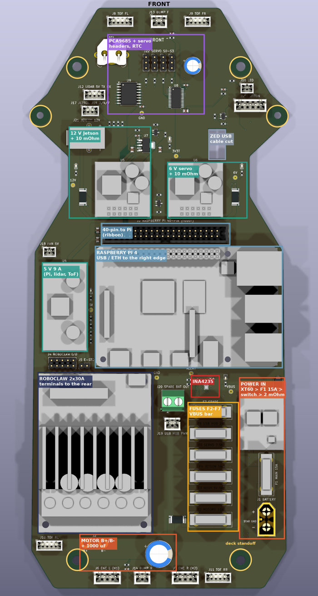
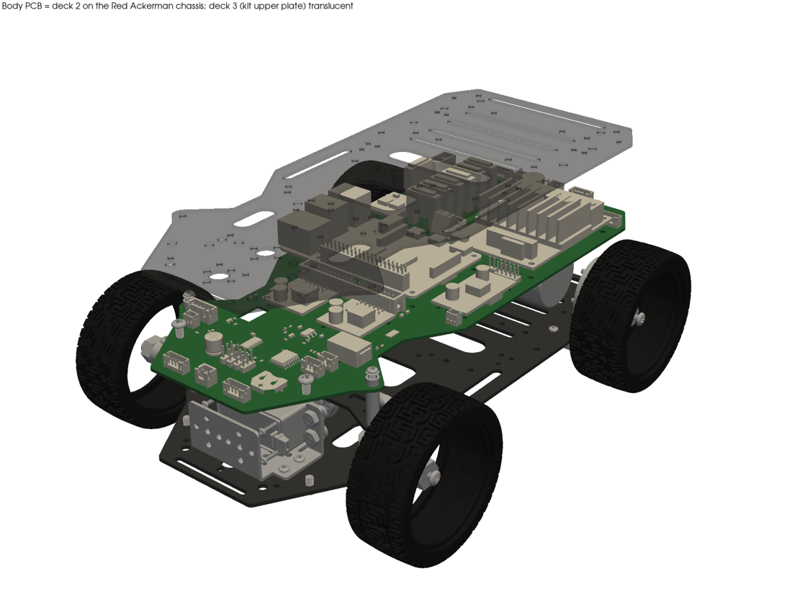
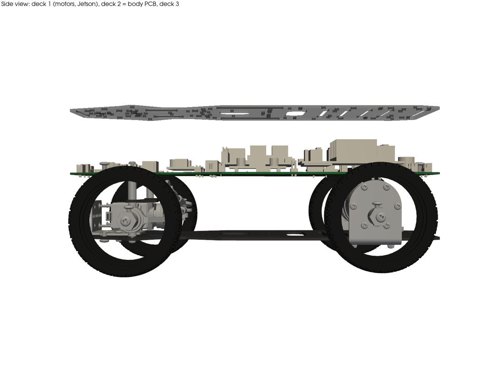
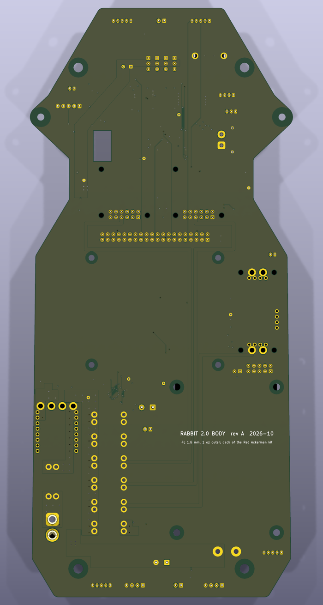
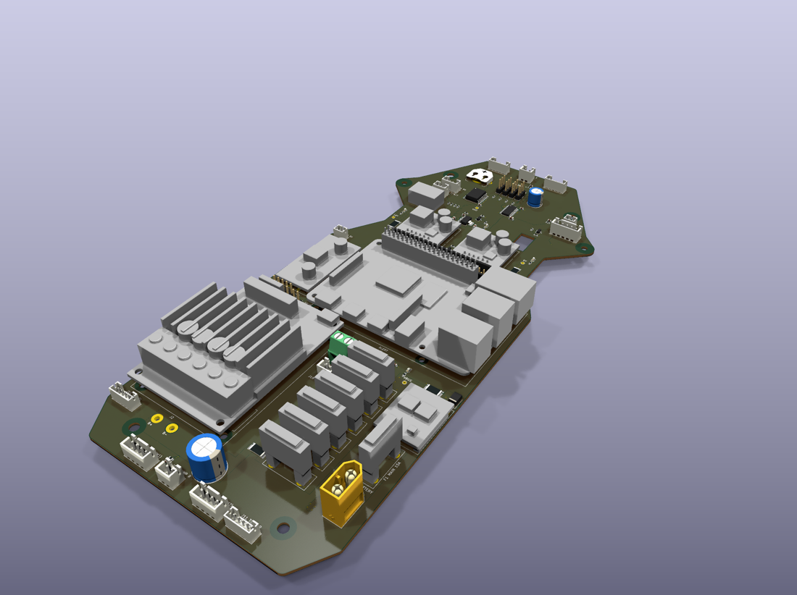

# Rabbit 2.0: плата тела (палуба 2)

Дата: 2026-10-03. Робот выключен, всё сделано офлайн. Плата реализует [`2026-10-03-architecture-2.0-wiring.md`](2026-10-03-architecture-2.0-wiring.md). Проект: `pcb/rabbit-body/`, генерируется кодом. Старый `pcb/rabbit-board/` не тронут.

## Итог

| | |
|---|---|
| Что это | четырёхслойная плата 120,5 × 269,9 мм по контуру палубы шасси Red Ackerman. Заменяет акриловую палубу 2 между нижней пластиной (Jetson, моторы, серва) и верхней (батарея, ZED, мачта лидара) |
| На плате | Pi 4 на стойках, RoboClaw на стойках, D24V90F5, 2× D36V50F, выключатель Pololu #2813, 7 предохранителей ATO, 4 шунта + INA4235, PCA9685, DS3231, LDO 3,3 В для ToF, 3 ключа, E-stop, 24 разъёма |
| Стороны | все детали сверху. Снизу только медь и шелкография: под платой Jetson и моторы |
| Слои | 4, 1,6 мм, 1 oz снаружи, 0,5 oz внутри |
| DRC | **0 ошибок, 0 предупреждений, 0 неразведённых** (`kicad-cli pcb drc --severity-all`, правила JLCPCB) |
| Разводка | силовая часть — вручную полигонами и широкими дорожками. Сигналы — Freerouting, 60 проходов |
| Цена | **~US$200–260 (A$300–390)**: 5 плат + 2 собранные с SMD на JLCPCB + THT-детали, с доставкой |



## 1. Инструменты

| Вариант | Почему нет / да |
|---|---|
| **KiCad 10 + Python (`pcbnew`) + Freerouting + `kicad-cli`** | **выбран.** KiCad 10.0.6 из DMG brew (cask требует sudo ради демо, приложение скопировано в `/Applications/KiCad`). Встроенный Python 3.9 с `pcbnew` работает без GUI. `kicad-cli` делает DRC, заливку, Gerber, сверловку, CPL, STEP и 3D-рендеры. Freerouting 2.4.1 (jar, OpenJDK 27 из brew) разводит сигналы через DSN/SES. Формат — тот, что знают JLCPCB и владелец (v1 тоже KiCad) |
| atopile | хорош для схем и подбора деталей JLC, но размещение, 3D и производство всё равно в KiCad: лишний слой |
| SKiDL | даёт netlist и ERC, но импорт netlist в `pcbnew` из Python не поддержан, пришлось бы писать то же самое |
| tscircuit | свой автороутер и экспорт, но нет готовых моделей модулей Pololu/Pi/RoboClaw и полигонов питания с контролем тока |

**Схемы KiCad нет.** Netlist задан кодом: `gen/design.py`, детали с пинами и цепями, источник правды. Вместо ERC работает `gen/check_netlist.py`: в каждой цепи не меньше двух выводов, у микросхем подключены питание и шины, плата совпадает с `design.py` пин в пин. DRC проверяет и соединения.

**Конвейер** (`gen/make.sh`):
1. `footprints.py` → `lib/rabbit_body.pretty` (модули по чертежам производителей);
2. `build_board.py` → размещение, сеть, контур, ручная силовая разводка (`routing.py`), полигоны;
3. `fill.sh` → заливка через `kicad-cli` (заливка из Python игнорирует зазоры до отверстий и края);
4. `autoroute.py` → DSN без земляных заливок и с запретом в вырезе, Freerouting `-mt 1`, импорт SES;
5. `cleanup.py` → удаление неиспользованных переходных INA, расширение сужений автороутера < 0,1 мм;
6. `drc_summary.py`.

Отдельно:
- `fab.py` → производство;
- `models.py` и `extract_outline.py` (venv `model/`) → STEP-модели модулей и контур из STEP шасси;
- `render_chassis.py` → плата на шасси.

## 2. Палуба и размеры

**Какая палуба.** По модели (`model/chassis.step`) и фото (блог #139–#147, фото 03.10) стек такой:

| Палуба | Что это | Что на ней |
|---|---|---|
| 1 | нижняя пластина кита | моторы, серва, Jetson |
| 2 | **эта плата** (сейчас акрил) | электроника тела |
| 3 | верхняя пластина кита | площадка V-mount с батареей, ZED спереди, мачта лидара |

Обе пластины кита — одна деталь 120,5 × 269,9 × 2 мм. Акрил вырезан по тому же контуру (сужение и «нос» спереди).

**Контур** взят из верхней грани пластины (тело 132 в STEP):
- 16 отрезков и 18 дуг;
- `gen/outline.json`, `outline.dxf` — контур платы со всеми её отверстиями;
- `kit_plate.dxf` — пластина кита со всеми 96 отверстиями и пазами.

**Система координат платы** (во всех файлах и таблицах):
- мм, начало в центре габарита пластины, +X — вправо по ходу, +Y — вперёд, вид сверху;
- в модели шасси: x_м = 2,482 − X, y_м = −3,427 − Y (поворот на 180°);
- в KiCad: x = 150 + X, y = 150 − Y.

| Элемент | Координаты, мм | Ø, мм |
|---|---|---|
| Колонны стоек между палубами (в ките — алюминиевые 50 мм, M4) | (±38,09; −121,89), (±38,09; 107,64) | 4,3 (M4; M3 с шайбой) |
| Стойки кронштейна руля (в ките 23 мм, M3) | (±55,26; 84,95) | 3,2 |
| Ширина | сзади ±59,4, у колёс ±57,8, талия ±42,2 (Y 48…65), плечи ±60,3 (Y 85), нос ±26,6 (Y 135) | |
| Вырез под кабель ZED | X 23,2…31,0, Y 64,8…78,6 — над передним правым пазом пластин палуб 1 и 3 | |

Остальные 90 отверстий пластины не повторены: они резали бы медь. Плата держится на тех же колоннах, что акрил.

## 3. Стек по высоте

Масштаб — колёса 75 мм на фото 03.10 и модель кита. Пол = 0, высоты в мм.

| Уровень | Высота | Откуда |
|---|---|---|
| Пол | 0 | |
| Палуба 1, верх | 24,8 | модель кита |
| Jetson dev kit с вентилятором | до 59,6 (+ проставки владельца, ~3) | 103 × 90,5 × 34,77 мм, SP-11324 рис. 4-2 |
| Моторы 37D, верх (худший случай) | ~63 | Ø37, ось колеса 37,5, смещение редуктора 7 |
| **Стойки 1→2** | **45** | сегодня ~40 по фото; **купить 45 мм** (4 шт.) |
| Плата, низ / верх | 69,8 / 71,4 | |
| Самые высокие детали на плате | +23,4 (USB Pi), +23,2 (RoboClaw), +27 (C1), +30 (XT60 с вилкой) | модели |
| Кулер Pi | не выше +35 над платой Pi (+42 над палубой) | |
| **Стойки 2→3** | **45** (как сегодня) | |
| Палуба 3, низ / верх | 116,4 / 118,4 | |

Агент CAD по высоте ZED оценил верх палубы 3 в ~122 мм над полом (`log/2026-10-03-printed-mounts.md`), здесь 118,4 при 45 + 45. Разница в пределах точности фото. Если сегодня уже ~122, то нижние стойки уже ≥ 45 мм. **Измерить линейкой две стойки** перед заказом.

**Почему не 40 мм снизу.** Под платой два риска:
- над Jetson при 40 мм остаётся 5 − 1,5 = 3,5 мм (выводы THT), вентилятору не хватает воздуха;
- моторы при 40 мм почти касаются платы (на фото мотор упирается в акрил), а над ними выводы держателей предохранителей и разъёмов.

При 45 мм над Jetson ≥ 7 мм, над моторами ≥ 5 мм. Выводы THT снизу обрезать до 1,5 мм.

Над платой при 45 мм запас до палубы 3 ≥ 10 мм. Над RoboClaw 22 мм воздуха.





## 4. Размещение

Все детали сверху: снизу Jetson и моторы, а односторонний монтаж JLCPCB дешевле.

| Блок | Где | Почему |
|---|---|---|
| Ввод питания: XT60 (вертикальный), F1 15 А, выключатель #2813, TVS, шунт 2 мОм | правый задний край, X 38…58 | батарея сзади на палубе 3, кабель спускается по правому заднему углу прямо в XT60 сверху. Путь сильного тока короткий: XT60 → F1 → выключатель → шунт → шина VBUS — 70 мм |
| Блок F2–F7 и шина VBUS | X 14…37, Y −107…−49 | шина по входам всех 6 предохранителей. Выходы налево к нагрузкам. F2 моторы — самый задний, рядом с шунтом 5 мОм |
| RoboClaw 2x30A | левый задний угол, клеммы назад, стойки 6 мм | моторы под задней осью, провода моторов к клеммам 3–5 см. Радиатор вверх, вокруг свободно. Сигнальный край смотрит на Pi |
| B+ / B− RoboClaw (J2, под AWG14) и C1 1000 мкФ | за клеммами RoboClaw | короткие перемычки к винтовым клеммам. C1 на шине моторов у этих площадок |
| Raspberry Pi 4 | середина, стойки M2.5 × 6 мм | USB и Ethernet выходят к правому краю: там нет колёс (Y −49…20), Ethernet уходит вниз к Jetson. CSI смотрит назад, к задней камере |
| D24V90F5 (5 В) | слева от Pi | короткий путь 5 В к выводам 2/4 разъёма Pi |
| 40-pin (J3) + ленточный кабель к Pi | перед Pi | см. «Отступления» |
| D36V50F12 (Jetson) + шунт 10 мОм + XT30 | талия слева | XT30 у выемки талии, кабель уходит вниз к Jetson снаружи контура |
| D36V50F6 (руль) + шунт 10 мОм | талия справа | 6 В идёт к разъёмам сервы в носу полигоном на B.Cu |
| INA4235 | перед блоком предохранителей, рядом с шунтом 2 мОм | Кельвин-пары к четырём шунтам на внутреннем слое над сплошной землёй |
| PCA9685, разъёмы сервы S0–S3, 470 мкФ, DS3231 + CR1220, LDO ToF | нос | серва под носом |
| Разъёмы | по краям, к своим устройствам | ToF FL/FR, бампер F — передний край. ToF RL/RR, бампер R, энкодеры — задний. Лидар, кнопка, LED, UART Jetson — бока носа. Разводка RoboClaw — у его сигнального края |

**Зона привода моторов** — одна сплошная область сзади слева, её можно заменить целиком: если RoboClaw заменят на BLDC-драйвер на плате (2× DRV8316 + STM32G4 или STSPIN32G4), остальное не двигается.

| | |
|---|---|
| Границы | X −59,4…+7,2, Y −135…−34,7 (задний край, левый борт, до шины предохранителей) |
| Площадь | **6544 мм², 23% платы** (28 661 мм²). С F2 и шунтом R3 на её правой кромке (X 4,6…19, Y −107…−99) ~7700 мм². Сам RoboClaw по контуру courtyard — 3981 мм² |
| Своё питание | F2 10 А от шины VBUS → шунт 5 мОм (канал 3 INA) → полигон `MOT_BAT` (F.Cu, 11 мм) → J2 B+ и C1 1000 мкФ |
| Своя земля | `GND_MOT` (B.Cu, 11 мм) от J2 B− и C1 к звезде NT1 у минуса XT60, с общей землёй больше нигде не соединена |
| Сигналы в зону | J4: UART S1/S2, E-stop S3, энкодеры, 5 В энкодеров |
| Разъёмы у края | энкодеры J6/J7; провода моторов идут прямо на клеммы |
| Что ещё в зоне | J10 (ToF RL) и J14 (бампер R) — останутся при замене |

Для BLDC-ревизии в той же зоне нужны разъёмы фаз 2 × 3 на заднем крае на месте клемм и датчики Холла / энкодеры на J6/J7. 2× DRV8316 (7 × 5 мм) или STSPIN32G4 (9 × 9 мм) с обвязкой занимают ~1500 мм².

**Земля «звездой».**
- In1 — сплошная GND.
- Обратный ток моторов идёт отдельной цепью `GND_MOT`: полигон B.Cu от B− RoboClaw и C1 до XT60.
- С общей землёй он соединён в одной точке, NetTie NT1 у минуса XT60.
- Ток моторов не идёт под логикой и I2C. Силовая часть сзади справа, логика спереди и в середине.

**Тепло.** Самые горячие места:
- RoboClaw при ограничении 3 А — доли ватта;
- шунт 2 мОм — 0,39 Вт при 14 А;
- LDO ToF — ~0,45 Вт при 0,26 А;
- преобразователи Pololu на штырях в 2,5 мм над платой.

Над каждым ≥ 15 мм воздуха.

## 5. Отступления от `-wiring.md`

| Что | В документе | На плате | Почему |
|---|---|---|---|
| ALERT INA4235 | на GPIO24 | **не подключён**. GPIO24 с подтяжкой 10 кОм выведен на TP8 | шарик B2 внутренний в DSBGA 0,4 мм, без via-in-pad не выводится. Пороги проверяет `ina.py` опросом 50 Гц. Ток моторов ограничивает сам RoboClaw |
| 5 В к Pi | два провода AWG20 к выводам 2 и 4 | 40-жильный шлейф ~60 мм (28 AWG) | Pi лежит компонентами вверх: кулер сверху, порты к краю. Провод AWG20 к штырю, занятому шлейфом, не подключить. Падение ~0,065 В при 2 А: 5,0 → ~4,93 В, порог Pi 4,63 В. Вариант — короткий шлейф или 2×20 с толстыми жилами на 2/4/6 |
| Блок предохранителей | Blue Sea 5025 (6 × ATO, минусовая шина) | 7 держателей ATO на плате (2 × Keystone 3557 на предохранитель, 30 А) + звезда земли у XT60 | одна сборка вместо блока и проводов |
| INA4235 | EVM (шунты 10 мОм на EVM, внешние 2 и 5 мОм) | микросхема на плате, шунты 2512: 2 / 10 / 5 / 10 мОм на каналах 1 / 2 / 3 / 4, адрес 0x41 | так и задумано. Маркировка R010 на EVM подтверждена владельцем, поэтому данные Forge с 1.10 масштабированы верно |
| Регулятор ToF | Pololu D24V10F3 | TPS73733 (LDO 1 А, SOT-223-6) от 5 В, EN подтянут к 5 В, Q2 гасит | меньше модулей, без пульсаций рядом с I2C |
| E-stop | GPIO16 → S3, 1 кОм у RoboClaw | то же + перемычка J5 последовательно: туда можно включить внешний грибок (NC) | 1 кОм к земле остаётся в разъёме у RoboClaw, как в документе |
| Моторы | через блок? | провода моторов прямо на клеммы RoboClaw | ток моторов не идёт по плате |
| USB-хаб | Waveshare 4U | тот же модуль, питание с J19 (F6 2 А). Сам хаб не на плате, а под палубой 3 над U5/U6 | на плате нет места 100 × 55 мм. Своя USB 3 разводка не нужна |

Остальное как в документе:
- выводы Pi;
- шины I2C3–6 для ToF;
- UART0 к RoboClaw (основной, решение владельца) + USB через хаб;
- UART4 к лидару, UART5 через 1 кОм к Jetson J14;
- ключи Q1–Q3 (AO3400A, 1 кОм / 100 кОм);
- бамперы 4,7 кОм + 100 нФ, кнопка 10 кОм + 100 нФ;
- выключатель: OFF от GPIO17, A — к первому полюсу кнопки;
- TVS SMBJ20A на выходе выключателя.

## 6. Слои

| Слой | Назначение |
|---|---|
| F.Cu, 1 oz | детали, силовые полигоны (батарея, VBUS, мотор B+), 5 В к Pi, 12 В, 6 В, часть сигналов, заливка GND |
| In1, 0,5 oz | **сплошная GND** |
| In2, 0,5 oz | основной сигнальный слой автороутера, заливка GND |
| B.Cu, 1 oz | дубли силовых полигонов, `GND_MOT`, полоса 6 В к сервам, три ветви питания под RoboClaw и Pi, заливка GND |

**Почему 4 слоя и 1 oz, а не 2 oz.**
- Шаг 0,4 мм у INA4235 требует дорожек и зазоров 0,1 мм. JLCPCB с 2 oz снаружи даёт не меньше ~0,2 мм.
- Ток набран шириной полигонов на двух наружных слоях со сшивкой: 55 переходных 0,8/0,4.
- Сплошная земля под 4 шинами ToF, I2C1, UART и ШИМ рядом с моторными токами стоит ~US$10 разницы.

**Правила** (`rabbit-body.kicad_pro`, `.kicad_dru`):

| Класс цепей | Дорожка | Зазор | Переходное |
|---|---|---|---|
| по умолчанию (сигналы) | 0,15 | 0,15 | 0,6/0,3 |
| PWR_HI (батарея, VBUS, моторы) | 2,0 | 0,3 | 1,0/0,5 |
| PWR_MID (ветви, 12 В, 6 В, 5 В) | 1,0 | 0,2 | 0,8/0,4 |
| PWR_LO (3,3 В, GND) | 0,4 | 0,15 | 0,6/0,3 |

- Внутри корпуса INA4235: 0,1/0,1 мм, площадки BGA 0,25 мм (минимум JLCPCB).
- Медь до края 0,3, отверстие до меди 0,25, кольцо ≥ 0,13.

## 7. Токи

IPC-2221/2152, наружный 1 oz. Нагрев указан на каждый слой отдельно, где полигон на двух слоях.

| Цепь | Сечение на плате | Допустимо | Нужно |
|---|---|---|---|
| Батарея → F1 → выключатель → шунт → VBUS | полигоны 7,6–9 мм на F и B. Узкое место — 3,6 мм × 2 слоя у колонки выключателя | ~16 А при +20 °C в узком месте, >20 А в остальном | 15 А предохранитель, площадка 14 А, обычно 2–3 А |
| Мотор B+ (F.Cu) / `GND_MOT` (B.Cu) | 11 мм | 13,6 А при +10 °C | предохранитель 10 А, RoboClaw 2 × 3 А |
| BODY_IN, BRAIN_IN, STEER_IN (B.Cu) | 1,5 мм | 3,2 А при +10 °C | 2,3 / 1,8 / 3 А пик |
| 5 В к Pi | 2,0 мм | 4 А | 2 А |
| 6 В: регулятор → шунт (2 мм F) → полоса B.Cu 6 мм | | 5,4 А (+20 °C) / 8,6 А | 5,9 А на пиках по 1–2 с |
| 12 В Jetson | 1,5 мм | 3,2 А | 1,8 А (2,2 А на 12 В) |
| Держатели ATO (Keystone 3557) | | 30 А | |
| XT60 / XT30 | | 60 / 15 А | |
| Штыри 0,1" модулей Pololu | по 2 штыря на вывод (+ отверстия 2,18 мм под провод) | ~3 А на штырь | D36V50F12 4,5 А, D24V90F5 до 9 А: при > 5 А паять провода в отверстия 2,18 |

## 8. Разводка и проверки

- **Вручную** (`gen/routing.py`):
  - 9 полигонов: BAT_IN, BAT_FUSED, SW_OUT, VBUS, MOT_FUSED, MOT_BAT, GND_MOT, SERVO_6V, GND;
  - 18 полилиний: ветви, 5 В, 12 В, 6 В, звезда;
  - сшивка, разводка INA4235 (12 шариков дорожками 0,1 мм на переходные, 3 внутренних — диагоналями к соседям той же цепи);
  - переходные на In1 у 48 SMD-выводов земли;
  - запреты дорожек над силовыми полигонами, чтобы сигналы их не резали.
- **Автоматически:** Freerouting 2.4.1, 60 проходов, однопоточно, ~4 мин. Многопоточный оптимизатор даёт нарушения зазоров.
  - Для одного DSN результат один и тот же. Если цепь не развелась, повтор не поможет: менять надо вход.
  - Здесь три таких случая сняли:
    - XT30 сдвинут, чтобы не выходил за контур;
    - держатель CR1220 отодвинут от ToF FL;
    - сигнальные дорожки 0,15 мм вместо 0,2.
  - Проверенная копия — `data/pcb-route/good-final.kicad_pcb`.
- **DRC** (`fab/drc.json`): 0 нарушений любой степени, 0 неразведённых. Последняя заливка и проверка — `kicad-cli pcb drc --refill-zones --severity-all`.
- **Netlist:** 116 позиций, 91 цепь, в каждой цепи ≥ 2 выводов, плата = `design.py`.





## 9. Проходы кабелей через палубу 2

**С палубы 1 (Jetson, моторы, серва):**
- провода моторов — прямо на клеммы RoboClaw через задний край;
- энкодеры J6/J7, ToF RL/RR, бампер R — разъёмы на заднем крае;
- серва J22 — через передний край носа;
- 12 В Jetson (J21, XT30) и консоль Jetson (J17) — через левую выемку талии. Снаружи контура между талией (|X| 42) и передними колёсами (|X| ≥ 66) свободно;
- Ethernet от порта Pi — вниз по правому борту (Y −49…20, колёс нет).

**С палубы 3 (батарея, ZED, мачта):**
- батарея — по правому заднему углу сверху в вертикальный XT60 J1;
- кабель ZED USB 3 — через вырез платы X 23,2…31,0, Y 64,8…78,6. Он совпадает с передним правым пазом пластин палуб 1 и 3: кабель идёт насквозь к Jetson, вилка USB-A 12 × 4,5 мм проходит по диагонали выреза 7,8 × 13,8 мм;
- шлейф CSI задней камеры — от разъёма Pi (X 15,5, Y −20,5) вверх через продольный паз палубы 3 (Y −56,8…−52,5);
- лидар (J12), кнопка (J15) и LED (J16) — по бортам носа;
- ToF FL/FR и бампер F — разъёмы на переднем крае.

## 10. Крепёж (для печати)

Координаты — в системе платы (§2), мм. Детали печатает агент CAD; здесь только что держать, где и какие зазоры.

| № | Деталь | Что держит | Где | Крепёж | Зазоры |
|---|---|---|---|---|---|
| 1 | Стойки палуба 1 → плата | плату | (±38,09; −121,89), (±38,09; 107,64) | 4 × латунь 45 мм (M3 F-F, как сейчас; отверстие 4,3) | вокруг стойки нет меди R 4,6 |
| 2 | Стойки плата → палуба 3 | палубу 3 | те же колонны | 4 × 45 мм (как сейчас) | |
| 3 | Стойки кронштейна руля (если он висит на палубе 2, как в ките) | кронштейн сервы | (±55,26; 84,95) | 2 × M3 × 18 мм (в ките 23 мм до пластины на 50 мм) | |
| 4 | Стойки Pi | Raspberry Pi 4, компонентами вверх | (−26,0; −28,5), (32,0; −28,5), (−26,0; 20,5), (32,0; 20,5) | M2.5 × 6 мм + винты M2.5 × 6 | кулер ≤ 35 мм над Pi; порты USB/ETH на 2 мм за X 55,5; R 2,9 без меди |
| 5 | Стойки RoboClaw | RoboClaw 2x30A, клеммы назад | (−52,76; −105,34), (−7,04; −105,34), (−52,76; −38,66), (−7,04; −38,66) | M3 × 6 мм + винты M3 | радиатор до +23,2. По бокам рёбер ≥ 5 мм пусто, сзади 6 мм до J2 для проводов AWG14 |
| 6 | Хомут C1 | 1000 мкФ Ø12,5 × 25 стоя | центр (0; −119) | обхват на клею или стяжке (отверстий под стяжку на плате нет) | рядом J7 (Y ≤ −126,6) и провода M1 RoboClaw (X −17,5 и −9,2) |
| 7 | Разгрузка кабеля батареи | вилка XT60 сверху в J1 | J1: (50; −99,3) «+», (50; −106,5) «−» | к краю у (57; −110) | вилка ~16 мм над корпусом, провод вверх до палубы 3 |
| 8 | Гребёнка заднего края | кабели J10 (−51; −114,5), J6 (−24; −129,5), J14 (−8; −129,5), J7 (12; −129,5), J11 (27,5; −129,5) | вдоль Y −135 от X −47 до 47 | стяжки за край | разъёмы XH/PH с защёлкой сверху |
| 9 | Гребёнка переднего края | J8 (−18; 129), J13 (0; 129), J9 (18; 129) | Y 135, X ±26 | стяжки | |
| 10 | Перемычки B+/B− | AWG14 от J2 (−34,2 / −25,8; −114) к клеммам RoboClaw | | пайка в отверстия 2,2 мм | 2–3 см, U-петля |
| 11 | Втулка выреза ZED | кабель USB 3 | вырез X 23,2…31,0, Y 64,8…78,6, плата 1,6 мм | на защёлке | кромка платы не должна резать оплётку |
| 12 | Кронштейн USB-хаба | Waveshare USB3.2-Gen1-HUB-4U (габарит не опубликован; оценка 100 × 55 × 25, **измерить**) | под палубой 3, над X −20…20, Y 35…125 | к отверстиям 4,3 палубы 3, например (±23,93; 91,44) и (±23,94; 122,29) | низ хаба ≥ 20 мм над платой; под ним детали ≤ 14 мм (вилки серв, C14 12 мм) |
| 13 | Шлейф Pi | 40-жильный IDC ~60 мм от J3 к разъёму Pi | J3: вывод 1 в (−21,13; 28,73), ряд вдоль +X | без перекрутки: оба разъёма ключом в одну сторону | |

Модули Pololu стоят на штыревых линейках 2,54 мм, крепёж им не нужен. Изоляция снизу не нужна: на нижней стороне нет деталей, до Jetson ≥ 7 мм.

## 11. Стоимость JLCPCB (оценка, проверить в калькуляторе)

| Позиция | US$ |
|---|---|
| 5 плат: 4 слоя, 120,5 × 270 мм, 1,6 мм, 1/0,5 oz, HASL без свинца | ~60–90 |
| SMT-сборка 2 плат с одной стороны: подготовка ~25, трафарет ~7, 9 «расширенных» деталей × 3 = 27, 60 установок | ~65 |
| SMD-детали на 2 платы (INA4235 ~5, DS3231 ~9,4, PCA9685 ~2,9, остальное ~3) | ~40 |
| THT на 2 платы: XT60PB, XT30, 14 клипс 3557, JST, 40-pin, конденсаторы | ~15 |
| Доставка DHL в Австралию | ~20–30 |
| **Итого** | **~US$200–260 (A$300–390)** |

Модули Pi, RoboClaw и Pololu у владельца есть. Предохранители ATO, ленточный кабель 40 жил и перемычки в цену не входят.

**Риск по INA4235:** в каталоге JLC на 03.10 доступна 1 шт. (C33440856). Нужен Global Sourcing под заказ или своя микросхема с отправкой на JLC.

## 12. Открытые вопросы владельцу

1. **Стойки 1→2 до 45 мм** (сейчас ~40): иначе над Jetson и моторами 2–3 мм. Подтвердить высоту моторов 37D над полом.
2. **Кулер Pi:** 52Pi ICE Tower выше 35 мм не влезет, нужен низкий радиатор с вентилятором.
3. **Шлейф 40 жил вместо проводов AWG20** для 5 В Pi (падение ~65 мВ при 2 А): устраивает?
4. **Распиновка модулей Pololu** (D24V90F5 и #2813) выведена из чертежей вида снизу. Перед пайкой сверить с шелкографией модулей.
5. **Порядок клемм RoboClaw** принят M1A M1B B− B+ M2B M2A (слева направо при клеммах сверху). B+/B− на J2 подписаны. При клеммах назад M1 оказывается справа: левый мотор лучше завести на M2 и поменять каналы в `roboclaw.py`.
6. **Полярность XT60:** на плате «папа» (XT60PB-M), «+» — вывод 1, подписан. На кабеле батареи должна быть «мама».
7. **Хаб Waveshare:** измерить габарит, подтвердить место под палубой 3.
8. **ALERT INA4235** без провода. Если нужен аппаратный, следующая ревизия с via-in-pad (дороже у JLC) или INA с другим корпусом.
9. **Доступ к предохранителям:** нужно снимать палубу 3 или тянуть пинцетом сбоку. Нормально?
10. **F7 (резерв, без предохранителя) и J20:** под что — 4G или манипулятор? От этого номинал.

## 13. Файлы

| Путь | Что |
|---|---|
| `pcb/rabbit-body/rabbit-body.kicad_pro`, `.kicad_pcb`, `.kicad_dru`, `fp-lib-table` | проект KiCad 10 |
| `pcb/rabbit-body/gen/` | генератор: `design.py` (netlist и размещение), `footprints.py`, `models.py`, `routing.py`, `build_board.py`, `autoroute.py`, `fab.py`, `make.sh` и проверки |
| `pcb/rabbit-body/lib/rabbit_body.pretty`, `3d/` | свои посадочные места и упрощённые STEP-модели модулей (размеры с чертежей) |
| `pcb/rabbit-body/rabbit-body.step` | плата с деталями в системе платы |
| `pcb/rabbit-body/outline.dxf` | контур и все отверстия ≥ 2 мм |
| `pcb/rabbit-body/kit_plate.dxf` | пластина кита (палубы 1 и 3) со всеми отверстиями |
| `pcb/rabbit-body/renders/` | `top.png`, `top_labelled.png`, `bottom.png`, `iso.png`, `chassis_iso.png`, `chassis_side.png`, `chassis_top.png` |
| `pcb/rabbit-body/fab/` | `rabbit-body-gerbers.zip` (Gerber + Excellon PTH/NPTH), `rabbit-body-bom-jlc.csv`, `rabbit-body-cpl-jlc.csv`, `rabbit-body-bom-full.csv` (все 57 строк с THT и модулями), `drc.json` |

**Пересборка:**
```
cd pcb/rabbit-body && PASSES=60 gen/make.sh   # плата, разводка, DRC
~/…/python3 gen/fab.py                         # производство (Python KiCad)
model/.venv/bin/python pcb/rabbit-body/gen/render_chassis.py
```

Внешние данные:
- чертежи и STEP Pololu, чертёж Pi 4 — в `data/pcb-vendor/` (лицензия не позволяет класть в репозиторий);
- Freerouting — в `data/tools/`.
