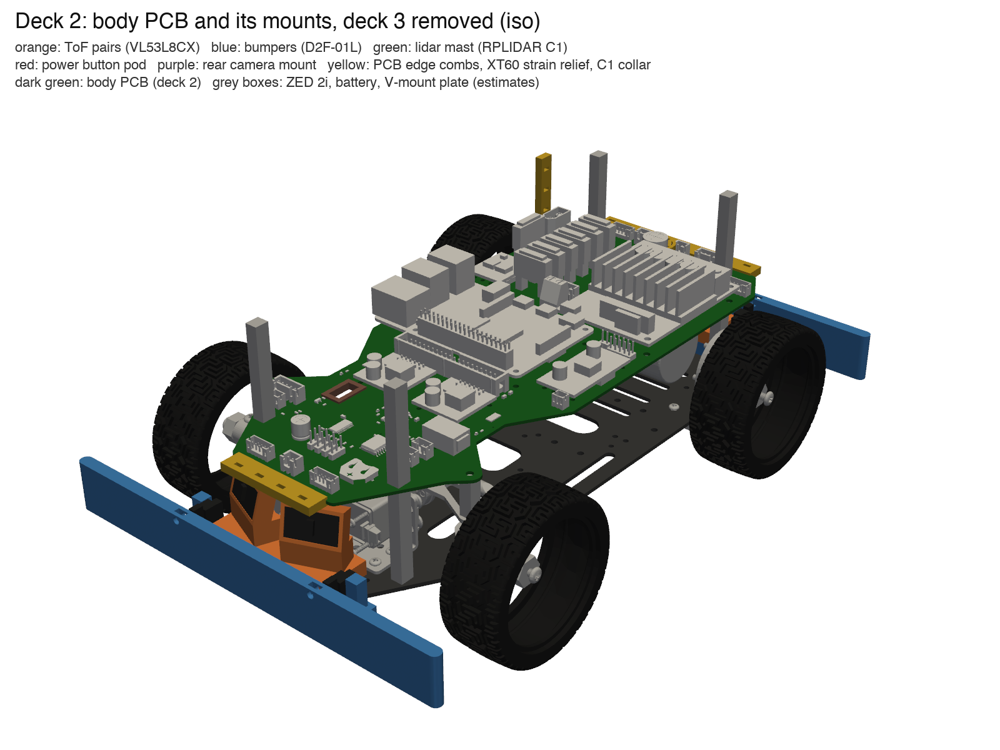

# Rabbit 2.0: печатные крепления

Приложение к [`2026-10-03-architecture-2.0.md`](2026-10-03-architecture-2.0.md) и к плате тела [`2026-10-03-body-pcb.md`](2026-10-03-body-pcb.md). Модели, файлы для печати, лист печати и список крепежа — в [`cad/brackets/`](../../cad/brackets/README.md). Печать на Bambu Lab P2S: всё из PETG, грометы из TPU, без поддержек. Робот был выключен: всё проверено по моделям — шасси `model/chassis.step` и плата `pcb/rabbit-body/rabbit-body.step` — и по фото робота сбоку от 03.10.

## Стек

| Палуба | Что | Высота над полом, мм |
|---|---|---|
| 1 | нижняя пластина кита: моторы, серва, Jetson, бамперы, пары ToF | верх 24,8 |
| — | 4 латунные стойки M3 45 мм | |
| 2 | плата тела, 1,6 мм, все детали сверху | низ 69,8, верх 71,4 |
| — | 4 латунные стойки M3 45 мм на тех же колоннах | |
| 3 | верхняя пластина кита: площадка V-Mount с батареей, ZED, мачта лидара, кнопка, задняя камера | низ 116,4, верх 118,4 |

## Детали

| Деталь | Шт. | Материал | Что держит | Где |
|---|---|---|---|---|
| `tof_pair` | 2 | PETG | два VL53L8CX на Pololu #3419 | на бампере, спереди и сзади; одна и та же деталь |
| `bumper_front`, `bumper_rear` | по 1 | PETG | бампер-пружина и два Omron D2F-01L | палуба 1, передний и задний край |
| `lidar_mast` | 1 | PETG | RPLIDAR C1 | палуба 3, между ZED и площадкой V-Mount |
| `power_button_panel` | 1 | PETG | кнопка 16 мм 2NO с подсветкой и светодиод состояния | сбоку на мачте (слева по ходу) |
| `rear_camera_mount` | 1 | PETG | Camera Module 3 Wide | задний край палубы 3 |
| `pcb_comb_front`, `pcb_comb_rear` | по 1 | PETG | кабели ToF, бамперов и энкодеров на краю платы | надеваются на передний и задний край платы (§10, п. 8–9) |
| `xt60_strain_relief` | 1 | PETG | провод батареи у XT60 | правый край платы (§10, п. 7) |
| `cap_clamp` | 1 | PETG | конденсатор C1 1000 мкФ | на клею (§10, п. 6) |
| `zed_grommet` | 1 | TPU 95A | край выреза платы под кабель ZED | вырез платы (§10, п. 11) |
| `slot_grommet` | 2 | TPU 95A | края пазов палубы 3 | пазы для кабелей ZED, лидара, кнопки |
| `cable_clip` | 6 | PETG | жгуты до 6,5 мм | любое отверстие 3,2 мм |

Покупное: 8 латунных стоек M3 45 мм, 2 стойки M3 18 мм для кронштейна руля, стойки M2,5 × 6 для Pi и M3 × 6 для RoboClaw, 18 термовставок M3 × 5,7, винты M3, M2,5 и M2. Полная таблица — в README. Сверлить пластины не нужно: всё встаёт на родные отверстия кита.

## Решения

- **ToF: 57,8 мм над полом, ±22° наружу, наклон 15° вверх, платы лежат горизонтально.**
  - Нижний ряд зон видит пол только с ~0,44 м. Поэтому зона 0–0,4 м, ради которой ToF и ставим, свободна от отражений пола.
  - Цена: совсем низкое прямо перед роботом не видно (на 0,1 м — ниже ~45 мм, на 0,3 м — ниже ~18 мм). Это закрывает бампер (25–49 мм над полом) и ZED дальше 0,3 м.
  - Нос и хвост платы проходят над головками ToF, а выводы разъёмов торчат на 1,8 мм вниз. Поэтому платы датчиков положены горизонтально, головки опущены, и зазор до платы — 3,5 мм спереди и 2,7 мм сзади.
  - Сетка зон повёрнута на 90°: в `T_base_tof` нужен поворот (roll 90°).
- **Бампер — одна деталь из PETG, пружина из двух пластин 1,25 мм.**
  - Жёсткость ~0,7 Н/мм, срабатывание при ~2 Н, ход до упора 3,5 мм.
  - Выключатель нажимает винт M3 в планке; его подкручивают, чтобы щелчок был на ~1,5 мм хода.
  - Планка, нажатая до упора, не достаёт до передних колёс при повороте до ±40°: зазор 7,2 мм.
- **Габарит растёт:** спереди 0,2452 м от задней оси (было 0,2245), сзади 0,072 м, полуширина 0,102 м. Поменять `Footprint` в `lib/safety.py` и `front_overhang` в `lib/planner.py`, когда бамперы встанут.
- **Мачта — перед площадкой V-Mount.**
  - На фото площадка владельца длинная: от ~26 до ~180 мм от заднего края палубы 3.
  - Поэтому мачта стоит в полосе 40–81 мм от переднего края палубы, между ZED и площадкой. Центр лидара — на оси, 160 мм впереди задней оси.
- **Плоскость скана лидара — 230 мм над полом.**
  - Палуба 3 на 118,4 мм, площадка V-Mount на фото ~17 мм, батарея 56,7 мм: верх батареи ~192 мм.
  - Основание лидара на 8 мм выше, на 200,2 мм. Батарея вынимается под ним, а плоскость проходит над батареей с запасом 38 мм — у C1 наклон плоскости до 1,5° даёт всего 5 мм на 0,2 м.
  - Это на 1 см выше диапазона 18–22 см из отчёта 2.0: реальная батарея с площадкой выше, чем там считали.
  - Высота робота — 241,5 мм.
- **Кнопка — на мачте**, на 164 мм над полом, снаружи основания лидара: её удобно нажать сверху. Провода кнопки и светодиода уходят вниз через правый паз палубы 3, провод лидара — через левый, вместе с кабелем ZED.
- **Задняя камера**: 138 мм над полом, наклон 15° вниз, в 10 мм за площадкой V-Mount. Шлейф идёт через задний край палубы 3. Паз, через который его ведёт отчёт о плате (y 51), закрыт площадкой V-Mount.
- **Детали для платы.** Гребёнки, держатель XT60 и хомут C1 надеваются на край платы или клеятся: отверстий под них на плате нет. Гребёнки держат кабели, которые идут через край вниз на палубу 1.

## Хаб USB: место из §10 не подходит

По чертежу Waveshare хаб 72,2 × 47,8 × 27,6 мм (86 мм с ушками), порты на обеих длинных сторонах. Под палубой 3 место из §10 п. 12 не годится:
- от низа хаба до платы остаётся не больше 17,4 мм, а §10 требует ≥ 20; детали под ним до 14 мм;
- в месте из §10 (X −20…20, Y 35…125 платы) хаб перекрывает оба паза палубы 3, через которые идут кабели ZED, лидара и кнопки;
- он упирается в передние стойки;
- вилкам USB нужно ~35 мм с каждой длинной стороны.

Кронштейн я не делал: нужно новое место хаба. Решают владелец и агент платы, вопрос в `docs/open-issues.md`.

## Что проверено по моделям

- **Винты.** Все 12 винтов в пластины попадают в измеренные по STEP отверстия и прорези нужного размера.
- **Пересечения.** Ни одна деталь и ни одно изделие на ней не пересекается ни с чем:
  - друг с другом;
  - со 134 телами шасси;
  - с 266 телами платы;
  - с габаритами ZED, площадки и батареи.
- **Зазоры до платы:** пары ToF — 3,5 мм спереди и 2,7 мм сзади, платы ToF — 5,9 и 4,6 мм. Бамперы далеко.
- **Колёса.** Передние колёса повёрнуты вокруг шкворней до ±35° и ±40°. Наименьший зазор до бампера — 4,5 мм, до планки, нажатой до упора, — 7,2 мм.
- **Поля зрения:**
  - все четыре ToF свободны;
  - полоса скана лидара (±(3 мм + r·tan 1,5°), 31–500 мм) свободна, плата тоже не попадает;
  - поле ZED свободно;
  - задняя камера не видит ничего своего.

Подробности и картинки — в [`cad/brackets/README.md`](../../cad/brackets/README.md), числа — в `cad/brackets/renders/fit_report.json`.

## Что измерить на роботе до печати

Пункты ведутся в [`docs/open-issues.md`](../open-issues.md), раздел «Измерить на роботе».

1. **Длины стоек** (45 + 45 мм, палуба 3 на 118,4 мм). От них зависит высота мачты.
2. **Верх батареи с площадкой V-Mount** (~192 мм). Он должен быть ниже основания лидара (200,2 мм).
3. **Полоса между ZED и площадкой V-Mount**: мачта занимает 40–81 мм от переднего края палубы 3. По фото задняя грань ZED с вилкой USB на 23 мм, площадка начинается на 90 мм.
4. **Задние 15,5 мм палубы 3** свободны под камеру: по фото площадка кончается в 25 мм от края.
5. **Выводы THT под носом и хвостом платы** (J8, J9, J13, J6, J7, J11, J14) обрезать до 1,5 мм: головки ToF на 2,7 мм ниже самых длинных.
6. **Края палубы 1** свободны (14 мм перед кронштейном сервы и полоса за задними стойками), угол поворота колёс ≤ 40°.
7. **Своя кнопка:** корпус за панелью не длиннее 37 мм, гайка не больше 21 мм по углам.
8. **Провода ToF** паяются прямо на плату, а разъём шлейфа камеры должен совпасть с окном 14 × 16 мм.

## Не сделано

- **Кронштейн хаба USB** — см. выше.
- **Крепление антенн Wi-Fi.** Alfa AWUS036ACM — 62 × 85,3 × 24 мм. Антенны 5 dBi длиной ~19 см стоя пересекут плоскость скана (230 мм) и затенят ~3° каждая. Варианты: короткие антенны, наклон антенн или маска этих секторов в `rabbit-lidar`.
- **Стойки между палубами** не печатаются: латунные покупные, см. README.
