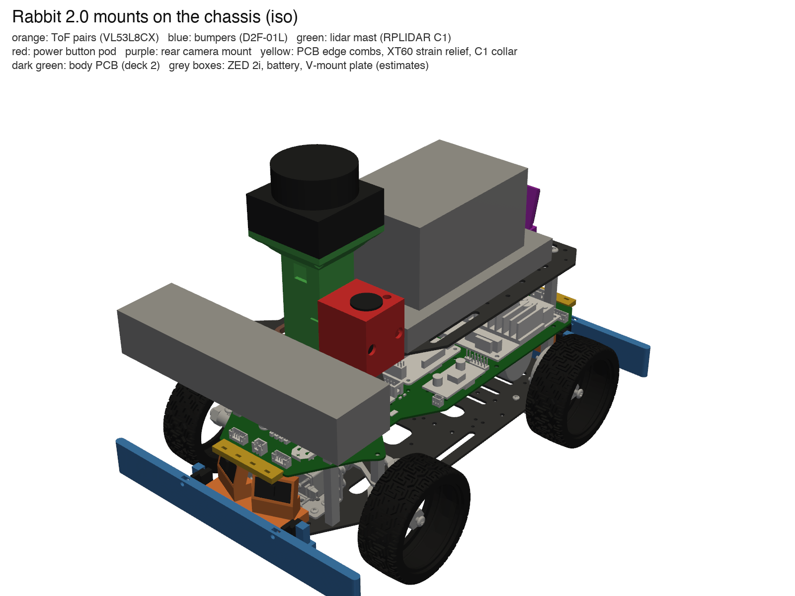

# Rabbit 2.0: печатные крепления

Приложение к [`2026-10-03-architecture-2.0.md`](2026-10-03-architecture-2.0.md). Модели, файлы для печати, лист печати и список крепежа — в [`cad/brackets/`](../../cad/brackets/README.md). Печать на Bambu Lab P2S, всё из PETG, без поддержек. Робот был выключен: всё проверено по модели шасси `model/chassis.step`, а не на роботе.

## Детали

| Деталь | Шт. | Что держит | Где |
|---|---|---|---|
| `tof_pair` | 2 | два VL53L8CX на Pololu #3419 | на бампере, спереди и сзади; одна и та же деталь |
| `bumper_front`, `bumper_rear` | по 1 | бампер-пружина и два Omron D2F-01L | нижняя пластина, передний и задний край |
| `lidar_mast` | 1 | RPLIDAR C1 | верхняя пластина, между ZED и батареей |
| `power_button_panel` | 1 | кнопка 16 мм 2NO с подсветкой и светодиод состояния | сбоку на мачте (слева по ходу) |
| `rear_camera_mount` | 1 | Camera Module 3 Wide | задний край верхней пластины |
| `cable_clip` | 6 | жгуты до 6,5 мм | любое отверстие 3,2 мм |

Крепёж: 18 термовставок M3 × 5,7, винты M3, M2,5 и M2 (таблица в README). Отверстия в пластинах — родные отверстия набора, сверлить ничего не нужно.

## Решения

- **ToF: 60 мм над полом, ±22° наружу, наклон 15° вверх.**
  - Нижний ряд зон видит пол только с ~0,46 м, поэтому зона 0–0,4 м, ради которой ToF и ставим, свободна от отражений пола (вопрос 9 в отчёте).
  - Цена: совсем низкое прямо перед роботом не видно (на 0,1 м — ниже ~47 мм, на 0,3 м — ниже ~20 мм). Это закрывает бампер (23–47 мм над полом) и ZED дальше 0,3 м.
  - Два датчика на одной детали, поэтому деталей две, а не четыре.
- **Бампер — одна деталь из PETG, пружина из двух пластин 1,25 мм.**
  - Удар в любую точку отодвигает планку. Удар сбоку её поворачивает, и ближний выключатель нажимается сильнее.
  - Жёсткость ~0,7 Н/мм, срабатывание при ~2 Н. Ход до упора 3,5 мм.
  - Выключатель нажимает винт M3 в планке; его подкручивают, чтобы щелчок был на ~1,5 мм хода (у D2F точка срабатывания 6,8 ± 1,5 мм).
  - Планка, нажатая до упора, не достаёт до передних колёс при повороте до ±40°: зазор 7,2 мм.
- **Габарит растёт:** спереди 0,2452 м от задней оси (было 0,2245), сзади 0,072 м (было 0,07), полуширина 0,102 м. `Footprint` в `lib/safety.py` и `front_overhang` в `lib/planner.py` надо поменять, когда бамперы встанут.
- **Плоскость скана лидара — 220 мм над полом.**
  - Самое высокое на роботе — батарея, ~188,7 мм (оценка).
  - У C1 плоскость скана может быть наклонена до 1,5°: на ~0,19 м до дальнего угла батареи это 5 мм, плюс высота луча. Значит, нужно не меньше ~200 мм.
  - На 220 мм весь лидар выше батареи, и её можно вынуть, не снимая лидар. Это верх диапазона 18–22 см из отчёта.
  - Проверка: полоса ±(3 мм + r·tan 1,5°) на расстоянии 31–500 мм от лидара не задевает ничего в модели.
  - Высота робота становится 231,5 мм.
  - Центр лидара на оси робота, 134 мм впереди задней оси. Ставить кабелем вперёд, тогда поворот в `T_base_lidar` — 0.
- **Задняя камера: 142 мм над полом, наклон 15° вниз.** Пол виден с ~0,13 м за объективом; пластина, бампер и ToF в кадр не попадают.
- **Кнопка — на мачте**, а не на пластине. Сзади места нет: там камера, а длина площадки V-mount неизвестна. Сбоку от мачты нет пары свободных отверстий, чтобы закрепить отдельную коробку. Провода кнопки и лидара уходят в одну прорезь пластины.

## Что проверено по модели

- **Винты.** Все 12 винтов в пластины попадают в измеренные по STEP отверстия и прорези нужного размера.
- **Пересечения.** Ни одна деталь и ни одно изделие на ней (датчики, выключатели, лидар, кнопка, камера) не пересекается ни с чем: ни друг с другом, ни со 134 телами шасси, ни с габаритами ZED и батареи.
- **Колёса.** Передние колёса повёрнуты вокруг измеренных шкворней до ±35° и ±40°. Наименьший зазор до бампера — 4,5 мм (при 40°), до планки, нажатой до упора, — 7,2 мм.
- **Поля зрения:**
  - все четыре ToF (45° × 45°, 0,6 м) свободны;
  - лидар свободен;
  - камера свободна;
  - в поле ZED (110° × 70°) из новых деталей не попадает ничего.

Подробности и картинки — в [`cad/brackets/README.md`](../../cad/brackets/README.md), числа — в `cad/brackets/renders/fit_report.json`.

## Что измерить на роботе до печати

Модель — это набор, а не наш робот: у робота стойки длиннее, и верхняя пластина выше. В модели она поднята на 46,6 мм — до 122 мм над полом, по высоте ZED. ZED, батарея и площадка V-mount добавлены коробками по оценке. Перед печатью проверить:

1. **Высота верхней пластины над полом** (принято 122 мм). От неё зависит высота мачты.
2. **Верх батареи с площадкой V-mount** (принято 188,7 мм). Он должен быть хотя бы на 10 мм ниже основания лидара (190,2 мм).
3. **Свободная полоса между ZED и батареей**, 68–105 мм от переднего края верхней пластины. Измерить, где задняя грань ZED с разъёмом USB (принято 67 мм) и передний край площадки V-mount (принято 119 мм).
4. **Задние 15,5 мм верхней пластины** свободны под камеру, и батарея при этом вынимается.
5. **Края нижней пластины свободны:** передняя полоса 14 мм перед кронштейном сервы и задняя полоса за угловыми стойками.
6. **Угол поворота колёс:** проверено до ±40°.
7. **Своя кнопка:** корпус за панелью не длиннее 37 мм, гайка не больше 21 мм по углам.
8. **Провода ToF** паяются прямо на плату: прямые штыри не влезут.
9. **Разъём шлейфа камеры** — напротив окна 14 × 16 мм в креплении.

## Не сделано

- **Крепление антенн Wi-Fi.**
  - Alfa AWUS036ACM — 62 × 85,3 × 24 мм, разъёмы RP-SMA на корпусе. Антенны 5 dBi длиной ~19 см стоя пересекут плоскость скана и затенят ~3° каждая.
  - Место адаптера зависит от раскладки палубы.
  - Варианты: короткие антенны (верх ниже 205 мм), наклон антенн или маска этих секторов в `rabbit-lidar`.
- **Детали под плату тела** (`pcb/rabbit-body/`): межпалубные стойки, разгрузка кабелей и так далее.
  - Плата ещё в работе. Контур повторяет пластину и крепится на шесть стоек набора: четыре угловые M4 и две у шкворней M3.
  - Файла `rabbit-body.step` и списка нужных деталей пока нет.
