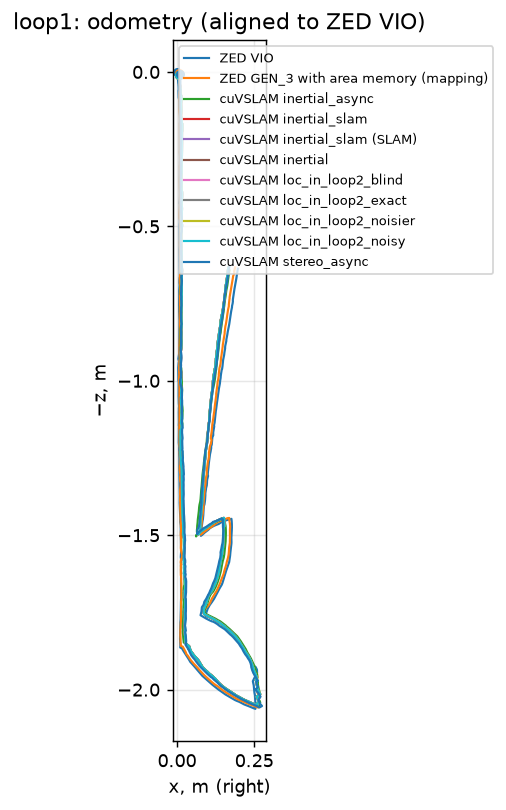
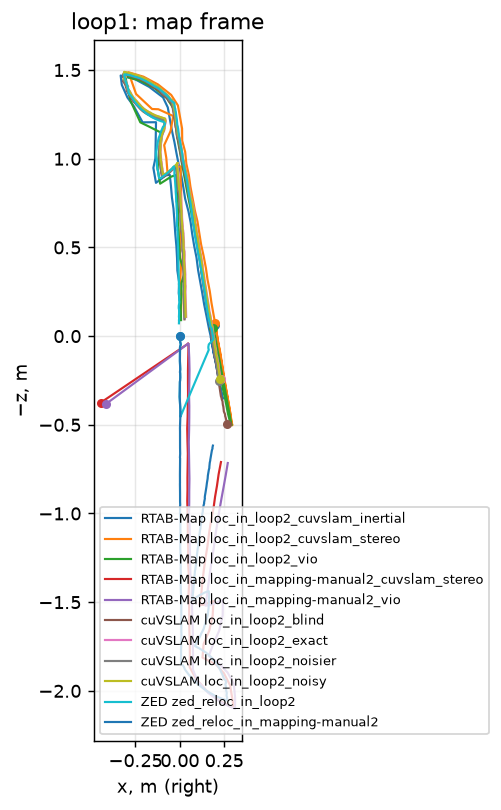
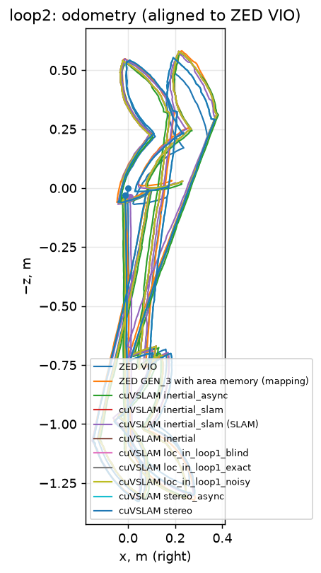
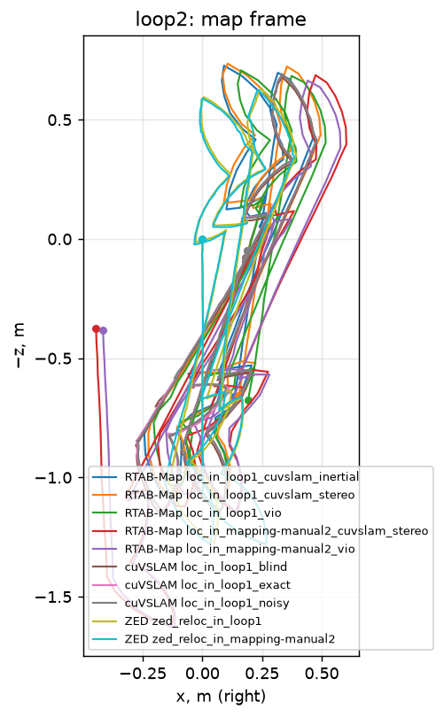
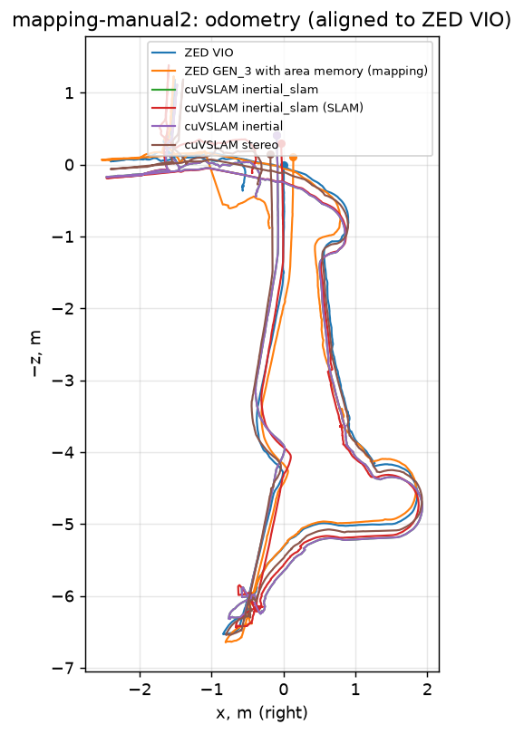

# Localization bench

Poses are in the IMAGE frame (x right, y down, z forward); plots are top-down (x, −z). cuVSLAM and ZED runs are on the Jetson; RTAB-Map runs are on the Mac (arm64 container) unless named `jetson_*`. CPU cores = CPU seconds per second (cuVSLAM: tracker only, per second of recording).

## loop1

### Odometry

| candidate | poses | path m | start–end m | start–end % | APE vs ZED VIO m | lost | ms p50 | ms p95 | CPU cores | RSS MB | GPU MB |
|---|---|---|---|---|---|---|---|---|---|---|---|
| ZED GEN_3 VIO (no area) | 552 | 3.91 | 0.67 | 17.0 | — | — | — | — | — | — | — |
| ZED GEN_3 with area memory (mapping) | 552 | 3.91 | 0.66 | 16.8 | 0.008 | — | — | — | — | — | — |
| cuVSLAM inertial_async | 552 | 3.91 | 0.65 | 16.8 | 0.028 | 0 | 4.2 | 8.6 | 0.08 | 298 | 350 |
| cuVSLAM inertial_slam | 552 | 3.90 | 0.65 | 16.5 | 0.029 | 0 | 4.5 | 73.0 | 0.19 | 324 | 393 |
| cuVSLAM inertial_slam (SLAM) | 552 | 3.90 | 0.65 | 16.5 | 0.029 | 0 | 4.5 | 73.0 | 0.19 | 324 | 393 |
| cuVSLAM inertial | 552 | 3.90 | 0.65 | 16.5 | 0.029 | 0 | 4.3 | 53.5 | 0.17 | 294 | 350 |
| cuVSLAM loc_in_loop2_blind | 552 | 3.90 | 0.65 | 16.5 | 0.029 | 0 | 4.4 | 61.8 | 0.19 | 333 | — |
| cuVSLAM loc_in_loop2_exact | 552 | 3.90 | 0.65 | 16.5 | 0.029 | 0 | 4.3 | 61.1 | 0.18 | 323 | — |
| cuVSLAM loc_in_loop2_noisier | 552 | 3.90 | 0.65 | 16.5 | 0.029 | 0 | 4.4 | 61.7 | 0.19 | 321 | — |
| cuVSLAM loc_in_loop2_noisy | 552 | 3.90 | 0.65 | 16.5 | 0.029 | 0 | 4.4 | 61.6 | 0.19 | 318 | — |
| cuVSLAM stereo_async | 552 | 3.91 | 0.64 | 16.4 | 0.016 | 0 | 2.5 | 6.8 | 0.03 | 263 | 350 |

### Localization

| candidate | mode | frames | first loc s | localized % | inter-session links | jumps >0.5 m | map→odom spread m | ms p50 | ms p95 | CPU cores | RSS MB |
|---|---|---|---|---|---|---|---|---|---|---|---|
| RTAB-Map loc_in_loop2_cuvslam_inertial | localization | 61 | 4.3 | 66 | 0 | 0 | 0.07 | 151 | 212 | 1.29 | 286 |
| RTAB-Map loc_in_loop2_cuvslam_stereo | localization | 61 | 2.6 | 71 | 0 | 0 | 0.08 | 144 | 198 | 1.32 | 283 |
| RTAB-Map loc_in_loop2_vio | localization | 61 | 2.6 | 70 | 0 | 0 | 0.08 | 149 | 210 | 1.29 | 284 |
| RTAB-Map loc_in_mapping-manual2_cuvslam_stereo | localization | 61 | 0.5 | 60 | 0 | 0 | 0.06 | 60 | 95 | 1.41 | 365 |
| RTAB-Map loc_in_mapping-manual2_vio | localization | 61 | 0.5 | 60 | 0 | 0 | 0.04 | 60 | 80 | 1.39 | 357 |
| RTAB-Map map_cuvslam_inertial | mapping | 61 | — | 0 | 0 | 0 | — | 61 | 71 | 1.27 | 236 |
| RTAB-Map map_cuvslam_stereo | mapping | 61 | — | 0 | 0 | 0 | — | 61 | 67 | 1.27 | 234 |
| RTAB-Map map_vio | mapping | 61 | — | 0 | 0 | 0 | — | 61 | 71 | 1.27 | 233 |
| RTAB-Map merge_into_mapping-manual2_cuvslam_stereo | mapping | 61 | 0.0 | 26 | 16 | 0 | 0.01 | 45 | 93 | 1.30 | 388 |
| RTAB-Map merge_into_mapping-manual2_vio | mapping | 61 | 0.0 | 31 | 19 | 0 | 0.01 | 43 | 83 | 1.30 | 382 |
| cuVSLAM loc_in_loop2_blind | localize_in_map | 552 | 0.5 | — | — | — | 1 attempts | 4.4 | 61.8 | 0.96 | 333 |
| cuVSLAM loc_in_loop2_exact | localize_in_map | 552 | 5.0 | — | — | — | 1 attempts | 4.3 | 61.1 | 0.95 | 323 |
| cuVSLAM loc_in_loop2_noisier | localize_in_map | 552 | 5.0 | — | — | — | 1 attempts | 4.4 | 61.7 | 0.96 | 321 |
| cuVSLAM loc_in_loop2_noisy | localize_in_map | 552 | 5.0 | — | — | — | 1 attempts | 4.4 | 61.6 | 0.95 | 318 |
| ZED GEN_3 zed_reloc_in_loop2 | area localization | 552 | 6.7 | 79 | — | 0 | — | 45 | 65 | — | — |
| ZED GEN_3 zed_reloc_in_mapping-manual2 | area localization | 552 | — | 0 | — | 0 | — | 45 | 66 | — | — |

## loop2

### Odometry

| candidate | poses | path m | start–end m | start–end % | APE vs ZED VIO m | lost | ms p50 | ms p95 | CPU cores | RSS MB | GPU MB |
|---|---|---|---|---|---|---|---|---|---|---|---|
| ZED GEN_3 VIO (no area) | 1121 | 8.78 | 0.17 | 1.9 | — | — | — | — | — | — | — |
| ZED GEN_3 with area memory (mapping) | 1121 | 9.06 | 0.21 | 2.3 | 0.048 | — | — | — | — | — | — |
| cuVSLAM inertial_async | 1121 | 9.01 | 0.32 | 3.5 | 0.079 | 0 | 4.4 | 9.1 | 0.07 | 293 | 350 |
| cuVSLAM inertial_slam | 1121 | 9.01 | 0.32 | 3.6 | 0.083 | 0 | 4.5 | 127.4 | 0.27 | 334 | 393 |
| cuVSLAM inertial_slam (SLAM) | 1121 | 9.12 | 0.20 | 2.2 | 0.042 | 0 | 4.5 | 127.4 | 0.27 | 334 | 393 |
| cuVSLAM inertial | 1121 | 9.01 | 0.32 | 3.6 | 0.083 | 0 | 4.4 | 56.2 | 0.19 | 279 | 350 |
| cuVSLAM loc_in_loop1_blind | 1121 | 9.01 | 0.32 | 3.6 | 0.083 | 0 | 4.2 | 89.4 | 0.30 | 339 | — |
| cuVSLAM loc_in_loop1_exact | 1121 | 9.01 | 0.32 | 3.6 | 0.083 | 0 | 4.3 | 87.1 | 0.29 | 336 | — |
| cuVSLAM loc_in_loop1_noisy | 1121 | 9.01 | 0.32 | 3.6 | 0.083 | 0 | 4.2 | 86.0 | 0.29 | 344 | — |
| cuVSLAM stereo_async | 1121 | 9.02 | 0.19 | 2.1 | 0.034 | 0 | 2.5 | 6.8 | 0.03 | 247 | 350 |
| cuVSLAM stereo | 1121 | 9.02 | 0.19 | 2.1 | 0.034 | 0 | 2.5 | 9.8 | 0.04 | 251 | 350 |

### Localization

| candidate | mode | frames | first loc s | localized % | inter-session links | jumps >0.5 m | map→odom spread m | ms p50 | ms p95 | CPU cores | RSS MB |
|---|---|---|---|---|---|---|---|---|---|---|---|
| RTAB-Map jetson_loc_in_loop1_vio | localization | 135 | 0.5 | 51 | 0 | 0 | 0.13 | 195 | 228 | 1.04 | 220 |
| RTAB-Map jetson_map_vio | mapping | 135 | 35.5 | 66 | 0 | 0 | 0.09 | 109 | 217 | 1.08 | 277 |
| RTAB-Map loc_in_loop1_cuvslam_inertial | localization | 135 | 0.5 | 52 | 0 | 0 | 0.05 | 122 | 150 | 1.10 | 228 |
| RTAB-Map loc_in_loop1_cuvslam_stereo | localization | 135 | 0.5 | 54 | 0 | 0 | 0.05 | 118 | 139 | 1.10 | 225 |
| RTAB-Map loc_in_loop1_vio | localization | 135 | 0.5 | 54 | 0 | 0 | 0.09 | 122 | 150 | 1.10 | 226 |
| RTAB-Map loc_in_mapping-manual2_cuvslam_stereo | localization | 135 | 20.5 | 31 | 0 | 0 | 0.04 | 60 | 77 | 1.22 | 365 |
| RTAB-Map loc_in_mapping-manual2_vio | localization | 135 | 20.5 | 34 | 0 | 0 | 0.05 | 59 | 77 | 1.19 | 358 |
| RTAB-Map map_cuvslam_inertial | mapping | 135 | 26.9 | 51 | 0 | 0 | 0.23 | 66 | 148 | 1.18 | 279 |
| RTAB-Map map_cuvslam_stereo | mapping | 135 | 36.0 | 63 | 0 | 0 | 0.04 | 68 | 146 | 1.18 | 281 |
| RTAB-Map map_vio | mapping | 135 | 36.5 | 65 | 0 | 0 | 0.08 | 67 | 158 | 1.17 | 285 |
| RTAB-Map merge_into_loop1_cuvslam_inertial | mapping | 135 | 0.0 | 49 | 27 | 0 | 0.05 | 132 | 207 | 1.15 | 310 |
| RTAB-Map merge_into_loop1_cuvslam_stereo | mapping | 135 | 0.0 | 48 | 29 | 0 | 0.03 | 122 | 204 | 1.16 | 311 |
| RTAB-Map merge_into_loop1_vio | mapping | 135 | 1.0 | 50 | 28 | 0 | 0.07 | 130 | 213 | 1.16 | 310 |
| RTAB-Map merge_into_mapping-manual2_cuvslam_stereo | mapping | 135 | 19.9 | 58 | 14 | 0 | 0.04 | 48 | 97 | 1.18 | 440 |
| RTAB-Map merge_into_mapping-manual2_vio | mapping | 135 | 19.9 | 59 | 16 | 0 | 0.07 | 44 | 98 | 1.18 | 432 |
| cuVSLAM loc_in_loop1_blind | localize_in_map | 1121 | 21.6 | — | — | — | 8 attempts | 4.2 | 89.4 | 0.67 | 339 |
| cuVSLAM loc_in_loop1_exact | localize_in_map | 1121 | 21.5 | — | — | — | 11 attempts | 4.3 | 87.1 | 0.69 | 336 |
| cuVSLAM loc_in_loop1_noisy | localize_in_map | 1121 | 21.5 | — | — | — | 11 attempts | 4.2 | 86.0 | 0.73 | 344 |
| ZED GEN_3 zed_reloc_in_loop1 | area localization | 1121 | — | 0 | — | 0 | — | 47 | 70 | — | — |
| ZED GEN_3 zed_reloc_in_mapping-manual2 | area localization | 1121 | — | 0 | — | 0 | — | 47 | 64 | — | — |

## mapping-manual2

### Odometry

| candidate | poses | path m | start–end m | start–end % | APE vs ZED VIO m | lost | ms p50 | ms p95 | CPU cores | RSS MB | GPU MB |
|---|---|---|---|---|---|---|---|---|---|---|---|
| ZED GEN_3 VIO (no area) | 2098 | 24.59 | 0.75 | 3.1 | — | — | — | — | — | — | — |
| ZED GEN_3 with area memory (mapping) | 2098 | 26.05 | 1.05 | 4.0 | 0.212 | — | — | — | — | — | — |
| cuVSLAM inertial_slam | 2098 | 26.07 | 0.90 | 3.4 | 0.291 | 0 | 5.8 | 85.0 | 0.08 | 453 | — |
| cuVSLAM inertial_slam (SLAM) | 2098 | 26.59 | 0.57 | 2.2 | 0.255 | 0 | 5.8 | 85.0 | 0.08 | 453 | — |
| cuVSLAM inertial | 2098 | 26.07 | 0.90 | 3.4 | 0.291 | 0 | 4.9 | 53.8 | 0.07 | 295 | 350 |
| cuVSLAM stereo | 2098 | 25.03 | 0.48 | 1.9 | 0.173 | 0 | 2.6 | 16.9 | 0.01 | 250 | 350 |

### Localization

| candidate | mode | frames | first loc s | localized % | inter-session links | jumps >0.5 m | map→odom spread m | ms p50 | ms p95 | CPU cores | RSS MB |
|---|---|---|---|---|---|---|---|---|---|---|---|
| RTAB-Map map_cuvslam_stereo | mapping | 589 | 448.6 | 17 | 0 | 0 | 0.30 | 29 | 33 | 1.17 | 361 |
| RTAB-Map map_vio | mapping | 589 | 449.1 | 17 | 0 | 0 | 0.37 | 42 | 46 | 1.13 | 359 |

## ZED depth modes (loop1, HD720, depth at 640×360, robot runtime settings)

| mode | precision used | frames | open s | grab+retrieve ms p50 | p95 | GPU MB | valid % | floor σ mm @1/2/3/4/5 m | wall σ mm @1/2/3/4/5 m (noisy) | flying ‰ | temporal σ mm @1/2/3/4/5 m |
|---|---|---|---|---|---|---|---|---|---|---|---|
| neural fp16 | FP16 | 552 | 408 | 71.8 | 86.8 | 626 | 97.3 | 1 / 5 / 28 / 29 / 34 | 40 / 20 / 22 / 20 / 56 | 4.74 | 16 / 25 / 27 / 41 / 53 |
| neural int8 | FP16 | 552 | 710 | 69.6 | 84.6 | 709 | 98.4 | 1 / 5 / 12 / 21 / 29 | 37 / 32 / 21 / 25 / 46 | 10.84 | 12 / 28 / 33 / 59 / 69 |
| neural_light fp16 | FP16 | 552 | 2 | 63.3 | 83.8 | 191 | 97.5 | 1 / 6 / 19 / 23 / 28 | 24 / 29 / 38 / 23 / 58 | 6.17 | 16 / 25 / 36 / 62 / 62 |

`precision used` is what `get_init_parameters()` returns; for the INT8 run it says FP16, but the SDK log says `INT8 requested, INT8 in use` (separate `neural_depth_5.4` INT8 engine). `open s` includes the one-off TensorRT engine build. grab+retrieve includes lossless SVO decoding on the CPU. GPU MB is the nvmap peak of the container. Check the run log for other GPU work overlapping the timings.

## Wake-up simulation (RTAB-Map localization started every 5 s into the session, 15 s each)

Wrong = map←odom more than 0.3 m or 10° from the full-session reference. Per start: `offset s:first match s`.

| query in map | starts | localized | first match s median | max | wrong | per start |
|---|---|---|---|---|---|---|
| loop1 in loop2 (vio) | 6 | 6 | 2.1 | 7.0 | 0 | 0:2.6 5:1.6 10:1.0 15:7.0 20:1.6 25:4.4 |
| loop1 in mapping-manual2 (vio) | 6 | 5 | 0.5 | 3.1 | 1 | 0:0.5 5:0.5 10:0.5 15:0.6 20:3.1✗ 25:— |
| loop2 in loop1 (vio) | 14 | 14 | 5.8 | 14.0 | 0 | 0:0.5 5:0.5 10:9.7 15:5.3 20:1.1 25:7.3 30:2.2 35:1.1 40:14.0 45:9.1 50:7.5 55:11.3 60:6.4 65:2.0 |
| loop2 in mapping-manual2 (vio) | 14 | 10 | 1.6 | 13.9 | 0 | 0:— 5:— 10:10.2 15:5.3 20:0.6 25:0.5 30:0.5 35:— 40:— 45:13.9 50:5.5 55:0.5 60:0.5 65:2.6 |

## Cross-checks of map←odom (agreement between independent localizations)

| localization | compared with | difference |
|---|---|---|
| RTAB-Map loop1 in loop2 ∘ loop2 in loop1 (vio) | identity | 0.014 m / 1.32° |
| RTAB-Map loop1 in loop2 ∘ loop2 in loop1 (cuvslam_stereo) | identity | 0.039 m / 0.67° |
| RTAB-Map loop1 in loop2 ∘ loop2 in loop1 (cuvslam_inertial) | identity | 0.065 m / 3.05° |
| cuVSLAM loc_in_loop2_blind | RTAB-Map loop1 in loop2 (cuvslam_inertial) | 0.023 m / 2.95° |
| cuVSLAM loc_in_loop2_exact | RTAB-Map loop1 in loop2 (cuvslam_inertial) | 0.029 m / 2.95° |
| cuVSLAM loc_in_loop2_noisier | RTAB-Map loop1 in loop2 (cuvslam_inertial) | 0.010 m / 3.13° |
| cuVSLAM loc_in_loop2_noisy | RTAB-Map loop1 in loop2 (cuvslam_inertial) | 0.025 m / 3.02° |
| cuVSLAM loc_in_loop1_blind | RTAB-Map loop2 in loop1 (cuvslam_inertial) | 0.032 m / 0.72° |
| cuVSLAM loc_in_loop1_exact | RTAB-Map loop2 in loop1 (cuvslam_inertial) | 0.021 m / 0.69° |
| cuVSLAM loc_in_loop1_noisy | RTAB-Map loop2 in loop1 (cuvslam_inertial) | 0.022 m / 0.69° |
| RTAB-Map loop1 in loop2 (vio) | ZED GEN_3 loop1 in loop2 | 0.015 m / 0.27° |

